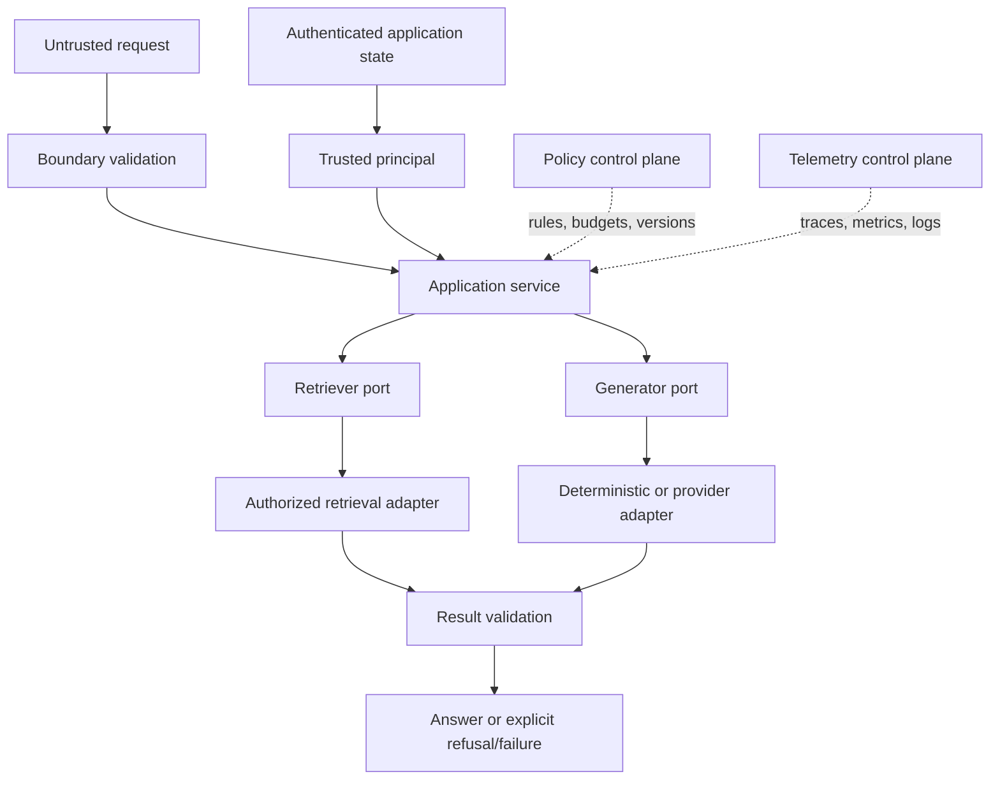

# Course 1 — Production AI Development in Python

**Level:** Advanced
**Time:** 3 weeks, 18–24 hours
**Scenario:** Northstar Underwriting Guideline Assistant
**Primary lab:** [production_ai_development.ipynb](production_ai_development.ipynb)
**Reusable implementation:** [lab.py](lab.py)
**Checkpoint:** [checkpoint.json](checkpoint.json)
**Last reviewed:** 2026-09-20

## Course thesis

A Staff-level AI specialist can turn a model-centred prototype into a typed, testable, observable
application whose policies, providers, and infrastructure can evolve independently—and can review
the resulting design with evidence.

## Learning outcomes

By the end, you can:

1. explain the difference between source, distribution, environment, manifest, resolution, and
   installed runtime, then choose packaging/build/dependency tools deliberately;
2. separate untrusted boundary data, trusted identity, domain state, application policy, ports,
   and technology adapters;
3. use Protocols and dependency injection to isolate model/retrieval SDKs without creating a maze
   of abstractions;
4. decide when asynchronous I/O and structured concurrency help, and enforce cancellation/timeouts;
5. design explicit error, retry, validation, logging, and terminal-state behavior;
6. test authorization, failure, and result invariants without calling a live model;
7. evaluate state correctness, citations, forbidden outcomes, latency, and cost with valid
   populations and denominators;
8. write a Staff-level review that connects code structure to reliability, security, delivery, and
   future architectural change.

## Prerequisites

- Comfortable writing Python functions/classes and using virtual environments.
- Prior exposure to an LLM or RAG prototype.
- Familiarity with HTTP APIs and automated tests at a conceptual level.
- Python 3.11+ and uv for the guided environment.

No AWS account, model key, vector database, Docker daemon, or paid service is needed.

## Success criteria and non-goals

You have succeeded when you can run the notebook and tests, explain every trust boundary, diagnose
the injected failures, compare a simple and layered design using measured evidence, and write the
production upgrade decision.

This course does **not** attempt to teach deep cloud deployment, distributed queues, enterprise
identity protocols, retrieval algorithms, agent frameworks, or live-model quality evaluation.
Those are later courses. The lab uses keyword retrieval and a deterministic generator to isolate
application-engineering decisions; their output is not evidence of model quality.

## Scenario and constraints

Northstar's underwriting team has a notebook that searches policy text and produces an answer. A
prototype demo worked, but the service must now satisfy:

| Constraint | Requirement |
|---|---|
| Identity | Principal and tenant come from authenticated application state |
| Authorization | Only documents for the principal's tenant and groups may be ranked |
| Grounding | Every answer citation must resolve to authorized retrieved evidence |
| Failure | No evidence means refusal; timeout and invalid result are explicit failures |
| Budget | Retrieval + generation share a bounded request deadline |
| Testability | Core behavior runs without cloud credentials or network calls |
| Observability | Trace stages expose reason codes, evidence IDs, duration, and terminal state |
| Evaluation | Correctness, safety, latency, and cost proxy use documented denominators |

The critical boundary is:

```text
model / retriever proposes content
                ↓
trusted application validates identity, scope, evidence, budget, and terminal state
```

Typed output is useful, but it is not automatically authorized, current, grounded, or correct.

## Mental model: four layers and two control planes



### Boundary layer

Parses untrusted transport data. In the lab, `AskPayload` rejects unknown fields and coercion. It
does not accept `tenant_id`, `principal_id`, or groups because request text cannot establish
identity.

### Application layer

Owns the use case: retrieve authorized evidence, refuse when absent, call the generator, verify
citations, and produce an application-owned terminal record.

### Ports

Small Protocols express what the application needs: `Retriever.retrieve` and
`Generator.generate`. They make dependencies replaceable and testable. A port is valuable when it
protects a meaningful boundary; one interface per function is abstraction theatre.

### Adapters

Translate a provider, database, or framework into a port. SDK request/response types stop here.
Adapters own provider errors, timeouts, connection lifecycle, and observability translation.

## Foundation 1 — modern Python projects

### Source, build, distribution, and environment

```text
source tree + pyproject.toml
             ↓ build frontend invokes backend
wheel / source distribution
             ↓ installer resolves and installs
environment containing exact artifacts
```

`pyproject.toml` declares project metadata, compatibility ranges, direct dependencies, build
requirements, development groups, and tool configuration. A resolver converts acceptable ranges
to a concrete graph. A lock captures that resolution; syncing makes an environment match it.

```text
pyproject.toml → resolver → uv.lock → sync → .venv → tests/build/runtime
```

Do not copy `pip freeze` into runtime dependencies. Declare direct runtime requirements; keep test,
lint, notebook, and type-check tools in dependency groups. Commit an application lockfile and make
CI reject stale resolution (`uv sync --locked`). Libraries and deployed applications have different
pinning responsibilities.

Deep references:

- [`pyproject.toml` and modern packaging](references/pyproject-and-packaging.md)
- [Python build systems and backend selection](references/build-backends.md)

### `src/` layout versus course repository

A deployable package benefits from a `src/` layout because tests exercise the installed package
instead of accidentally importing the repository directory. This curriculum repository is a
non-packaged uv project: each course owns a directly runnable `lab.py`. The distinction is
intentional. In Exercise 5 you turn the lab into an installable service package.

## Foundation 2 — types, validation, and trust

Static typing helps humans and tools reason about contracts before execution. Runtime validation
turns external data into a typed structure. Neither proves business truth or authority.

| Mechanism | Useful for | Does not prove |
|---|---|---|
| Type hint / Protocol | design contract, static checks, editor support | runtime input validity |
| Pydantic model | runtime parsing/constraints, schema | authenticated identity or truth |
| Dataclass | domain state with low runtime magic | external data safety |
| Authorization decision | permitted principal/action/resource | model answer correctness |
| Evidence validation | cited IDs exist in authorized result set | source itself is factually correct |

Pydantic is used at the untrusted request boundary. Frozen dataclasses represent application/domain
records. `TrustedPrincipal` is constructed by trusted authentication middleware in production, not
from `AskPayload` or a model tool call.

## Foundation 3 — dependency injection and architecture

This creates hidden, untestable dependencies:

```python
class Assistant:
    def __init__(self) -> None:
        self.model = make_bedrock_client()
        self.search = make_opensearch_client()
```

This makes dependencies explicit:

```python
class Assistant:
    def __init__(self, retriever: Retriever, generator: Generator) -> None:
        self._retriever = retriever
        self._generator = generator
```

Dependency injection does not require a framework. Constructor injection is often sufficient. The
composition root—the place that selects concrete adapters—should be small and explicit.

Use a layered/hexagonal shape when provider churn, test isolation, policy ownership, or multiple
interfaces justify it. For a short-lived script with one stable dependency, direct code may be
clearer. Architecture has carrying cost.

## Foundation 4 — async I/O, deadlines, and cancellation

Async helps when a request waits on model, search, database, storage, or HTTP I/O. It does not make
CPU-heavy tokenization or embedding computation faster by itself.

Rules for production review:

1. Place a deadline around the user-visible operation, not an unbounded timeout per nested call.
2. Propagate cancellation; swallowing `CancelledError` can break structured concurrency.
3. Reuse clients and connection pools rather than rebuilding them per request.
4. Bound parallelism with queues/semaphores; parallel fan-out can lower wall-clock latency while
   increasing total work and provider pressure.
5. Do not call blocking SDK methods directly on the event loop. Use an async client, thread bridge,
   or different service boundary deliberately.
6. Retry only classified transient failures; authorization denial and invalid output are terminal.

The lab applies `asyncio.timeout()` to the end-to-end operation and converts timeout into a typed
`DependencyTimeout`. Later courses add durable retry, reconciliation, and idempotency.

## Internal mechanics: the request lifecycle

For `UnderwritingAssistant.answer`:

1. the API layer validates `AskPayload` but obtains principal/tenant/groups from trusted state;
2. the retriever filters by tenant and intersecting groups **before** scoring;
3. it computes a deterministic token-overlap score on the authorized set only;
4. no results produce a refusal terminal state—generation is skipped;
5. the generator proposes answer text and evidence IDs;
6. the application verifies that every cited ID is in the authorized retrieved set;
7. it records state, trace events, evidence IDs, token proxy, and latency;
8. timeout or invalid citation raises an explicit application error for boundary translation.

Why filter before ranking? Ranking unauthorized material can leak information through scores,
timing, logs, caches, or downstream context even if a later step removes the final document.

## Architecture alternatives

| Pattern | Strength | Cost / failure risk | Best fit |
|---|---|---|---|
| Single function | Minimal ceremony | Coupling, poor test seams, provider types spread | disposable exploration |
| Layered service | Familiar boundaries | Can become an anemic, pass-through layer stack | stable web services |
| Ports and adapters | Provider isolation, deterministic tests | Too many tiny interfaces if overused | AI systems with provider/data churn |
| Event-driven application | Decoupling and burst handling | duplicates, ordering, state, replay, observability | asynchronous/long work |
| Agent framework | Flexible dynamic planning | non-determinism, tool authority, cost, termination | variable tasks that justify autonomy |

Course 1 uses ports and adapters around only retrieval and generation. Course 2 determines when to
cross a distributed boundary; Course 5 determines whether an agent earns its complexity.

## Technology landscape and current practice

| Concern | Course choice | Credible alternatives | Selection criteria |
|---|---|---|---|
| Project manager | uv | Poetry, PDM, pip/pip-tools | standards, lock, speed, estate, support |
| Build backend | none at curriculum root; compare uv_build/Hatchling | setuptools, Flit, PDM backend | artifact type, hooks, native code |
| Lint/format | Ruff | Black + isort + Flake8 family | rules, speed, migration, plugin needs |
| Type checking | mypy | Pyright, ty, Pyrefly | soundness needs, ecosystem, editor, maturity |
| Runtime validation | Pydantic v2 | msgspec, attrs, dataclasses + manual validation | coercion, schema, performance, portability |
| API | FastAPI concepts | Litestar, Django Ninja, Flask, Django | estate, async, schema, operations |
| Testing | pytest | unittest; Hypothesis as complement | team conventions, generated boundaries |
| Telemetry | reason-coded local trace | OpenTelemetry, structlog, vendor SDKs | correlation, standards, privacy, backend |

### State of the art, without hype

**Established:** standardized `pyproject.toml` metadata/build interfaces; dependency groups; type
Protocols; Pydantic v2-style boundary validation; structured concurrency; deterministic tests;
ports/adapters; OpenTelemetry traces/metrics.

**Current production direction:** consolidated Rust-based Python tooling (uv/Ruff), stronger
machine-readable contracts, software supply-chain evidence, and provider-neutral telemetry. These
improve developer experience; they do not replace architectural controls.

**Emerging:** tool-neutral `pylock.toml` adoption, newer high-performance type checkers, and GenAI
semantic conventions. Pilot against real repository constraints before standardizing.

**Open problems:** static tools cannot prove business authorization or semantic truth; live-model
behavior remains non-deterministic; cross-provider “compatibility” is incomplete; evaluation,
privacy-safe telemetry, and dependency/supply-chain assurance require continuous work.

See the program-wide [tooling review](../../../docs/tooling-landscape.md).

## Implementation map

Open [lab.py](lab.py) alongside the notebook.

| Symbol | Responsibility | Invariant to inspect |
|---|---|---|
| `AskPayload` | untrusted request boundary | strict, bounded, no identity fields |
| `TrustedPrincipal` | authenticated state | non-empty principal/tenant; not model-controlled |
| `Document` | versioned evidence record | stable evidence/tenant/group metadata |
| `Retriever` / `Generator` | narrow ports | provider types do not enter application service |
| `InMemoryAuthorizedRetriever` | local adapter | authorization happens before scoring |
| `DeterministicGroundedGenerator` | local test adapter | repeatable citations and usage proxy |
| `UnderwritingAssistant` | application policy | refusal, deadline, citation validation, terminal record |
| `evaluate` | release evidence | explicit cases, metrics, denominators, forbidden outcomes |

## Experiments

The notebook conducts four comparisons.

### 1. Naive baseline versus trusted boundary

Attempt to put identity/groups in an input payload. The strict model rejects unknown fields and
string-to-integer coercion. Explain why validation alone would still be insufficient if those
identity fields were part of the schema.

### 2. Ordinary versus senior principal

Ask the same exception question as two principals. Inspect `last_ranked_ids`, authorized evidence,
citations, reason codes, and terminal state. Confirm restricted evidence is not even ranked for the
ordinary underwriter.

### 3. Time-budget failure

Inject retriever delay greater than the operation budget. Verify a typed timeout instead of a fake
answer, silent fallback, or hanging request. Decide what the HTTP boundary should expose and log.

### 4. Schema-valid forged evidence

Use `InvalidCitationGenerator`. Its result has the correct Python shape but cites a missing ID. The
application rejects it. Explain why structured generation is necessary but not sufficient.

## Evaluation design

```text
labelled cases → execute → capture terminal records → compute metrics → inspect slices → decide
```

| Metric | Population and formula | Direction | What it does not prove |
|---|---|---|---|
| State accuracy | cases with expected state / all cases | higher | answer content quality |
| Citation recall | required cited IDs found / all required IDs | higher | source truth or completeness outside labels |
| Forbidden outcomes | answers citing outside authorized evidence | zero | blocked attempts or false denials |
| p95 latency | 95th percentile over observed end-to-end records | lower within SLO | load capacity from a tiny local set |
| Cost units/compliant success | all token proxy units / successful compliant answers | lower at equal quality | actual provider currency cost |

Do not average away important slices. Report regular versus senior principal, successful versus
refused cases, and injected failures separately. Local latency and token proxies teach metric
mechanics; they are not production benchmarks.

## Failure modes and mitigations

| Failure / anti-pattern | Consequence | Mitigation and test |
|---|---|---|
| Identity accepted from request/model | privilege escalation | authenticated state; reject identity fields |
| Rank then filter | side-channel/cache/context exposure | authorize before ranking; inspect ranked IDs |
| Provider SDK in route/service core | coupling and poor deterministic tests | narrow adapter and composition root |
| `except Exception: return answer` | fabricated success | typed failures and application terminal states |
| Unbounded retries | cost/latency explosion; duplicate effects | classed errors, bounded attempts, idempotency later |
| Timeout per component only | total SLA exceeded | shared end-to-end deadline/budget |
| Schema-valid output trusted | forged evidence or action | semantic/policy validation against trusted state |
| Logs contain prompts/documents/secrets | data exposure | IDs/digests/reason codes and redaction policy |
| Mock quality called “model quality” | invalid release claim | separate live evaluation with representative labels |
| Framework selected before requirements | accidental complexity/lock-in | start with primitive and measure architecture need |

## Production upgrade path

| Local course component | Production concern | Upgrade decision |
|---|---|---|
| In-memory retriever | durable index, ACL consistency, freshness, deletes | Course 4 retrieval/data design |
| Deterministic generator | model variance, safety, rate limits, residency | provider adapter + Course 6 gateway decision |
| `TrustedPrincipal` fixture | authentication, token validation, workload identity | Course 3 identity boundary |
| in-process timeout | downstream budgets, cancellation, durable work | Course 2 distributed design |
| local trace tuple | correlation, sampling, retention, redaction | Course 7 OpenTelemetry contract |
| local evaluation set | representative labels, human review, uncertainty | Course 8 release gate |
| source checkout | immutable build, SBOM, provenance, promotion | Course 10 delivery pipeline |

Before production, also add secret management, connection reuse, rate/concurrency limits, safe error
translation, health/readiness probes, load tests, dependency/security scans, deployment rollback,
privacy review, data retention, and on-call ownership.

## Guided path

1. Read this chapter through “Internal mechanics.”
2. Study the two packaging references as decision material, not commands to memorize.
3. Run the [notebook](production_ai_development.ipynb) top to bottom from this directory.
4. Inspect [lab.py](lab.py) and [the invariant tests](../../../tests/test_course_01_lab.py).
5. Complete the [checkpoint](checkpoint.json) without notes.
6. Write the two portfolio artifacts below and review them against the rubric.

## Portfolio exercises

### Exercise 1 — Staff code review

Review an endpoint that constructs Bedrock/OpenSearch clients, reads user groups from JSON, retries
every exception, logs complete prompts, and returns the provider object. Identify the trust,
coupling, reliability, operations, and delivery consequences. Propose the smallest architecture
change that establishes safe boundaries; do not say only “use clean code.”

### Exercise 2 — Packaging/build ADR

Choose project/dependency/build tooling for (a) a deployed pure-Python AI service and (b) a reusable
Python library with a Rust extension. Record requirements, alternatives, choice, consequences,
lock/reproducibility policy, supply-chain controls, review date, and reversal trigger.

### Exercise 3 — Failure policy

Classify authentication failure, authorization denial, validation error, dependency throttle,
timeout, network reset, malformed model result, and unknown external-write outcome. For each specify
retry, user response, log/metric, terminal state, and whether reconciliation is needed.

### Exercise 4 — Evaluation extension

Add at least six labelled cases across regular/senior, another tenant, empty query evidence,
boundary `top_k`, and injected delay. Add one metric only after defining its population, numerator,
denominator, unit, direction, and release interpretation.

### Exercise 5 — Package the service

Move the reusable core into a `src/` package, add a build backend, build wheel and sdist, install the
wheel into a clean environment, and prove tests do not depend on the repository import path.

## Architecture review questions

1. Why are groups absent from `AskPayload`?
2. Why does the `Retriever` contract receive the trusted principal?
3. What could leak if filtering occurs after ranking?
4. Why is a valid `GenerationDraft` still untrusted?
5. Which failure classes are safe to retry and which are terminal?
6. When would an event-driven boundary improve this design? When would it make it worse?
7. What would have to change to swap Bedrock for another provider? What should remain unchanged?
8. Which local metrics cannot support a production release decision, and why?
9. What would you record in telemetry, and what would you deliberately omit?
10. What evidence would justify replacing the deterministic workflow with an agent?

## References

### Standards and Python internals

- [PyPA: `pyproject.toml` specification](https://packaging.python.org/en/latest/specifications/pyproject-toml/)
- [PyPA: dependency groups](https://packaging.python.org/en/latest/specifications/dependency-groups/)
- [PyPA: `pylock.toml` specification](https://packaging.python.org/en/latest/specifications/pylock-toml/)
- [Python typing specification](https://typing.python.org/en/latest/spec/)
- [Python: `asyncio` tasks, cancellation, TaskGroup, and timeout](https://docs.python.org/3/library/asyncio-task.html)
- [Python: logging cookbook](https://docs.python.org/3/howto/logging-cookbook.html)

### Selected implementation documentation

- [uv projects](https://docs.astral.sh/uv/concepts/projects/)
- [uv locking and syncing](https://docs.astral.sh/uv/concepts/projects/sync/)
- [Ruff documentation](https://docs.astral.sh/ruff/)
- [mypy Protocols](https://mypy.readthedocs.io/en/stable/protocols.html)
- [Pydantic models](https://docs.pydantic.dev/latest/concepts/models/)
- [Pydantic strict mode](https://docs.pydantic.dev/latest/concepts/strict_mode/)
- [FastAPI async guidance](https://fastapi.tiangolo.com/async/)
- [pytest good integration practices](https://docs.pytest.org/en/stable/explanation/goodpractices.html)
- [Hypothesis documentation](https://hypothesis.readthedocs.io/en/latest/)
- [OpenTelemetry Python](https://opentelemetry.io/docs/languages/python/)

### Provider boundary example

- [Amazon Bedrock Converse API](https://docs.aws.amazon.com/bedrock/latest/userguide/conversation-inference.html)
- [Boto3 Bedrock Runtime `converse`](https://boto3.amazonaws.com/v1/documentation/api/latest/reference/services/bedrock-runtime/client/converse.html)

## Next course

[Course 2 — Cloud and Distributed AI Systems](../../../COURSE_PLAN.md#course-2--cloud-and-distributed-ai-systems)
will move this application across process and service boundaries, where delivery, state,
idempotency, backpressure, recovery, and cost become first-class design concerns.
