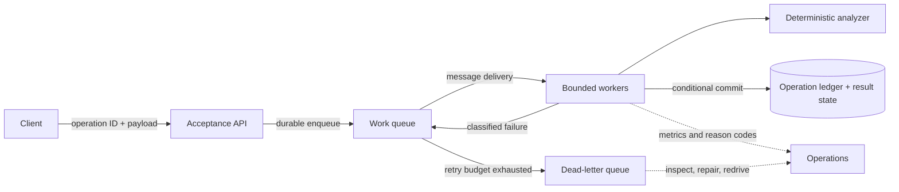

# Course 2 — Cloud and Distributed AI Systems

- **Level:** Advanced
- **Time:** 3 weeks, 18–24 hours
- **Prerequisite:** [Course 1 — Production AI Development in Python](../01-production-ai-development/README.md)
- **Scenario:** Northstar asynchronous document-analysis platform
- **Primary lab:** [cloud_distributed_ai_systems.ipynb](cloud_distributed_ai_systems.ipynb)
- **Reusable implementation:** [lab.py](lab.py)
- **Checkpoint:** [checkpoint.json](checkpoint.json)
- **Last reviewed:** 2026-09-20

## Course thesis

A Staff-level AI specialist chooses compute, messaging, workflow, and state from workload and
failure requirements. They can prove how the system behaves under duplicate delivery, throttling,
out-of-order events, overload, and an acknowledgement lost after a successful write.

The important skill is not remembering AWS icons. It is preserving application invariants after a
request crosses an unreliable boundary.

## Learning outcomes

By the end, you can:

1. decide whether work belongs on a synchronous request path, durable queue, event stream, or
   workflow engine;
2. distinguish request IDs, message IDs, delivery-attempt IDs, and stable logical operation IDs;
3. design idempotent processing with payload digests, conditional writes, reconciliation, and
   bounded retention;
4. classify terminal, transient, and unknown failures and give each a bounded recovery policy;
5. reason about at-most-once, at-least-once, ordering, replay, visibility, and dead-letter behavior
   without making an “exactly once” application claim;
6. estimate capacity and expose overload using arrival rate, service rate, utilization, backlog,
   queue age, tail latency, and work amplification;
7. select among Lambda, ECS/Fargate, EKS, EC2, SageMaker, Bedrock, SQS, SNS, EventBridge, Kinesis,
   Step Functions, and common state services from explicit constraints;
8. write an architecture decision record (ADR) with failure, cost, security, recovery, and
   operability evidence rather than vendor preference.

## Prerequisites and boundaries

You should understand the application boundary, typed ports, time budgets, authorization-before-
rank rule, and deterministic evaluation from Course 1. You need Python 3.11+ and uv. The lab needs
no AWS account, credentials, network, paid model, or Docker daemon.

This course does not teach IAM federation in depth, build a production VPC, benchmark an AWS
service, or claim that a simulator predicts provider latency. Course 3 owns identity and delegated
authorization; later courses own RAG, agents, observability, evaluation, security, and delivery.
The local simulation isolates distributed-system invariants so failures are cheap and repeatable.

## Scenario: the request no longer fits the request path

Northstar already has the bounded application core from Course 1. Some documents now take minutes
to parse, classify, and enrich. Traffic arrives in bursts, a dependency throttles, users retry, and
the API can lose a response after a database write. Product requires fast acceptance and status
tracking; operations requires recovery without duplicate results.

| Requirement | Course contract |
|---|---|
| Acceptance | acknowledge durable ownership quickly; do not hold an HTTP connection for long work |
| Identity | tenant and authorization context originate in trusted application state, never event text |
| Delivery | duplicate delivery is expected and safe |
| Retry | only classified transient/unknown failures retry, with a finite attempt budget |
| Write safety | one logical operation cannot create two externally visible results |
| Version safety | an older event cannot overwrite a newer document projection |
| Ambiguity | a timeout after write triggers reconciliation before another side effect |
| Overload | bound concurrency; expose backlog and oldest-message age; shed or defer work deliberately |
| Recovery | dead-letter records retain reason and identifiers; redrive is reviewed and idempotent |
| Evidence | tests and experiments demonstrate the invariants without cloud credentials |

## The distributed boundary changes the contract



The queue acknowledges **transport**, not business completion. A `202 Accepted` response means the
system durably owns the request, not that analysis succeeded. The client observes a resource such
as `/operations/{operation_id}` whose terminal state belongs to the application.

### Identity vocabulary

| Identifier | Lifetime | Purpose | Must remain stable on retry? |
|---|---|---|---|
| request/trace ID | one inbound interaction | correlate one request | no |
| message ID | one queue record | transport diagnosis | no |
| attempt ID | one delivery/execution | reason about retry work | no |
| operation/idempotency ID | one intended business effect | reconcile and deduplicate | **yes** |
| resource/version ID | one domain entity revision | prevent stale overwrite | stable for that revision |

Conflating these identifiers is a common production defect. If the client creates a fresh
operation ID after every timeout, the server cannot know whether it is seeing a new intent or a
retry of an old one.

## Delivery semantics are end-to-end properties

### At-most-once

An attempt is not replayed. Duplicate effects are less likely, but work may be lost. This can fit
disposable telemetry; it rarely fits a required underwriting result.

### At-least-once

Work is retried until acknowledged or its receive budget is exhausted. This improves durability
but deliberately permits duplicates. Amazon SQS standard queues document at-least-once delivery,
and visibility timeout does not create an absolute no-duplicate guarantee
([SQS delivery](https://docs.aws.amazon.com/AWSSimpleQueueService/latest/SQSDeveloperGuide/standard-queues-at-least-once-delivery.html),
[visibility timeout](https://docs.aws.amazon.com/AWSSimpleQueueService/latest/SQSDeveloperGuide/sqs-visibility-timeout.html)).
The application must tolerate the same logical operation arriving more than once.

### “Exactly once” needs a scope

A broker may deduplicate message submission, or a workflow service may prevent duplicate workflow
starts. That does not atomically include every database, email, model call, or external API side
effect. AWS describes Step Functions Standard as exactly-once workflow execution unless retries
are specified, while asynchronous Express is at-least-once and synchronous Express is at-most-once
([workflow types](https://docs.aws.amazon.com/step-functions/latest/dg/choosing-workflow-type.html)).
Those are execution semantics—not proof that arbitrary downstream effects occur exactly once.

Use precise claims:

- “SQS FIFO deduplicates sends within its documented scope” is testable.
- “A conditional operation record prevents a second result write for the same operation and
  digest” is an application invariant.
- “The whole distributed system is exactly once” is normally too broad to defend.

## Idempotency is a domain decision

An operation is idempotent when repeating the same intended operation leaves the accepted state as
if it happened once. HTTP method names, queue type, or a retry library do not provide that by
themselves.

The lab uses this contract:

```text
operation_key = caller-generated logical operation ID
request_identity = SHA-256(canonical tenant, document, version, content)

same key + same digest       → return/reconcile recorded outcome
same key + different digest  → terminal conflict; never guess
new key + stale version      → record stale; do not overwrite current state
new key + current version    → conditional commit and record outcome
```

AWS's Builders' Library recommends caller-provided request identifiers because inferred semantic
equivalence can confuse a legitimate second intent with a retry
([Making retries safe with idempotent APIs](https://aws.amazon.com/builders-library/making-retries-safe-with-idempotent-APIs/)).
An idempotency record needs an owner, storage scope, retention window, payload fingerprint, status,
and recovery policy. Expiration is a business decision: after the record expires, the system may
no longer recognize a very late retry.

### Unknown outcomes require reconciliation

There are three materially different outcomes:

1. **known failure before effect:** safe to apply the retry policy;
2. **known success:** acknowledge and return the stored result;
3. **unknown outcome:** the effect may have committed, so query authoritative state before trying
   the effect again.

The lab writes a result and then injects a lost acknowledgement. The next delivery finds the
operation record and acknowledges it without rerunning analysis or writing again. This is why a
logical operation ledger is stronger than a process-local “seen IDs” set.

## Retries are load multipliers

Retry only failures likely to improve with time: throttling, selected timeouts, or a transient
dependency outage. Invalid input, authorization denial, an idempotency digest mismatch, and a
same-version content conflict are terminal.

A production retry policy specifies:

- maximum attempts and maximum elapsed time;
- exponential backoff and jitter;
- per-attempt timeout inside an end-to-end deadline;
- concurrency and rate limits;
- which layer owns retry so nested SDK, worker, and workflow retries do not multiply;
- an observable exhausted state and recovery owner.

If three layers each attempt a call three times, one logical request can create 27 downstream
attempts. Report **work amplification**:

```text
delivery or dependency attempts / successful logical operations
```

High success with rapidly increasing amplification is not healthy recovery; it can be the start of
a retry storm.

For Lambda with SQS batches, the default failed invocation can return the entire batch for retry.
Partial batch response reports only failed records and avoids replaying successful siblings
([Lambda SQS configuration](https://docs.aws.amazon.com/lambda/latest/dg/services-sqs-configure.html)).
Application idempotency is still required.

## Ordering, versions, and clocks

Arrival order is not domain order. Retries, partitions, batching, and parallel consumers can make
version 2 complete before version 1. A timestamp from a worker clock is not a safe last-writer rule
across machines.

Use a domain version, sequence, or conditional state transition:

```text
write v2 when current is v1  → accepted
later write v1 when current is v2 → stale, recorded, not applied
different payload claiming v2 → conflict, not last-writer-wins
```

DynamoDB optimistic locking uses a version attribute and conditional write; a failed condition
signals that another writer changed the item
([DynamoDB optimistic locking](https://docs.aws.amazon.com/amazondynamodb/latest/developerguide/BestPractices_OptimisticLocking.html)).
Relational databases offer transactions and compare-and-swap patterns with different operational
trade-offs. The invariant matters more than the product name.

## Backpressure and capacity

Let:

- `λ` = average arrival rate;
- `μ` = service rate per worker;
- `c` = active worker count;
- `ρ = λ / (cμ)` = utilization.

When sustained arrival exceeds capacity, backlog grows. Operating close to full utilization also
raises queueing delay and tail latency because ordinary variance has no spare capacity to absorb.
Little's Law relates average items in a stable system, throughput, and average time:
`L = λW` ([Little, 1961](https://pubsonline.informs.org/doi/10.1287/opre.9.3.383)). It is a
long-run relationship, not permission to average away bursts, priorities, non-stationarity, or
tail risk.

Watch together:

- oldest eligible message age, not only queue depth;
- arrival and completion rate;
- concurrency, throttles, retry rate, and work amplification;
- p50/p95/p99 queue wait and end-to-end completion latency;
- completion, terminal failure, and dead-letter rate by workload slice;
- downstream saturation and cost per successful operation.

Scale-out is bounded by downstream capacity. If the model endpoint safely accepts 40 concurrent
calls, launching 1,000 workers moves the queue into the dependency and may worsen recovery.

## Dead-letter queues are quarantine, not disposal

A dead-letter queue separates work that exhausted its receive budget or failed terminal checks.
For each record retain safe identifiers, failure class, attempts, first/last failure time, version,
and enough provenance to reconstruct—not necessarily sensitive full content.

Define:

1. alert threshold and owner;
2. inspection and repair procedure;
3. retention and privacy policy;
4. redrive rate limit and idempotency check;
5. rule for poison messages;
6. evidence that redrive will not violate ordering.

AWS warns that using a DLQ with a FIFO queue can break strict order where order is significant
([SQS dead-letter queues](https://docs.aws.amazon.com/AWSSimpleQueueService/latest/SQSDeveloperGuide/sqs-dead-letter-queues.html)).
A “redrive all” button without review can replay the incident.

## Partitions, consistency, and cache ownership

The CAP result shows that, in an asynchronous network model with partitions, a read/write service
cannot guarantee both availability and atomic consistency for every execution
([Gilbert and Lynch](https://www.cs.princeton.edu/courses/archive/spr22/cos418/papers/cap.pdf)).
CAP does not say every database is permanently “CP” or “AP,” and it does not choose product-level
latency, durability, isolation, or staleness for you.

For every piece of state, name:

- authoritative owner and write path;
- consistency needed by each reader;
- conflict/version rule;
- recovery point and recovery time objectives;
- cache key, tenant scope, invalidation trigger, and maximum staleness;
- replay source and retention.

A cache is a copy, not an owner, unless the design explicitly promotes it. Global cache keys that
omit tenant, policy version, model version, or document version can return valid-looking but wrong
results.

## Architecture patterns: choose from the workload

| Pattern | Prefer when | Main risks | Required evidence |
|---|---|---|---|
| synchronous request/response | bounded work must finish inside a user deadline | timeouts, tied-up capacity, ambiguous retry | latency distribution, deadline, idempotent mutation |
| durable work queue | each item is processed by one scalable consumer group | duplicates, backlog, poison work | operation ledger, age alarm, DLQ/redrive test |
| pub/sub event | multiple independent consumers react to a fact | compatibility, fan-out failure, hidden coupling | event contract, owner, replay/version plan |
| event stream/log | ordered history, replay, analytics, many offsets | partitions, hot keys, retention, consumer lag | partition key, ordering scope, lag/capacity test |
| durable workflow | multi-step state, waits, compensation, audit | definition complexity, retry layering, quotas | state model, compensation/reconciliation test |
| scheduled/batch job | latency is flexible and throughput/cost dominates | long recovery cycle, partial output | checkpoint, restart, manifest, reconciliation |

Do not turn every internal function call into an event. A distributed boundary adds state,
failure, security, versioning, observability, and operating ownership.

## AWS decision landscape

The following is a decision frame, not a universal ranking. Verify quotas, regional availability,
pricing, compliance, and current service behavior for the target account before an ADR.

### Compute and AI runtime

| Service/pattern | Strong fit | Be cautious when |
|---|---|---|
| Lambda | event-driven work with bounded execution and rapid elastic scaling | runtime/resource limits, long GPU jobs, dependency connection pressure |
| ECS on Fargate | container workloads needing process/runtime control without node management | extreme scale-to-zero sensitivity or Kubernetes ecosystem requirements |
| EKS | organization already operates Kubernetes and needs its APIs/ecosystem | team lacks platform capacity; control-plane and upgrade burden is unjustified |
| EC2 / autoscaling | specialized hardware, host control, steady utilization | undifferentiated node management and slow elasticity |
| AWS Batch | queued batch/ML jobs with heterogeneous compute | low-latency interactive paths |
| SageMaker AI endpoints | managed model lifecycle, custom inference, hosting controls | foundation-model API is sufficient; platform overlap is costly |
| Amazon Bedrock | managed foundation-model access and GenAI capabilities | custom training/hosting or unsupported model/control requirements |

AWS's compute guide distinguishes EC2 control, ECS/EKS orchestration, Fargate managed container
compute, and Lambda event-driven serverless execution
([Choosing an AWS compute service](https://docs.aws.amazon.com/decision-guides/latest/decision-guides/choosing-aws-compute-service.html)).
The current Fargate/Lambda guide also includes newer Lambda durable-functions and managed-instance
options; treat them as current platform capabilities to evaluate, not automatic replacements for
established queue/workflow designs
([Fargate or Lambda](https://docs.aws.amazon.com/decision-guides/latest/decision-guides/fargate-or-lambda.html)).
For AI platform scope, compare Bedrock and SageMaker from required model access, customization,
deployment control, governance, and operating model
([Bedrock or SageMaker AI](https://docs.aws.amazon.com/decision-guides/latest/decision-guides/bedrock-or-sagemaker.html)).

### Messaging and orchestration

| Service | Core shape | Selection question |
|---|---|---|
| SQS | pull-based work queue | does one consumer group own each item, with retry/DLQ semantics? |
| SNS | push fan-out | do multiple subscribers need the same notification? |
| EventBridge | routed events across producers/consumers | do rules, schemas, integrations, and event ownership justify a bus? |
| Kinesis Data Streams | partitioned ordered stream and replay | is high-throughput event history/consumer lag central to the workload? |
| Step Functions | explicit durable workflow state | are steps, waits, branching, retry, and audit first-class? |

AWS's messaging guide frames SQS as queueing, SNS as pub/sub, and EventBridge as event routing
([SNS, SQS, or EventBridge](https://docs.aws.amazon.com/decision-guides/latest/decision-guides/sns-or-sqs-or-eventbridge.html)).
The broader integration guide includes streaming and workflow services
([Application integration on AWS](https://docs.aws.amazon.com/decision-guides/latest/decision-guides/application-integration-on-aws-how-to-choose.html)).

### State

| Need | Candidate | Decision pressure |
|---|---|---|
| immutable source objects/manifests | S3 | object/version lifecycle, event duplication, consistency contract |
| key-value operation ledger/projection | DynamoDB | access pattern, conditions, item limits, hot keys, TTL semantics |
| relational transactions/reporting | Aurora/RDS | schema, joins, isolation, connections, scaling and recovery |
| search/index projection | OpenSearch | refresh lag, shard design, source-of-truth separation |
| bounded ephemeral cache/rate state | ElastiCache/Redis | eviction, invalidation, availability, tenant-safe keys |

Avoid dual writes to unrelated owners without a transaction, outbox, workflow, or reconciliation
plan. “Write database then publish event” contains a crash window in both directions.

## State of the art: established, current, emerging

### Established production practice

- at-least-once delivery plus application-owned idempotency;
- transactional/conditional state changes and outbox/inbox patterns;
- bounded exponential backoff with jitter and retry budgets;
- queue age, consumer lag, tail latency, saturation, and outcome telemetry;
- explicit schemas, compatibility, replay, DLQ, and runbooks;
- load and failure experiments before production scale.

### Current platform direction

- durable execution is moving into serverless runtimes as well as workflow products;
- event-source integrations increasingly support partial failure reporting and finer concurrency;
- managed AI platforms add routing, guardrails, observability, and retrieval features;
- OpenTelemetry conventions for messaging and GenAI improve correlation, but semantic stability and
  provider coverage must be verified rather than assumed.

### Emerging or unsettled

- portable durable execution across cloud/runtime boundaries;
- consistent end-to-end semantics across agents, workflows, tools, and external side effects;
- standard measurement of AI work amplification and cost per successful compliant task;
- safe replay when prompts, models, policies, tools, and data have changed;
- capacity control for long, variable, accelerator-backed inference.

“Newest” is not a decision criterion. Require operational history, failure evidence, portability,
security review, total cost, and a credible exit path.

## Practical lab

The notebook imports the tested [lab.py](lab.py); it does not copy a second implementation. Its
virtual clock makes every retry and measurement deterministic.

### Exercise 1 — expose the unsafe baseline

Run a synchronous operation that writes successfully, loses the response, and is retried by the
client. Observe two external writes. Explain why the HTTP timeout does not reveal whether the
first write committed.

### Exercise 2 — cross a durable boundary

Submit a `JobRequest` containing a stable operation ID, tenant, document ID, version, and payload.
Trace queue message IDs and delivery-attempt IDs separately from the logical operation.

### Exercise 3 — prove idempotency

Inject a duplicate queue message. The first delivery conditionally writes; the duplicate reads the
operation record and acknowledges without analysis or a second write. Then reuse an operation ID
with a different digest and verify terminal quarantine.

### Exercise 4 — classify and bound retry

Make one dependency throttle once, then recover. Make another remain throttled. Verify the first
succeeds on attempt two and the second reaches the DLQ exactly at the configured receive bound.

### Exercise 5 — reconcile an unknown write

Inject loss after the result and operation record commit. The next delivery checks authoritative
state, recognizes success, and acknowledges. Prove analyzer calls and result writes remain one.

### Exercise 6 — reject stale and conflicting versions

Deliver document version 2 before version 1. Verify version 1 cannot overwrite it. Send different
content claiming the same current version and verify the system rejects last-writer-wins ambiguity.

### Exercise 7 — measure overload

Compare a stable load (`3 arrivals/tick`, `4 completions/tick`) with sustained overload
(`5 arrivals/tick`, `4 completions/tick`). Report utilization, maximum/final backlog, p95 queue
wait, and the Little's Law estimate. State why the finite deterministic run is not a cloud
benchmark.

### Exercise 8 — write the production ADR

Choose a Northstar target and reject credible alternatives. At minimum cover:

- synchronous acceptance plus asynchronous completion resource;
- compute and messaging choice with quotas/concurrency;
- operation ledger, conditional projection, retention, and conflict policy;
- retry ownership, DLQ/redrive, reconciliation, and disaster recovery;
- tenant identity propagation, encryption, network/egress, and least privilege;
- SLOs, alarms, traces, cost units, and load/failure validation;
- migration stages and rollback.

## Evaluation contract

The required invariant matrix is:

| Case | Expected terminal effect | Forbidden outcome |
|---|---|---|
| normal | one successful result | missing result |
| duplicate delivery | recorded result returned/reconciled | second write |
| one transient throttle | bounded retry then success | permanent failure or unbounded retry |
| persistent throttle | DLQ at receive limit | infinite hot loop |
| write then lost acknowledgement | reconcile success | repeat analysis/write |
| stale version | record stale, retain newer projection | overwrite version 2 with version 1 |
| same operation/different digest | terminal conflict | treating changed intent as retry |
| same version/different content | terminal version conflict | nondeterministic last writer wins |

Report counts before rates. Define the denominator for:

- logical-operation success rate;
- delivery attempts per successful logical operation;
- duplicate suppression;
- dead-letter rate;
- cost proxy per successful operation;
- latency from acceptance to terminal state.

Do not mix acceptance latency with completion latency, or message attempts with unique operations.

## Production review checklist

- [ ] Stable operation ID and canonical request digest are documented.
- [ ] Same-key/different-payload behavior is a terminal conflict.
- [ ] Every external side effect has an idempotency, transaction, or reconciliation plan.
- [ ] Retryable and terminal errors are enumerated; retries are bounded with one clear owner.
- [ ] Visibility/lease duration, heartbeat/extension behavior, and worker crash recovery are tested.
- [ ] Ordering scope and version conflict behavior are explicit.
- [ ] Partial batch failure does not replay successful siblings unnecessarily.
- [ ] DLQ ownership, alarms, privacy, retention, repair, and redrive are rehearsed.
- [ ] Concurrency protects downstream model, search, and data capacity.
- [ ] Queue age and tail completion latency are user-facing signals.
- [ ] Identity/tenant context is revalidated at the worker; event fields do not create authority.
- [ ] Logs exclude secrets, unnecessary document content, and private model reasoning.
- [ ] Cost includes retries, duplicate work, storage, transfer, observability, and idle capacity.
- [ ] Backup/restore and regional dependency assumptions match stated RPO/RTO.
- [ ] Load and failure evidence is separated from provider marketing and local simulation.

## Portfolio evidence

Produce four reviewable artifacts:

1. **AWS ADR:** decision, context, requirements, options, consequences, rejected alternatives,
   migration, rollback, and validation plan;
2. **failure model:** fault, detection, retry/terminal rule, side-effect risk, recovery owner, and
   tested invariant;
3. **load report:** workload assumptions, arrival/service rates, backlog/age/tail results,
   saturation point, scale limit, and measurement caveats;
4. **operability/cost comparison:** successful-operation unit cost proxy, amplification, quotas,
   on-call burden, recovery procedure, and sensitivity analysis.

The completion standard is a defensible design plus executable evidence. Drawing a cloud diagram or
successfully invoking a service is not sufficient.

## Knowledge checkpoint

Complete [checkpoint.json](checkpoint.json) after the lab. Passing score: **80%**. Then use the
[program quiz](../../../quiz/index.html) to mix Course 1 and Course 2 concepts.

## Primary and authoritative references

- Amazon Web Services, [Lambda application design](https://docs.aws.amazon.com/lambda/latest/dg/concepts-application-design.html)
  and [retry behavior](https://docs.aws.amazon.com/lambda/latest/dg/invocation-retries.html).
- Amazon Web Services, [SQS Developer Guide](https://docs.aws.amazon.com/AWSSimpleQueueService/latest/SQSDeveloperGuide/).
- Amazon Web Services, [Step Functions workflow types](https://docs.aws.amazon.com/step-functions/latest/dg/choosing-workflow-type.html).
- Amazon Builders' Library, [Making retries safe with idempotent APIs](https://aws.amazon.com/builders-library/making-retries-safe-with-idempotent-APIs/)
  and [Avoiding insurmountable queue backlogs](https://aws.amazon.com/builders-library/avoiding-insurmountable-queue-backlogs/).
- Amazon Web Services, [CloudWatch recommended alarms for SQS](https://docs.aws.amazon.com/AmazonCloudWatch/latest/monitoring/Best_Practice_Recommended_Alarms_AWS_Services.html).
- Nancy A. Lynch and Seth Gilbert, [Brewer's conjecture and the feasibility of consistent,
  available, partition-tolerant web services](https://www.cs.princeton.edu/courses/archive/spr22/cos418/papers/cap.pdf).
- John D. C. Little, [A Proof for the Queuing Formula: L = λW](https://pubsonline.informs.org/doi/10.1287/opre.9.3.383).

## Next course

[Course 3 — Enterprise Identity and Agent Authorization](../../../COURSE_PLAN.md#course-3--enterprise-identity-and-agent-authorization)
will harden the identity, tenant, service-authority, delegation, and approval assumptions that this
course deliberately treats as trusted inputs.
