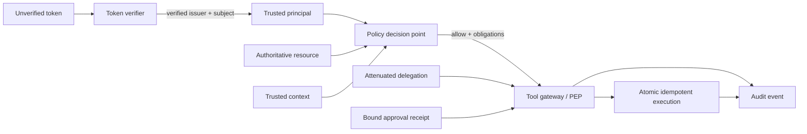
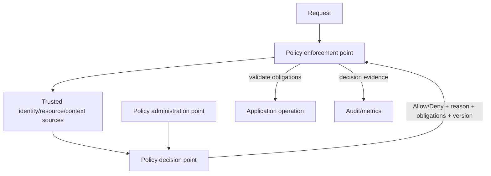

# Course 3 — Enterprise Identity and Agent Authorization

- **Level:** Advanced
- **Time:** 2 weeks, 16–20 hours
- **Prerequisite:** [Course 2 — Cloud and Distributed AI Systems](../02-cloud-distributed-ai-systems/README.md)
- **Scenario:** Northstar delegated underwriting exception workflow
- **Primary lab:** [enterprise_identity_agent_authorization.ipynb](enterprise_identity_agent_authorization.ipynb)
- **Reusable implementation:** [lab.py](lab.py)
- **Checkpoint:** [checkpoint.json](checkpoint.json)
- **Last reviewed:** 2026-09-21

## Course thesis

A Staff-level AI specialist can prove who a user and workload are, decide what each may do to a
specific resource, attenuate delegated authority, and bind consequential execution to a current,
single-use approval. A role name, prompt, agent label, token-shaped object, or tool argument never
creates authority.

## Learning outcomes

By the end, you can:

1. distinguish authentication, OAuth authorization, OpenID Connect identity, session state,
   workload identity, policy decisions, delegation, approval, and execution;
2. validate access-token issuer, signature/key, algorithm, token use, audience, time, subject, and
   tenant before constructing trusted application identity;
3. explain why `(issuer, subject)`—not email or `sub` alone—is the stable identity key;
4. design policy decision and enforcement points around principal, action, resource, and trusted
   context;
5. choose and combine RBAC, ABAC, relationship-based access control, and narrow capabilities;
6. propagate user and workload identity without confusing service authority with user authority;
7. make delegation an attenuating, expiring, resource-bound subset with depth and policy-version
   limits;
8. require independent, single-use approval bound to tenant, subject, actor, delegation, action,
   target, proposal digest, policy version, and expiry;
9. test wrong audience, confused deputy, cross-tenant access, stale entitlement, delegation
   widening, self-approval, approval replay, and altered proposal failures;
10. evaluate authorization accuracy, forbidden outcomes, and valid work blocked using separate
    populations and denominators.

## Prerequisites, success criteria, and non-goals

You should understand trusted application boundaries from Course 1 and idempotent distributed
operations from Course 2. Python 3.11+ and uv are sufficient. No identity tenant, cloud account,
token signing key, paid service, or network access is required.

You succeed when you can execute the notebook, explain each identity and policy boundary, prove the
negative invariants, and produce an authorization matrix plus delegated-action ADR that an identity,
security, application, and platform reviewer can challenge.

This course does **not** implement JWT cryptography, run an identity provider, teach passwords/MFA,
configure production Entra or AWS tenants, or claim that a local boolean simulates cryptographic
assurance. The deterministic verifier models the decisions an adapter must make after a real JOSE
library or token-introspection endpoint verifies evidence. Course 5 later applies this foundation
to agent architectures; Course 9 expands threat modeling and governance.

## Scenario: an assistant crosses from advice into action

Northstar's assistant can read an underwriting case and propose an exception. It now needs to apply
an approved exception through a tool gateway. The workflow has four distinct parties:

| Party | Identity | Legitimate authority |
|---|---|---|
| Alice | human underwriter | read/propose/apply approved changes in Northstar |
| Northstar agent | workload | call only explicitly enabled case tools |
| Bob | independent senior underwriter | approve another underwriter's exception |
| Tool gateway | enforcement workload | revalidate identity, policy, approval, parameters, and operation state |

The model can propose:

```json
{"action": "apply_approved_exception", "target": "case-101", "limit": "50000"}
```

It cannot decide that Alice is an administrator, that the target belongs to Northstar, that Bob
approved this exact change, or that a credential may be forwarded downstream. Those are trusted
application decisions.

## Mental model: four proofs before one effect



The effective authority for delegated action is an intersection:

```text
verified user permission
∩ verified workload permission
∩ delegated actions and resources
∩ current policy and entitlement state
∩ validated request parameters
∩ exact approval obligations
= permitted effect
```

Any missing term denies the action. The agent's role description is not one of the terms.

## Foundation 1 — authentication is not authorization

**Authentication** establishes evidence about an entity. **Authorization** decides whether a
specific principal may perform an action on a resource in a context. **Approval** is a separate
business control for a proposed consequential action. **Execution** performs and verifies the
effect.

| Artifact | Establishes | Does not establish |
|---|---|---|
| valid ID token | an authenticated end-user session for its intended client | permission to call an arbitrary API |
| valid access token | authorization-server claims for its intended resource | application resource ownership or every business rule |
| workload credential | which workload presented cryptographic evidence | authority to impersonate a user |
| scope | coarse authorization granted to the client/token | target ownership, current policy, or approval |
| role/group claim | an issuer assertion at token time | universal meaning across tenants or current business state |
| policy `Allow` | decision under provided policy/data | successful or approved external execution |
| approval receipt | approval of one bound proposal | reusable general permission |

OpenID Connect adds authentication to OAuth 2.0 and defines ID-token validation. An API should not
accept an ID token as an access token. OpenID Connect requires issuer and audience validation and
defines `sub` as locally unique within an issuer
([OIDC Core 1.0, Second Errata](https://openid.net/specs/openid-connect-core-1_0-errata2.html)).

## Foundation 2 — the token boundary

A decoded JWT is only structured, attacker-controlled input until verification succeeds. Do not
select an algorithm from the token and trust it, accept keys from arbitrary URLs, or treat parsing
as signature verification.

The resource server validation sequence is:

1. select an exact trusted issuer configuration;
2. require an allow-listed algorithm and trusted current key identifier;
3. verify the signature with a maintained JOSE library or introspect an opaque token;
4. require the correct token class/use for the endpoint;
5. require the API's audience/resource identifier;
6. validate `exp`, `nbf`, and relevant issue time with a small documented skew;
7. require non-empty subject and tenant/account binding;
8. construct a trusted principal and discard unnecessary raw claims/token material;
9. authorize the actual application resource and action.

RFC 9068 standardizes a JWT profile for OAuth access tokens and requires resource servers to verify
claims including issuer and audience
([RFC 9068](https://www.rfc-editor.org/rfc/rfc9068.html)). JWT BCP warns about algorithm and
cross-JWT confusion ([RFC 8725](https://www.rfc-editor.org/rfc/rfc8725.html)). OAuth's current
security best practice requires safer redirect flows and recommends sender-constrained tokens where
appropriate ([RFC 9700](https://www.rfc-editor.org/rfc/rfc9700.html)).

### Identity keys and tenant boundaries

`sub = alice` from issuer A is not the same identity as `sub = alice` from issuer B. Use a key such
as `(issuer, subject)`. Email addresses can change or be reassigned; display names are worse.

Tenant claims still require application binding. A token for tenant Northstar must not access a
resource whose authoritative owner says `other-tenant`, even if the caller supplies
`tenant_id=northstar` in a tool argument. Resource tenancy comes from the system of record.

### Bearer versus sender-constrained tokens

Anyone holding a bearer token can present it. Short lifetimes, secure storage, audience restriction,
and minimal scopes reduce exposure. DPoP binds presentation to a client key and HTTP request details;
mutual TLS is another sender-constraining option. Neither protects a compromised client that loses
both token and key, nor replaces resource authorization
([RFC 9449](https://www.rfc-editor.org/rfc/rfc9449.html)).

## Foundation 3 — user, workload, and actor/subject identity

An enterprise AI request often has two principals:

- **subject:** the human or service whose authority and data context are being used;
- **actor:** the current workload performing the call.

Application-only authority and user-delegated authority are different:

| Mode | Subject | Actor | Appropriate use | Main danger |
|---|---|---|---|---|
| application/service | workload | workload | background jobs owned by the service | silently impersonating a user |
| delegated/on-behalf-of | user | intermediary workload | downstream action within user consent/authority | capability widening or context loss |
| interactive user | user | user/client | direct user action | stale session or excessive scope |

OAuth Token Exchange defines subject and actor tokens and an `act` claim for delegation; it also
notes that token exchange itself does not automatically propagate revocation
([RFC 8693](https://www.rfc-editor.org/rfc/rfc8693.html)). Microsoft Entra's on-behalf-of flow is
a deployed example that exchanges a middle-tier token for downstream delegated scopes
([Entra OBO flow](https://learn.microsoft.com/en-us/entra/identity-platform/v2-oauth2-on-behalf-of-flow)).

### Workload identity

Prefer short-lived, automatically issued workload credentials over shared API keys or embedded
client secrets. Microsoft Entra distinguishes application objects, tenant-local service principals,
and managed identities
([Entra workload identities](https://learn.microsoft.com/en-us/entra/workload-id/workload-identities-overview)).
AWS commonly uses IAM roles and temporary STS credentials. SPIFFE standardizes workload identities
and an API that can deliver X.509- or JWT-based SVIDs across heterogeneous environments
([SPIFFE Workload API](https://spiffe.io/docs/latest/spiffe-specs/spiffe_workload_api/)).

A workload identity answers “which process is calling?” It does not answer “which customer's data
may this process access?” or “did a user approve this transfer?”

## Foundation 4 — policy models

### RBAC

Role-based access control maps principals to roles and roles to permissions. It is legible and
useful for stable job functions. It becomes brittle when organizations create one role per target,
tenant, condition, or exception—role explosion.

### ABAC

Attribute-based access control evaluates attributes of the subject, resource, action, and
environment. It handles tenant, classification, ownership, geography, device, or risk context, but
attribute provenance and lifecycle become part of the security boundary. NIST defines ABAC around
these subject/object/operation/environment attributes
([NIST SP 800-162](https://csrc.nist.gov/pubs/sp/800/162/upd2/final)).

### ReBAC / fine-grained authorization

Relationship-based systems model tuples such as `user:alice member organization:northstar` and
`organization:northstar viewer document:101`. They fit sharing graphs and nested resources. The
Zanzibar paper describes a globally distributed relationship-based system with external consistency
requirements ([Zanzibar](https://research.google/pubs/zanzibar-googles-consistent-global-authorization-system/)).
OpenFGA is one current open-source implementation with explicit authorization models and
relationship tuples ([OpenFGA concepts](https://openfga.dev/docs/concepts)).

### Capabilities and delegated grants

A capability names a narrow authority. A safe delegated grant binds subject, actor, tenant,
actions, resources, issue/expiry time, policy version, and parent. A child grant must be a subset:

```text
child.actions   ⊆ parent.actions
child.resources ⊆ parent.resources
child.expiry    ≤ parent.expiry
child.depth     ≤ configured budget
```

Capabilities complement rather than replace policy. The issuer must be authorized to delegate,
the receiver must be eligible to act, and the enforcement point rechecks current state.

### Combine models deliberately

Northstar uses RBAC for underwriter job functions, ABAC for tenant/classification/ownership,
workload scopes for tool eligibility, and a capability for one delegated case workflow. The models
are intersected; none silently overrides a deny.

## Policy architecture: decision is separate from enforcement



- **PAP:** authors, reviews, tests, versions, and deploys policy.
- **PIP:** supplies authoritative identity, resource, relationship, and context attributes.
- **PDP:** evaluates principal–action–resource–context and returns a decision with diagnostics.
- **PEP:** intercepts the real action, calls the PDP, satisfies obligations, executes, and verifies.

Do not call a remote PDP once at planning time and assume approval remains valid forever. Recheck at
the narrow tool boundary, decide how outages fail, bind decisions to policy/data versions where
needed, and make caching explicit. Cedar uses default deny and forbid-overrides-permit semantics
([Cedar authorization](https://docs.cedarpolicy.com/auth/authorization.html)).

## Confused deputy and token passthrough

A confused deputy is a privileged service tricked into using its authority for another party. The
Northstar agent has broad technical reach, so the gateway must require both its workload identity
and Alice's attenuated authority. AWS documents External IDs and source conditions as mitigations
for cross-account and cross-service deputy problems
([AWS confused deputy guidance](https://docs.aws.amazon.com/IAM/latest/UserGuide/confused-deputy.html)).

Token passthrough—forwarding an inbound token to an unrelated downstream service—can leak authority,
use a token at the wrong audience, hide the true actor, and couple services to an inappropriate
credential. Exchange for a target-specific credential or use a service identity plus application
delegation. Never place bearer tokens in prompts, model context, logs, tool arguments, or durable
memory.

## Approvals are receipts, not booleans

`approved = true` does not prove who approved what. A consequential approval should bind:

| Field | Why it matters |
|---|---|
| receipt/proposal ID | correlation and uniqueness |
| tenant | prevents cross-tenant reuse |
| subject and actor | binds beneficiary and executing workload |
| delegation ID | binds the capability chain |
| exact action and target | prevents action/target substitution |
| canonical proposal digest | invalidates changed parameters |
| policy version | invalidates stale governance decisions |
| approver identity/role | proves an independently authorized reviewer |
| issued and expiry time | bounds decision lifetime |
| consumed operation ID | makes use single-shot and auditable |

Consumption and the consequential effect need one transaction or a recoverable protocol. The lab
uses one atomic in-memory store for approval consumption, operation idempotency, and the effect. A
production system may use a database transaction plus outbox, conditional write, workflow, or
reconciliation. Course 2's stable operation ID remains essential: an exact retry returns the prior
result, while a new operation cannot reuse the consumed approval.

## Internal mechanics of the lab

The deterministic implementation follows this sequence:

1. `DeterministicTokenVerifier` validates trust configuration, algorithm, simulated signature
   result, access-token use, audience, time, subject, and tenant.
2. It creates a `Principal` keyed by issuer and subject; raw token material does not enter the model
   or tool request.
3. `IdentityRegistry` rejects disabled principals, stale entitlement versions, and expired tokens.
4. `PolicyEngine` evaluates user RBAC/ABAC or workload scopes with default deny.
5. `DelegationService` confirms the user and workload are each eligible, forbids delegated approval,
   and limits action, resource, lifetime, depth, and policy version.
6. `ToolGateway` reloads the authoritative target and rechecks actor, subject, tenant, delegation,
   parameters, user policy, and workload policy at the enforcement boundary.
7. For a consequential action, the gateway requires `VALID_APPROVAL`.
8. `ApprovalService` enforces an independent senior approver and creates an exact bound receipt.
9. `TransactionalActionStore` atomically checks/consumes the receipt, records the operation, and
   applies one effect. Exact retry is idempotent; altered input conflicts.
10. `AuditEvent` records safe identity keys, action, target, decision, reason, policy/delegation and
    approval IDs—never raw bearer tokens or private model reasoning.

## Architecture and technology landscape

| Option | Best fit | Strength | Cost / caution |
|---|---|---|---|
| application code + database ACL | small bounded domain | simplest transaction and debugging | duplication and policy drift across services |
| Cedar / Amazon Verified Permissions | application fine-grained policy | typed policy/schema, analyzable decisions, managed option | entity-data modeling, network/service dependency |
| OPA/Rego | general policy across APIs, platform, admission | mature CNCF ecosystem, arbitrary structured input | domain-agnostic flexibility increases modeling burden |
| OpenFGA / Zanzibar-style | resource sharing and relationship graphs | explicit tuple model, nested relations | consistency, model/version, tuple lifecycle complexity |
| cloud IAM | cloud resource/workload access | native temporary credentials and resource policies | not a complete application authorization model |
| Entra ID / external IdP | human/workload authentication, federation, consent | lifecycle, conditional access, managed identity | token claims still need application resource policy |
| SPIFFE/SPIRE | portable workload identity across heterogeneous compute | short-lived workload identity and trust domains | operational control plane; not user delegation/policy |
| API gateway/service mesh authorization | coarse edge/service enforcement | uniform ingress/transport controls | insufficient alone for object-level business actions |

Amazon Verified Permissions externalizes application authorization using Cedar and presumes the
principal was already authenticated
([Verified Permissions overview](https://docs.aws.amazon.com/verifiedpermissions/latest/userguide/what-is-avp.html)).
OPA explicitly separates policy decision from enforcement and accepts structured input
([OPA documentation](https://www.openpolicyagent.org/docs)).

Choose from access patterns, attribute/relationship ownership, decision latency/SLO, consistency,
policy analysis needs, failure mode, deployment model, data residency, auditability, portability,
and team ownership—not language popularity.

## State of the art: established, current, and emerging

### Established production practice

- OAuth/OIDC validation using maintained libraries and exact issuer/audience configuration;
- short-lived user and workload credentials, least privilege, and secret-free workload federation;
- authorization at every protected resource, with default deny and authoritative resource data;
- RBAC plus ABAC/ReBAC where the domain requires it;
- policy versioning, tests, decision reason codes, revocation/lifecycle, and access review;
- independent approval and atomic/idempotent consequential execution.

### Current standardization and platform direction

- OAuth BCP strengthens authorization-code, redirect, refresh-token, and sender-constraint practice;
- RFC 9728 standardizes protected-resource metadata discovery
  ([RFC 9728](https://www.rfc-editor.org/rfc/rfc9728.html));
- the OpenID AuthZEN Authorization API defines a common subject–action–resource–context decision API,
  reducing—but not eliminating—differences among policy engines
  ([Authorization API 1.0](https://openid.net/specs/authorization-api-1_0.html));
- current MCP authorization builds on OAuth protected-resource patterns, while tool-level business
  authorization remains the resource server's responsibility;
- cloud platforms increasingly support workload federation, fine-grained application policy, risk
  signals, and continuous access evaluation.

### Emerging agent identity work

Agent-specific identity is not a reason to discard proven identity controls. NIST's 2026 software
and AI agent identity project is still an exploratory concept effort
([NCCoE project](https://www.nccoe.nist.gov/projects/software-and-ai-agent-identity-and-authorization)).
The July 2026 IETF AI-agent authentication and authorization document is an Internet-Draft, not an
Internet Standard, and proposes applying existing workload identity and OAuth patterns
([draft-klrc-aiagent-auth](https://datatracker.ietf.org/doc/draft-klrc-aiagent-auth/)).

Treat agent passports, delegation-chain formats, and new agent identity protocols as emerging until
their specifications, security analysis, interoperability, and operational revocation mature.

### Open problems

- reliable, portable delegation and revocation across many tool/resource domains;
- representing human, organization, workload, model, and session provenance without claim bloat;
- authorization-aware tool discovery without leaking sensitive capability metadata;
- policy consistency and low-latency decisions across regions and offline agents;
- usable approvals that resist fatigue while binding exact high-risk actions;
- independent evidence that an authorized action was the action actually executed.

## Practical lab

The notebook imports the tested [lab.py](lab.py); it does not copy a second policy implementation.

### Exercise 1 — break the token boundary

Inject wrong audience, ID-token use, invalid signature evidence, an untrusted issuer, and algorithm
`none`. Explain why decoding succeeds while authentication fails.

### Exercise 2 — inspect the authorization matrix

Compare standard/restricted cases, owners, underwriters, seniors, workloads, and a second tenant.
Report allowed/denied counts, forbidden outcomes, and valid work blocked.

### Exercise 3 — issue an attenuated delegation

Delegate only read, propose, and apply-approved actions for `case-101`, a 10-minute lifetime, one
agent actor, and the current policy. Attempt to add approval authority, another tenant's case, a
longer lifetime, and an ineligible child workload.

### Exercise 4 — expose the unsafe baseline

Show how a naive gateway that trusts `role`, `tenant`, and `approved=true` from tool arguments lets
an agent fabricate authority. This anti-pattern remains local and creates no real effect.

### Exercise 5 — prepare and approve one exact proposal

The trusted gateway validates `decision=approve` and a bounded numeric limit, then hashes the full
request/delegation context. Bob independently approves the proposal under current policy.

### Exercise 6 — attack approval binding

Change limit, target, actor, delegation, operation, policy version, expiry, and approver. Each must
fail before an effect. Confirm a failed altered attempt does not count as successful execution.

### Exercise 7 — prove single-use plus idempotency

Execute once, retry the same operation, then try the receipt with a new operation ID. Observe one
effect, one idempotent replay, and one approval-replay denial.

### Exercise 8 — revoke authority

Change entitlement version and policy version after delegation. Confirm the gateway denies stale
authority even though the old principal/grant objects remain well-formed.

### Exercise 9 — write the delegated-action ADR

Compare embedded policy, Cedar/Verified Permissions, OPA, and OpenFGA for Northstar. Define identity
providers, token/resource audiences, workload identity, policy/relationship data ownership,
decision SLO and outage behavior, delegation, approval transaction, audit/privacy, revocation,
testing, migration, and rollback.

## Evaluation contract

| Case | Expected decision/effect | Forbidden outcome |
|---|---|---|
| valid same-tenant read | allow | unrelated restriction or tenant leak |
| wrong audience / ID token | reject before principal | API accepts token-shaped input |
| cross-tenant target | deny | resource content or existence leaked |
| agent claims a role in arguments | reject parameters | tool argument becomes authority |
| delegation requests approval action | deny issuance | agent gains reviewer authority |
| child adds action/resource/time | deny attenuation | capability widening |
| self approval | deny | requester approves own effect |
| altered approved parameters | deny binding | changed effect executes |
| consumed approval, new operation | deny replay | second effect |
| exact operation retry | prior result, no new effect | duplicate effect |
| stale policy/entitlements | deny | old authority remains active |

Report:

- total labeled decisions and decision accuracy;
- forbidden outcomes / labeled forbidden cases;
- valid work blocked / labeled valid cases;
- approval bypass and replay outcomes as counts;
- effects per successful logical operation;
- decision latency by policy/data path in a real deployment.

Do not report “blocked attacks” as if they were actual unauthorized effects. A secure result can
still be unusable if valid work is routinely blocked.

## Failure modes and mitigations

| Failure | Why it happens | Mitigation |
|---|---|---|
| token accepted at wrong API | audience omitted | exact audience/resource validation |
| ID token used as API token | token types conflated | explicit token-use and profile validation |
| same `sub` merged across issuers | identity key too small | issuer + subject key |
| cross-tenant deputy | service authority substitutes for user scope | intersect subject, actor, resource tenant, delegation |
| stale roles/groups | long token/cache lifetime | short lifetime, entitlement version/introspection, revocation plan |
| policy outage fail-open | availability prioritized invisibly | explicit fail-closed/degraded policy and SLO |
| role explosion | RBAC represents every object/context | combine RBAC with ABAC/ReBAC |
| attribute spoofing | caller supplies policy input | authoritative PIP and provenance |
| relationship staleness | tuple changes lag decisions | consistency token/version and cache policy |
| approval replay | reusable boolean/receipt | atomic single-use consumption + operation ID |
| approval drift | parameters change after review | canonical digest + policy/target/actor binding |
| token leakage | secrets in prompts/logs/memory | credential isolation, redaction, short-lived/sender-constrained tokens |
| policy cache leak | key omits tenant/version | tenant/principal/resource/action/context/policy-safe cache key |

## Production review checklist

- [ ] Authentication and authorization responsibilities are named separately.
- [ ] Exact issuer, audience/resource, token type, algorithm/key, and time validation is configured.
- [ ] Principal keys use issuer + subject; tenant/resource ownership comes from trusted state.
- [ ] Human, workload, client, and agent/session identities are distinguishable in audit.
- [ ] Application-only and delegated flows cannot silently substitute for one another.
- [ ] Tokens/credentials never enter model context, tool arguments, logs, or long-term memory.
- [ ] PDP input sources, provenance, freshness, caching, consistency, and outage policy are explicit.
- [ ] The PEP protects the real object/action, not only the route or prompt.
- [ ] Default deny, deny precedence, unknown attributes, and policy evaluation errors are tested.
- [ ] Delegation is a subset in action, resource, tenant, time, depth, and policy version.
- [ ] Consequential approval is independent, exact, expiring, single-use, and atomic with effect.
- [ ] Stable operation IDs and reconciliation protect uncertain retries.
- [ ] Revocation, key rotation, entitlement change, policy rollout/rollback, and access review work.
- [ ] Audit contains safe identifiers/reasons/versions without bearer tokens or unnecessary PII.
- [ ] Negative tests include cross-tenant, confused deputy, replay, stale state, and altered action.

## Portfolio evidence

Produce:

1. **identity sequence:** browser/client, IdP/authorization server, API, workload, PDP, downstream
   resource, approval, and audit boundaries;
2. **authorization matrix:** subjects/actors × actions × resources × contexts, including negative
   and lifecycle cases;
3. **delegated-action ADR:** options, trust assumptions, token/delegation/approval design, failure
   behavior, migration, rollback, and reversal triggers;
4. **test evidence:** wrong audience, cross-tenant, confused deputy, delegation widening, altered
   approval, replay, expiry, stale policy, and revocation results;
5. **operating plan:** decision SLO, policy deployment, emergency deny/revocation, access review,
   incident evidence, and privacy retention.

## Knowledge checkpoint

Complete [checkpoint.json](checkpoint.json) after the lab. Passing score: **80%**. Then use the
[program quiz](../../../quiz/index.html) to mix Courses 1–3.

## Primary and authoritative references

- OpenID Foundation, [OpenID Connect Core 1.0, Second Errata](https://openid.net/specs/openid-connect-core-1_0-errata2.html).
- IETF, [OAuth 2.0 Security Best Current Practice, RFC 9700](https://www.rfc-editor.org/rfc/rfc9700.html).
- IETF, [JWT Profile for OAuth 2.0 Access Tokens, RFC 9068](https://www.rfc-editor.org/rfc/rfc9068.html).
- IETF, [OAuth 2.0 Token Exchange, RFC 8693](https://www.rfc-editor.org/rfc/rfc8693.html).
- IETF, [OAuth 2.0 DPoP, RFC 9449](https://www.rfc-editor.org/rfc/rfc9449.html).
- NIST, [SP 800-162 ABAC](https://csrc.nist.gov/pubs/sp/800/162/upd2/final) and
  [SP 800-207 Zero Trust Architecture](https://csrc.nist.gov/pubs/sp/800/207/final).
- NIST, [SP 800-207A cloud-native access control](https://csrc.nist.gov/pubs/sp/800/207/a/final).
- Cedar, [authorization semantics](https://docs.cedarpolicy.com/auth/authorization.html) and
  [schema](https://docs.cedarpolicy.com/schema/schema.html).
- OpenID Foundation, [AuthZEN Authorization API 1.0](https://openid.net/specs/authorization-api-1_0.html).
- SPIFFE, [workload identity specifications](https://spiffe.io/docs/latest/spiffe-specs/).

## Next course

[Course 4 — Production RAG and Knowledge Systems](../../../COURSE_PLAN.md#course-4--production-rag-and-knowledge-systems)
will use these identity, tenant, policy, and provenance boundaries to authorize ingestion and
retrieval before ranking.
