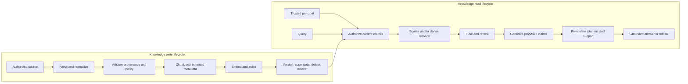
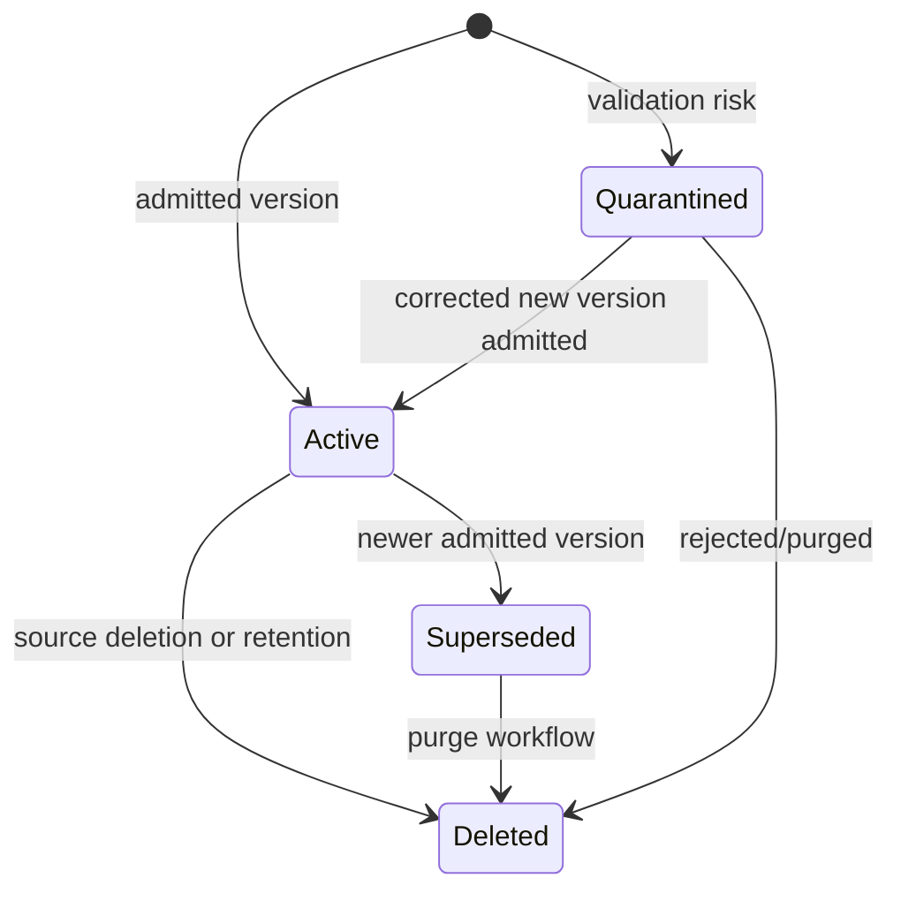

# Course 4 — Production RAG and Knowledge Systems

- **Level:** Advanced
- **Time:** 3 weeks, 20–24 hours
- **Prerequisites:** [Course 2 — distributed systems](../02-cloud-distributed-ai-systems/README.md)
  and [Course 3 — identity and authorization](../03-enterprise-identity-agent-authorization/README.md)
- **Scenario:** Northstar's governed underwriting policy knowledge system
- **Primary lab:** [production_rag_knowledge_systems.ipynb](production_rag_knowledge_systems.ipynb)
- **Reusable implementation:** [lab.py](lab.py)
- **Checkpoint:** [checkpoint.json](checkpoint.json)
- **Last reviewed:** 2026-09-21

## Course thesis

A Staff-level AI specialist can design, evaluate, secure, and operate the complete knowledge
lifecycle behind retrieval-augmented generation. The system must prove source provenance,
authorization, currency, retrieval quality, and claim support; embeddings and fluent answers prove
none of those properties by themselves.

## Learning outcomes

By the end, you can:

1. define a knowledge contract from source identity through parsing, chunking, indexing, retrieval,
   generation, citation validation, deletion, and recovery;
2. explain BM25, dense dual-encoder retrieval, approximate nearest neighbours, reciprocal rank
   fusion, late interaction, and reranking well enough to choose among them;
3. preserve tenant, ACL, classification, version, effective time, locator, producer, and digest on
   every retrievable chunk;
4. enforce current authorization and lifecycle constraints before sparse, vector, hybrid, or
   reranking stages;
5. design idempotent ingestion, optimistic versioning, supersession, quarantine, tombstones,
   re-embedding, and poison recovery;
6. measure Recall@k, MRR, nDCG@k, citation correctness/completeness, forbidden outcomes, stale
   exposure, and valid work blocked with explicit denominators;
7. separate retrieval relevance, answer usefulness, factual support, safety, latency, and cost;
8. compare PostgreSQL/pgvector, search engines, dedicated vector databases, managed knowledge
   services, and framework layers from requirements rather than fashion;
9. place query transformation, HyDE, late interaction, hierarchical/graph, and multimodal retrieval
   behind evidence gates; and
10. produce a defensible data contract, retrieval experiment, architecture decision record, and
    production migration plan.

## Prerequisites, success criteria, and non-goals

You should already understand typed Python, idempotency, conditional writes, tenant isolation,
trusted principal state, policy enforcement, and basic LLM/RAG concepts. Course 1 intentionally used
a tiny retriever; this course owns the missing data and retrieval system.

You succeed when the notebook runs without credentials and proves all of these:

- an exact identifier query and a semantic paraphrase expose different sparse/dense behaviour;
- hybrid retrieval covers both without claiming universal superiority;
- another tenant, a restricted source, a superseded version, a deletion, and a poisoned upload
  never enter an unauthorized user's ranked set;
- a schema-valid forged citation and a retrieved-but-unsupported claim fail closed;
- evidence deleted between retrieval and answer validation cannot be cited;
- metrics state their population, numerator, denominator, cutoff, and failure meaning.

This course does **not** claim that its eight-dimensional semantic fixture represents a production
embedding model, that a toy corpus predicts live relevance, or that RAG eliminates hallucination or
prompt injection. It does not benchmark vendor throughput or replace privacy, legal, records,
security, or source-owner review.

## Why production RAG is a knowledge system

The original RAG formulation combined parametric generation with retrieved non-parametric memory,
motivated partly by update and provenance problems in model parameters
([Lewis et al., 2020](https://arxiv.org/abs/2005.11401)). A prototype often compresses that idea to:

```text
files → chunks → embeddings → vector search → prompt → answer
```

That path omits the hard enterprise questions:

- Who authorized the connector to read and index a source?
- Which source version and page support a claim?
- Did permissions change after indexing?
- Is a superseded or deleted chunk still reachable?
- Did parsing corrupt a table, heading, unit, or reading order?
- Does the index contain hostile instructions or an unauthorized upload?
- What happens when the embedding model changes?
- Can an answer cite a chunk that was never retrieved or no longer exists?
- Are retrieval improvements real on the application's query mix and access slices?

RAG moves knowledge from opaque model weights into an inspectable data path. That is valuable only
if the data path is governed.

## Mental model: two lifecycles and one evidence boundary



The trusted application owns both lifecycles. A parser proposes extracted structure. An embedding
model proposes geometry. A retriever proposes candidates. A generator proposes claims and citation
IDs. Application code validates, authorizes, versions, filters, records, and rechecks each artifact.

The central evidence invariant is:

```text
claim is publishable
  only if every citation was retrieved for this trusted principal
  and the cited source is still authorized, current, and unchanged
  and at least one cited evidence unit supports that exact claim
```

## The knowledge contract

### Source identity and provenance

A durable source record needs more than text:

| Field | Why it exists |
|---|---|
| tenant and document ID | stable ownership and isolation |
| source URI and locator | human verification and incident response |
| source version and digest | change detection and exact evidence binding |
| producer/connector | supply-chain accountability |
| updated/effective/expiry time | freshness and temporal truth |
| ACL groups and classification | query-time authorization |
| parser/chunker/embedding versions | reproducibility and migration |
| lifecycle state | active, superseded, deleted, or quarantined |

The lab computes a canonical SHA-256 digest over content and metadata. A digest proves equality to
the hashed input—not truth, authority, safety, or correct parsing.

### Chunk identity

Chunk IDs are derived from tenant, document, version, ordinal, and source digest. They are stable for
the same indexed representation and change when source evidence changes. Every chunk inherits the
source's ACL, classification, version, locator, effective interval, producer, and digest.

Do not attach permissions only to the parent file while storing children in a flat unprotected
namespace. OWASP's current RAG security guidance identifies access-control inheritance, poisoning,
embedding exposure, and index integrity as material risks
([RAG Security Cheat Sheet](https://cheatsheetseries.owasp.org/cheatsheets/RAG_Security_Cheat_Sheet.html)).

### Lifecycle state



The lab deliberately does not let a quarantined new version supersede the last known-good active
version. Recovery requires a new, reviewed version. Production policy may instead fail closed for
the whole document; record that decision explicitly.

## Ingestion mechanics

### Parse and normalize

PDF is a layout format, not a semantic data contract. Reading order, tables, footnotes, images,
forms, OCR, formulas, and hidden layers can alter meaning. Route formats deliberately:

- Apache Tika detects types and extracts text/metadata across many formats
  ([official project](https://tika.apache.org/));
- Docling targets structured document conversion including layout, tables, and OCR
  ([technical report](https://arxiv.org/abs/2408.09869));
- Unstructured partitions into typed elements and offers structure-aware chunking
  ([chunking documentation](https://docs.unstructured.io/api-reference/partition/chunking));
- cloud document-intelligence services may reduce operations but add residency, cost, provider,
  model-version, and reproducibility questions.

Evaluate parsers on field/table accuracy, reading order, locator preservation, failure visibility,
latency, cost, and downstream retrieval—not screenshot appeal. Keep the original immutable object
and extraction manifest so a bad parser release can be replayed or rolled back.

### Chunking

Chunking trades context against retrievability and cost:

| Strategy | Strength | Failure mode | Use when |
|---|---|---|---|
| fixed token window | simple, fast, reproducible | splits structure and duplicates overlap | baseline and uniform prose |
| heading/element aware | preserves semantic units and locators | depends on parser quality | policies, manuals, contracts |
| parent-child | precise child retrieval with broader parent context | more storage and join logic | long structured documents |
| semantic segmentation | boundaries follow topic shifts | model/version sensitivity | heterogeneous prose after evaluation |
| late chunking | encodes long context before pooling chunks | long-context embedding cost/limits | context loss is measured |
| visual/multimodal regions | preserves layout/table/image evidence | compute and model complexity | visually rich documents |

Late chunking is an emerging technique that embeds tokens with broader document context before
pooling chunk representations ([Günther et al., 2024/2025](https://arxiv.org/abs/2409.04701)). It is
an experiment candidate, not a default. Store parent/child relations and never let overlap create
fake independent corroboration.

### Versioning and idempotency

One logical ingestion operation has a stable operation ID. Repeating the same operation and payload
returns the prior manifest; reusing the ID with different content is a conflict. A conditional
`expected_current_version` prevents an older worker from replacing a newer index state.

Index publication should be atomic from the reader's perspective. Common patterns include:

1. build an immutable versioned index, validate it, then switch an alias;
2. write versioned chunks and update a current-version manifest transactionally;
3. use an outbox/change-data-capture path from the source of truth and reconcile gaps.

Never delete the source first and hope an eventually consistent vector index catches up. Tombstone
or deny at the serving boundary immediately, then purge projections under an owned SLO.

## Retrieval foundations

### Sparse retrieval and BM25

Sparse retrieval represents exact terms. BM25 scores term frequency with saturation, rarity, and
document-length normalization. A common form is:

$$
\operatorname{BM25}(q,d)=\sum_{t\in q}\operatorname{IDF}(t)
\frac{f(t,d)(k_1+1)}{f(t,d)+k_1(1-b+b|d|/\operatorname{avgdl})}.
$$

It is strong for policy IDs, names, error codes, product numbers, and exact terminology. It can miss
paraphrases. BEIR found BM25 a robust zero-shot baseline and found reranking/late interaction strong
on average but more computationally expensive
([BEIR](https://arxiv.org/abs/2104.08663)). Always retain a lexical baseline.

### Dense retrieval

A dual encoder maps query and passage to vectors, then ranks by a similarity such as cosine:

$$
\cos(q,d)=\frac{q\cdot d}{\lVert q\rVert\lVert d\rVert}.
$$

Dense Passage Retrieval demonstrated the effectiveness of learned dense representations for open
domain QA ([DPR](https://arxiv.org/abs/2004.04906)). Dense retrieval can bridge vocabulary gaps but
can blur exact identifiers, numbers, negation, rare entities, or domain distinctions. Embedding
model, instruction, normalization, dimensions, distance function, and version are one contract.

The lab's deterministic vector has eight hand-written semantic concepts. It exists to make a
paraphrase experiment inspectable and repeatable. It is not an embedding benchmark.

### Approximate nearest-neighbour indexes

Exact vector search computes every distance. Approximate indexes exchange recall for latency,
memory, and build/update cost. HNSW constructs a navigable multi-layer graph
([Malkov and Yashunin](https://arxiv.org/abs/1603.09320)); IVF partitions the space and searches
selected clusters. Tune candidate breadth against exact-search recall on production-like filters.

Filtering and ANN interact. A search may visit near neighbours that fail tenant/ACL predicates and
return too few authorized results. `pgvector`, for example, documents iterative scans, partial
indexes, partitioning, and exact-search comparison for filtered ANN
([official pgvector documentation](https://github.com/pgvector/pgvector)). Security filters must be
correct even while recall and latency are tuned.

### Hybrid fusion

Sparse and dense scores are not naturally comparable. Reciprocal rank fusion (RRF) combines ranks:

$$
\operatorname{RRF}(d)=\sum_{r\in R}\frac{1}{k+\operatorname{rank}_r(d)}.
$$

RRF ignores raw score scale, is simple, and is a strong starting point. Score normalization or a
learned fusion model may do better when calibrated judgments justify the extra coupling. OpenSearch
supports both score normalization and rank-based fusion and explicitly recommends comparing them on
your own judgment set ([hybrid search](https://docs.opensearch.org/latest/vector-search/ai-search/hybrid-search/index/)).

### Reranking and late interaction

A first-stage retriever optimizes candidate recall cheaply. A reranker spends more computation on a
small authorized candidate set. Cross-encoders jointly inspect query and passage; late-interaction
retrievers keep token-level representations. ColBERTv2 illustrates the quality/storage trade-off of
late interaction ([ColBERTv2](https://arxiv.org/abs/2112.01488)).

Reranking cannot recover a relevant document absent from the candidate pool. It must never receive
unauthorized candidates. Record candidate count, model/version, scores, cutoff, latency, and the
exact policy/corpus versions used.

## Authorization before ranking

The safe order is:

```text
trusted principal and current entitlements
  → tenant / ACL / classification authorization
  → active / effective / authoritative lifecycle
  → sparse and vector candidate generation
  → fusion and reranking
  → generation
  → citation and lifecycle revalidation
```

Filtering only after global top-k can reduce recall, expose IDs/scores/timing, waste compute, and
feed restricted text to a reranker. Search products differ in when and how filters execute. Azure AI
Search documents permission metadata and query-time document access patterns, with some native
identity features explicitly marked preview
([document-level access](https://learn.microsoft.com/en-us/azure/search/search-document-level-access-overview)).
Treat preview maturity and ACL synchronization limits as architecture inputs.

Do not accept `tenant_id`, `groups`, `classification`, or `include_deleted` from model-generated
query arguments. Derive them from trusted application state and compile them into every retrieval
branch. Course 3's subject/workload policy still applies to indexing and query services.

## Generation and citation validation

Retrieved text is untrusted **data**, not instructions. Prompt injection remains possible even with
RAG; RAG is not a prompt-injection mitigation
([OWASP Prompt Injection](https://genai.owasp.org/llmrisk/llm01-prompt-injection/)). Separate content
with explicit delimiters and provenance, limit tools, validate outputs, and keep external effects
behind Course 3 authorization/approval boundaries.

A URL-looking string or schema-valid citation ID is not evidence. The lab represents extracted
facts as stable fact IDs so support can be checked deterministically:

1. every claim has at least one citation;
2. every citation belongs to this request's retrieved set;
3. the exact chunk digest remains unchanged;
4. authorization, lifecycle, and effective time are rechecked after generation;
5. at least one cited chunk contains the claim's fact ID and exact fixture text.

A production verifier may use structured source spans, natural-language-inference models, claim
matching, or calibrated judges. Those are fallible measurements. Sample human review and
high-impact deterministic rules remain necessary.

## Evaluation: isolate the stage that failed

Use a versioned evaluation set with query, trusted principal/access slice, time, relevant evidence,
forbidden evidence, expected answer facts, and no-answer cases.

### Retrieval metrics

- **Recall@k:** relevant retrieved evidence / all labelled relevant evidence. High recall supplies
  the generator with what it needs.
- **Precision@k:** relevant hits / returned hits. It approximates context focus but depends on
  complete judgments.
- **MRR:** mean of `1 / rank` of the first relevant result. It emphasizes the first useful hit.
- **nDCG@k:** discounted gain normalized by an ideal ranking. It supports graded relevance.
- **ANN recall:** overlap between approximate and exact top-k under the same filter.

The lab reports micro Recall@k using relevant-document counts, and macro MRR/nDCG across queries.
It also reports actual forbidden outcomes and valid queries with no hits. “Four attacks blocked” is
not an unauthorized-exposure rate.

### Answer and citation metrics

Measure separately:

- answer correctness or task success against a domain rubric;
- claim support/faithfulness: supported claims / answer claims;
- citation completeness: claims with citations / claims requiring citations;
- citation correctness: supporting citation links / citation links;
- citation precision/recall against labelled evidence;
- refusal correctness for unanswerable or unauthorized queries;
- user outcome, latency, tokens, and cost per successful compliant answer.

Ragas proposes reference-free metrics for context and generation dimensions
([Ragas](https://arxiv.org/abs/2309.15217)); RAGChecker adds fine-grained diagnostic metrics
([RAGChecker](https://arxiv.org/abs/2408.08067)). Automated judges accelerate iteration but require
calibration against blinded human labels, slices, uncertainty, and drift. They are not ground truth.

### Required slices

At minimum slice by tenant, role/ACL, document type, language, query class, exact identifiers,
semantic paraphrases, temporal questions, table/image dependence, no-answer, source age, long-tail
entity, and adversarial content. A single average can hide a catastrophic tenant or deletion leak.

## Architecture and technology landscape

| Option | Strong fit | Limits and review questions |
|---|---|---|
| PostgreSQL + full text + pgvector | relational source and modest/medium vector workload | filtered ANN, scale, index build, operational headroom |
| OpenSearch / Elasticsearch | mature lexical search, filters, hybrid pipelines, operations | cluster skill, resource cost, consistency with source of truth |
| Qdrant, Milvus, Weaviate, Pinecone | vector-first workloads and managed/specialized features | lexical depth, tenant model, metadata filtering, exit path |
| Azure AI Search / managed cloud search | integrated ingestion, identity, semantic features | preview boundaries, region, provider coupling, reindex semantics |
| Vespa | large-scale programmable retrieval/ranking | specialist operating and ranking expertise |
| managed model-provider file search | fastest bounded product integration | lifecycle/control/portability/observability constraints |

Qdrant documents hybrid/multi-stage queries and several multitenancy strategies
([hybrid queries](https://qdrant.tech/documentation/search/hybrid-queries/),
[multitenancy](https://qdrant.tech/documentation/manage-data/multitenancy/)). Elasticsearch recommends
RRF as a hybrid starting point ([hybrid search](https://www.elastic.co/docs/solutions/search/hybrid-search)).
These features do not select an architecture for you.

Frameworks such as LlamaIndex, LangChain, Haystack, and provider SDKs can accelerate connectors and
composition. Keep the domain contract outside the framework: stable IDs, ACL provenance, lifecycle,
idempotency, retrieval traces, citations, evaluation cases, and rollback must survive replacement.

## State of the art: established, emerging, frontier

### Established production baseline

- structure-aware parsing with immutable originals and manifests;
- versioned chunks carrying source, locator, digest, ACL, lifecycle, and model versions;
- authorization and active-state filtering before ranking;
- BM25 plus dense retrieval, RRF/normalized fusion, optional reranking;
- labelled retrieval judgments plus answer/citation evaluation;
- alias/version-based index rollout, tombstones, reconciliation, and reindex/re-embedding plans;
- retrieval/generation traces with privacy-safe IDs and versions.

### Conditional upgrades

- **Query expansion/rewriting:** useful for shorthand or conversational queries; can alter intent and
  must keep the original query, generated variants, budgets, and evaluation.
- **HyDE:** generates a hypothetical document before dense retrieval and showed zero-shot retrieval
  gains in its evaluated settings ([HyDE](https://arxiv.org/abs/2212.10496)); generation cost and
  invented terms can hurt exact or regulated searches.
- **Late interaction:** improves token-level matching at greater storage/compute complexity.
- **Parent-child/hierarchical retrieval:** helps cross-section questions; RAPTOR recursively builds
  summary trees ([RAPTOR](https://arxiv.org/abs/2401.18059)). Summaries are derived evidence and need
  lineage, validation, and deletion propagation.
- **Graph RAG:** useful for global/relational questions when entity and relationship extraction are
  reliable; Microsoft's GraphRAG research targets query-focused summarization over graph-derived
  community structure ([GraphRAG paper](https://arxiv.org/abs/2404.16130)). It is not a free upgrade
  for ordinary fact lookup.
- **Multimodal retrieval:** preserves pages, tables, figures, and visual layout. ColPali retrieves
  document pages with vision-language representations
  ([ColPali](https://arxiv.org/abs/2407.01449)); evaluate OCR/layout quality, storage, access, and
  citation UX.

### Research and open problems

- robust retrieval under rapidly changing corpora and entitlement graphs;
- filtered ANN with predictable recall/latency under skewed tenants;
- reliable claim-level support over tables, images, conflicting sources, and temporal facts;
- poisoning detection without blocking legitimate policy/security language;
- embedding privacy, inversion, membership inference, and deletion verification;
- evaluation judgments that stay current as source truth changes;
- cost-effective long-context versus retrieval routing;
- cross-language, multimodal, and domain-shift generalization.

Do not call an architecture state of the art because it uses the newest retriever. State of the art
means the best evidenced fit for this corpus, access model, query distribution, risk, latency, cost,
team, and change rate.

## Practical lab

Run from the repository root:

```bash
uv sync --locked
uv run pytest tests/test_course_04_lab.py
uv run jupyter execute \
  curriculum/advanced/04-production-rag-knowledge-systems/production_rag_knowledge_systems.ipynb \
  --inplace
```

The notebook follows one Northstar scenario:

1. inspect versioned manifests and chunk provenance;
2. prove ingestion replay and optimistic version conflicts;
3. observe superseded, deleted, and quarantined states;
4. compare BM25-like sparse and deterministic semantic retrieval;
5. fuse them with RRF and inspect scores/traces;
6. verify regular versus senior and cross-tenant result sets;
7. evaluate exact, semantic, restricted, and safety cases;
8. generate one deterministic claim and validate citation support;
9. inject forged citation, unsupported claim, and delete-during-generation failures;
10. translate the contracts to a production architecture.

## Evaluation contract for the lab

| Case | Expected outcome | Forbidden outcome |
|---|---|---|
| exact `UW-17` | sparse/hybrid find current debt policy | stale version or dense result invented |
| semantic liability paraphrase | dense/hybrid find debt policy | another tenant's closer text returned |
| regular user asks executive waiver | no restricted evidence | ID, score, text, or citation leaks |
| senior user asks executive waiver | restricted current evidence may rank | access inferred from prompt role |
| poisoned uploaded note | quarantine, never rank | retrieved instructions influence answer |
| retired policy | tombstoned, never rank | stale citation after delete |
| forged citation ID | fail closed | schema-valid ID treated as evidence |
| unsupported claim over real hit | fail closed | relevance treated as factual support |
| evidence deleted after retrieval | fail closed on revalidation | time-of-check/time-of-use leak |

## Failure modes and mitigations

| Failure | Why it happens | Mitigation |
|---|---|---|
| wrong tenant enters ANN candidates | filter omitted/inconsistent across branches | compile trusted policy into every candidate stage; negative tests |
| permission change not reflected | ACL copied once and never synchronized | entitlement/source versions, CDC/reconciliation, deny SLA |
| old policy still ranks | supersession is append-only without current manifest | conditional version publication and active-state filter |
| deleted chunk is citable | projection deletion lags or answer races delete | immediate tombstone plus citation-time revalidation |
| poisoned upload replaces good policy | ingestion equates newest with valid | quarantine without promotion; reviewed recovery version |
| exact code disappears | dense-only retrieval | retain lexical/hybrid baseline and exact-query slice |
| semantic paraphrase disappears | sparse-only retrieval | evaluated dense branch and fusion |
| filtered ANN returns too few | candidate budget spent on filtered neighbours | tune/filter-aware index, iterative scans, partitions, exact fallback |
| chunk loses table/heading context | naive fixed splitting or parser error | structure-aware/parent-child chunks and parser evaluation |
| duplicate overlap looks corroborated | chunks from one source counted independently | source-level lineage and unique-source metrics |
| fluent answer cites real but irrelevant chunk | citation existence mistaken for support | claim-to-evidence validation and human-calibrated evaluation |
| re-embedding silently changes quality | model version overwritten in place | dual index, replayed eval, canary, alias switch, rollback |
| global metric hides leak | averages mix tenants/roles/query classes | required security, lifecycle, and long-tail slices |

## Production upgrade checklist

- [ ] Source owners, connector identities, allowed formats, size limits, malware handling, and legal
  basis are documented.
- [ ] Original objects and manifests are immutable/versioned; parser failure is explicit.
- [ ] Every chunk carries tenant, ACL/classification, source/version/locator/digest, lifecycle,
  parser/chunker/embedding versions, and lineage.
- [ ] Ingestion and deletion have stable operation IDs, conditional versions, retry ownership,
  reconciliation, and dead-letter recovery.
- [ ] Quarantine does not silently publish or replace known-good knowledge.
- [ ] Authorization/current-state filtering occurs before every candidate generation and reranking
  stage; filter behaviour is load- and recall-tested.
- [ ] Embeddings receive source-equivalent access, encryption, retention, and deletion controls.
- [ ] Exact, sparse, dense, hybrid, and reranking choices are backed by labelled query slices.
- [ ] ANN recall is compared with exact search under representative filters and tenant skew.
- [ ] Retrieval traces include safe IDs, policy/corpus/model versions, scores, cutoffs, latency, and
  reason codes without sensitive content.
- [ ] Generator inputs treat retrieved content as data; tools and effects retain independent policy.
- [ ] Citations are request-bound, current, authorized, locatable, and claim-supporting.
- [ ] No-answer, conflicting-source, stale, deleted, poisoned, cross-tenant, and forged-citation
  tests are release gates.
- [ ] Index/model upgrades use shadow evaluation, canary/alias promotion, rollback, and deletion
  reconciliation.
- [ ] SLOs cover ingest lag, permission/delete propagation, query latency, availability, and
  freshness—not only model latency.
- [ ] Cost is measured per successful compliant answer, including parsing, embeddings, storage,
  search, reranking, generation, evaluation, and operations.

## Portfolio evidence

Produce five reviewable artifacts:

1. **knowledge data contract:** IDs, versions, provenance, ACL, lifecycle, parsing, chunking,
   embedding, deletion, retention, and error semantics;
2. **retrieval evaluation:** labelled cases and sparse/dense/hybrid/rerank results with correct
   denominators and access/freshness slices;
3. **architecture ADR:** PostgreSQL/pgvector versus search engine versus vector service, including
   filter semantics, consistency, scale, operations, portability, cost, and reversal triggers;
4. **threat and failure model:** connector compromise, poisoning, injection, cross-tenant access,
   embedding leakage, stale ACL, deletion lag, forged citation, and rollback;
5. **migration plan:** backfill, dual write/read, shadow evaluation, cutover, reconciliation,
   observability, rollback, and decommissioning.

## Exercises

1. Add an effective-dated future policy and prove it cannot rank early.
2. Add a corrected version after a poisoned version; decide whether version numbers may have gaps.
3. Add graded relevance and modify nDCG; explain how incomplete judgments bias the metric.
4. Implement weighted score fusion and compare it with RRF on the same cases.
5. Add parent-child retrieval without counting parent and child as independent corroboration.
6. Design a cache key that safely includes principal/entitlement, tenant, policy, corpus, query,
   filter, retriever/model, and top-k versions; define invalidation.
7. Benchmark approximate versus exact filtered search on a production-like corpus and identify the
   recall/latency/cost frontier.
8. Write the ADR and name the evidence that would justify GraphRAG, HyDE, late interaction, or
   multimodal retrieval instead of the established baseline.

## Knowledge checkpoint

Complete [checkpoint.json](checkpoint.json) after the notebook. Passing is 80%. Defend every answer
in terms of trust boundaries, failure semantics, and measured trade-offs.

## Primary and authoritative references

- Lewis et al., [Retrieval-Augmented Generation](https://arxiv.org/abs/2005.11401).
- Karpukhin et al., [Dense Passage Retrieval](https://arxiv.org/abs/2004.04906).
- Thakur et al., [BEIR](https://arxiv.org/abs/2104.08663).
- Santhanam et al., [ColBERTv2](https://arxiv.org/abs/2112.01488).
- Gao et al., [HyDE](https://arxiv.org/abs/2212.10496).
- Sarthi et al., [RAPTOR](https://arxiv.org/abs/2401.18059).
- Edge et al., [GraphRAG](https://arxiv.org/abs/2404.16130).
- Faysse et al., [ColPali](https://arxiv.org/abs/2407.01449).
- Es et al., [Ragas](https://arxiv.org/abs/2309.15217).
- Ru et al., [RAGChecker](https://arxiv.org/abs/2408.08067).
- [OpenSearch hybrid search](https://docs.opensearch.org/latest/vector-search/ai-search/hybrid-search/index/).
- [pgvector official documentation](https://github.com/pgvector/pgvector).
- [Azure AI Search document-level access control](https://learn.microsoft.com/en-us/azure/search/search-document-level-access-overview).
- [OWASP RAG Security Cheat Sheet](https://cheatsheetseries.owasp.org/cheatsheets/RAG_Security_Cheat_Sheet.html).

## Next course

[Course 5 — Agentic AI Architecture and AgentCore](../../../COURSE_PLAN.md#course-5--agentic-ai-architecture-and-agentcore)
will use this governed evidence layer inside bounded workflows and agents. Retrieval results remain
untrusted data; they do not expand agent authority or authorize external effects.
