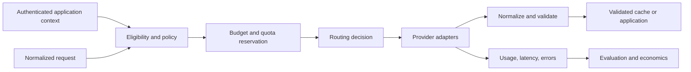

# Course 6 — Model Gateways and Inference Economics

Model access is a policy and economics layer balancing task quality, latency, availability,
privacy, safety, and cost. It is not merely a provider SDK call with a different base URL.

This course turns Northstar's underwriting model calls into a governed inference product. You will
normalize provider mechanics without pretending models are interchangeable, compare direct,
cascade, fallback, and delayed-hedge policies, and choose a route from measured workload evidence.

## Learning outcomes

After completing the chapter and lab, you can:

1. define a provider-neutral request, response, error, usage, and streaming contract while
   preserving provider capability differences;
2. separate authenticated model eligibility from model or prompt-supplied routing preferences;
3. distinguish direct selection, load balancing, semantic routing, cascades, reliability fallback,
   and delayed hedging;
4. classify failures so authentication, authorization, invalid requests, residency, and safety
   denials never become provider-shopping loops;
5. reserve worst-case token and spend capacity before inference and reconcile actual usage after it;
6. distinguish provider prompt/KV caching from application response caching and design safe keys;
7. calculate request cost, retry amplification, cascade economics, and cost per successful
   compliant task;
8. evaluate routing policies across labelled workload slices, quality, tail latency, availability,
   policy compliance, and total work;
9. identify router drift, correlated provider failure, output-schema drift, and silent fallback as
   production risks;
10. compare direct APIs, Amazon Bedrock, LiteLLM, cloud API management, and open inference gateways;
11. write a gateway ADR, routing policy, sensitivity analysis, and production migration plan; and
12. explain why a normalized API is not proof of semantic portability.

## Prerequisites

- [Course 2 — Cloud and Distributed AI Systems](../02-cloud-distributed-ai-systems/README.md):
  deadlines, retries, quotas, partial failure, and work amplification.
- [Course 3 — Enterprise Identity and Agent Authorization](../03-enterprise-identity-agent-authorization/README.md):
  authenticated scope, policy enforcement, and tenant boundaries.
- [Course 5 — Agentic AI Architecture and AgentCore](../05-agentic-ai-architecture-agentcore/README.md):
  bounded model/tool calls, application-owned control, and evaluation denominators.
- Comfort with typed Python, probability, percentiles, and basic unit economics.

Course 7 will build observability and reliability objectives on the gateway signals designed here.

## Scenario, success contract, and non-goals

Northstar's underwriting assistant serves simple, complex, restricted, and distribution-shifted
cases. A small model is inexpensive and fast but misses some complex decisions. A premium model is
more accurate on the labelled set but slower and more expensive. Both have quotas and can fail.
Restricted data must remain in the required region. Every accepted response must match the
application schema and the requested case.

The team is considering four policies:

- always call the economy model;
- always call the premium model;
- call the economy model and escalate when a calibrated acceptance score is low; or
- fall back or hedge only for an explicit reliability or latency objective.

Success means selecting the lowest-cost policy that meets explicit compliant-success and tail-
latency constraints on representative cases. Fluent output, a low average price, or a successful
HTTP response is not enough.

This course does not claim that fictional deterministic models predict live-provider quality or
prices. It does not teach GPU kernel optimization, train a router model, reproduce proprietary
provider routing, or recommend a vendor without workload evidence.

## Mental model: one trusted inference boundary



The gateway has two distinct jobs:

1. **Control-plane job:** admit models, versions, prompts, tenants, regions, credentials, budgets,
   routes, and policy changes.
2. **Data-plane job:** authenticate each call, reserve capacity, choose an eligible route, translate
   the request, enforce the deadline, normalize and validate the result, meter usage, and emit
   observable decisions.

The model may help predict which model is likely to work. It does not authorize itself, choose a
tenant, move restricted data, raise a budget, weaken a schema, or suppress usage records.

## Foundations: abstraction without false equivalence

### Normalize the stable application contract

A useful internal contract carries:

- stable request and task IDs;
- authenticated principal, workload, tenant, and required processing region outside prompt text;
- task kind and reviewed prompt version;
- input and maximum output tokens;
- deadline and streaming requirement;
- required capabilities such as structured output, tools, vision, or long context;
- data classification and retention constraints; and
- a typed output schema with semantic bindings such as the requested case ID.

Provider adapters should translate message roles, tool definitions, schema syntax, stream events,
usage, request IDs, and typed errors. The application contract must not collapse meaningful
differences. A provider may accept a parameter and ignore it, support only part of JSON Schema,
emit different stream events, count tokens differently, or store state under different rules.

### Schema validity is not semantic validity

Structured output reduces parsing failure. It does not prove that:

- the response belongs to the requested case;
- the recommendation is correct or grounded;
- the provider and region were authorized;
- the model followed the reviewed prompt version;
- a safety refusal should be bypassed; or
- the output is safe to cache and reuse.

The Course 6 lab validates exact fields, types, enums, confidence range, schema version, and case
binding after every provider call. Business-quality evaluation remains separate.

### Provider identity is configuration, not content

A prompt saying “use the US premium model” is untrusted data. Model eligibility comes from current
authenticated tenant policy, classification, residency, capability, context length, lifecycle,
and availability. A router may choose only within that admitted set.

This separation prevents a confused-deputy gateway: a caller can request a business task, but
cannot smuggle provider, region, retention, or billing-account selection through content.

## Internal mechanics

### Request lifecycle

1. Validate the normalized request and authenticated context.
2. Revalidate entitlement and prompt-policy versions.
3. Compute the eligible model set from trusted metadata.
4. Check an application response cache using a tenant- and version-scoped key.
5. Reserve worst-case request cost and tokens before each possible call.
6. Select a route from the configured policy.
7. Translate through a provider adapter and start a unique attempt under one logical request ID.
8. Enforce the application deadline and classify any failure.
9. Normalize usage, price the attempt, and settle reservations even when the result is unusable.
10. Validate the output schema and request/resource binding.
11. Apply a calibrated acceptance gate or explicit fallback rule where configured.
12. Return one application-owned terminal result and complete telemetry.

### Stable request versus attempt identity

One user task has a stable logical request ID. Every retry, fallback, or hedge gets a separate
attempt ID and provider request ID. This distinction is essential:

- support teams can correlate one task across providers;
- cost attribution includes failed and losing attempts;
- retry amplification is visible;
- a late hedge response cannot overwrite the selected result; and
- a provider timeout does not vanish from economics.

Inference is often read-like, but it is not free of side effects: providers may bill, log, reserve
capacity, or create state even when the client loses the response. A retry can also produce a
different answer. Do not call retries economically or semantically idempotent without evidence.

### Error taxonomy and retry ownership

| Error class | Default action | Why |
|---|---|---|
| bad authentication or credential | stop and alert | another model must not hide a control-plane failure |
| authorization, residency, data policy | deny | provider shopping would violate policy |
| malformed/unsupported request | stop | retrying unchanged input amplifies invalid work |
| safety refusal | stop or use reviewed application path | arbitrary fallback may bypass a safety decision |
| rate limit/throttle | bounded retry or eligible fallback | capacity condition may be transient |
| timeout/unavailable | bounded retry, fallback, or reconcile billing | outcome and cost may be uncertain |
| invalid provider output | validate, then bounded retry/fallback | no output crosses the application boundary |
| deadline exceeded | stop new work | a late success does not repair the user objective |
| budget/quota exhausted | deny before call | limits are controls, not telemetry warnings |

Choose one retry owner. If a provider SDK retries twice, the gateway retries twice, and the client
retries twice, one logical request can create up to 27 upstream attempts. Document whether SDK
retries are disabled, incorporated into the gateway attempt count, or intentionally independent.

### Streaming

Streaming improves time to first token and user perception, not necessarily total latency or cost.
A normalized stream needs explicit event types for content deltas, tool calls, usage, finish
reasons, refusals, and errors. The gateway must handle:

- failure before the first byte versus mid-stream failure;
- clients disconnecting while the provider continues;
- partial output that cannot pass the final schema;
- backpressure and cancellation propagation;
- when usage becomes authoritative; and
- whether fallback after visible partial output would create a confusing composite answer.

Do not promise transparent fallback after content has been shown unless the product explicitly
defines and tests that experience.

## Inference economics

### Price every attempt, not only the winning response

For attempt `j`, a simplified variable cost is:

```text
C_j = U_j × r_input + H_j × r_cached + O_j × r_output + F_j
```

where `U` is uncached input tokens, `H` is cached input tokens, `O` is output tokens, each `r` is
the applicable rate, and `F` contains fixed/provider/network charges. The strategy cost is the sum
of all calls, including retries, cascade probes, and losing hedges, plus gateway operation.

Prices vary by provider, model, region, service tier, batch mode, context band, cache write/read,
and contract. Store effective-dated price metadata and actual billed usage. Never hard-code a blog's
price table as permanent truth.

### Cost per successful compliant task

```text
cost per successful compliant task = total workload cost / compliant correct completions
```

This denominator excludes fluent but wrong answers, policy violations, and failed tasks. Cost per
request can make a cheap model look efficient while it creates rework or incorrect decisions. Also
track cost per attempt, per tenant, per task type, per output token, and per business outcome, but do
not substitute those for the release objective.

### Cascade economics

For a small model followed by a premium model with escalation probability `p`:

```text
E[cost] = C_small + p × C_premium + C_gate
E[latency] ≈ L_small + p × (L_gate + L_premium)
```

The cascade earns its complexity only if the acceptance gate is calibrated on the deployment
distribution. A low threshold accepts more cheap answers and more errors. A high threshold
approaches premium-model cost while adding the small-model call and serial latency.

The lab includes a drift slice where the gate scores a wrong economy answer highly. This makes an
important point: routing confidence is a prediction requiring its own labels, calibration, slices,
monitoring, and retraining policy.

### Fallback availability

If two providers fail independently with availabilities `A1` and `A2`, a rough ceiling is:

```text
A_fallback = 1 - (1 - A1)(1 - A2)
```

Production failures are often correlated: shared clouds, network paths, identity systems, DNS,
gateway state, prompt bugs, safety policy, upstream data, and traffic spikes can fail together.
Measure conditional failure, not only provider status-page uptime. A fallback that cannot satisfy
region, capability, or data policy is not part of the eligible availability set.

### Delayed hedging

Send the primary request at time zero. If it has not completed by delay `d`, send an eligible
secondary. The observed completion is approximately:

```text
min(T_primary, d + T_secondary)
```

when at least one succeeds. Hedging can reduce the tail but increases requests, tokens, and cost.
Set the delay from measured latency distributions, cancel losing work where supported, cap hedge
rates, and exclude expensive or stateful operations. Report wall-clock latency and total provider
work separately.

## Caching without scope leakage

### Provider prompt/KV cache

Prompt caching reuses computation for a matching prefix. It can reduce time to first token and
input cost, but does not reuse the output and does not make generation deterministic. Model,
instructions, tool definitions, schema, ordering, and provider-specific settings can affect hits.
Cache reads may still count toward token quotas. Retention and regional boundaries are part of the
data-policy decision.

### Application response cache

A response cache reuses a completed output. Cache only application-validated results. A safe key
normally includes:

- tenant and relevant subject or authorization scope;
- canonical task/request digest;
- prompt, schema, policy, router, and model generations;
- data/source version or freshness boundary;
- region and classification; and
- any parameter that can change semantics.

Do not cache provider errors, safety refusals as success, unvalidated JSON, or cross-tenant output.
Define TTL, invalidation, deletion, encryption, hit observability, and whether a cache lookup itself
can reveal that another principal submitted matching content.

### Break-even thinking

If a cache write costs `Cw`, a cache read costs `Cr`, uncached processing costs `Cu`, and an entry
is reused `n` times, caching pays on variable cost when:

```text
Cw + n × Cr < (n + 1) × Cu
```

Include miss lookup, storage, invalidation, and quality risk. A high hit rate on stale or wrongly
scoped output is a failure, not an optimization.

## Architecture patterns

### Direct provider call

Best for one bounded application and provider when shared policy, routing, and platform operations
do not justify another hop. Keep an application adapter, deadline, validation, usage, and tests so
the direct design remains deliberate rather than accidental.

### Central model gateway

Best when multiple applications need common identity, credentials, admission, quotas, cost
allocation, audit, routing, or provider translation. It creates a high-value dependency and blast
radius. The gateway needs high availability, configuration rollout, cache/state design, load tests,
tenant isolation, incident ownership, and an emergency bypass policy that does not become the
normal path.

### Static or rule router

Select from task kind, classification, region, capability, tenant tier, request size, or known risk.
Rules are inspectable and often strong baselines. They become brittle when workload complexity is
continuous or rules encode untested folklore.

### Learned semantic router

Predict the model most likely to meet a quality/cost objective from the request. This adds a model
whose quality, latency, cost, calibration, security, training data, drift, and failure modes must be
operated. Compare it with static, random, cheapest, and always-premium baselines.

### Model cascade

Call an inexpensive model first and escalate based on validation or a calibrated acceptance gate.
Cascades spend serial latency and the first-call cost on escalated cases. Never use model
self-confidence as the sole acceptance signal; it may be miscalibrated and strategically affected
by the same output being judged.

### Reliability fallback

Use another eligible model after an explicitly retryable capacity or dependency failure. Fallback
is not quality routing and should not silently handle authorization, safety, invalid request, or
residency denial. Validate the fallback's output separately and record the provider/model actually
used.

### Hedged request

Start a second eligible request only after the primary exceeds a measured delay. Useful for strict
tail-latency objectives when extra load is affordable. It is a poor default for expensive calls,
tight quotas, shared failure domains, or requests whose duplicates create external state.

## Quotas, budgets, and concurrency

Provider quotas commonly involve requests per minute, tokens per minute, concurrency, daily
limits, and model-specific pools. They are capacity constraints, not spend controls. A budget is a
financial/application constraint, not a substitute for rate limiting.

Concurrent requests can all pass a naive “current spend < limit” check and overshoot together. A
hard gateway limit needs atomic reservation:

1. estimate maximum admissible input/output usage;
2. reserve the worst-case amount before the provider call;
3. reject if current spend plus outstanding reservations would exceed the cap;
4. settle the reservation to authoritative actual usage; and
5. reconcile missing/late provider billing records.

The same pattern applies to token and concurrency quotas. Decide whether state lives in one process,
Redis, a transactional database, or a provider control plane and what happens when that state is
stale or unavailable. “Fail open” and “fail closed” are explicit risk decisions.

## Prompt and model lifecycle

A route references immutable or resolved versions of:

- application contract and output schema;
- prompt/template;
- provider adapter;
- model/deployment;
- safety and eligibility policy;
- router or acceptance gate;
- price table; and
- evaluation dataset and release thresholds.

Aliases such as `latest` simplify experimentation but make incident reconstruction difficult.
Resolve them to a version in telemetry. Provider deprecation can change availability, parameters,
tokenization, schemas, safety behavior, price, and output distribution. Run shadow evaluation and a
rollback-compatible migration before retirement.

## Evaluation contract

### Labelled workload

Represent production task mix and slices: simple, complex, long context, restricted, multilingual,
safety-sensitive, high-value, rare formats, and known drift. Include provider faults, bad schemas,
deadlines, quota pressure, and cache conditions. Split router training, threshold tuning, and final
evaluation data to avoid optimistic routing results.

### Metrics and denominators

| Measure | Population | Direction |
|---|---|---|
| task success | all labelled tasks | higher |
| compliant success | all labelled tasks | higher |
| forbidden outcomes | all attempts or cases, state explicitly | zero |
| valid work blocked | valid eligible tasks | lower |
| fallback/escalation rate | logical tasks | diagnose |
| provider attempts per task | logical tasks | lower subject to reliability |
| p50/p95/p99 latency | logical tasks, end to end | lower under SLO |
| total provider work | all attempts, including losers | lower |
| cache hit rate | eligible lookups | diagnose with freshness |
| cost per compliant success | compliant correct completions | lower under quality floor |
| router calibration/error | labelled routing decisions | lower |

Report results by slice and selected provider. An aggregate can hide that restricted or complex
cases fail while easy traffic dominates.

### Quality–latency–cost frontier

A policy is Pareto-dominated when another policy is at least as good on compliant success, tail
latency, and cost per compliant success and strictly better on one. The frontier narrows choices;
release constraints make the decision. Quality and compliance are normally floors, latency an
SLO, and cost the quantity minimized inside those constraints.

Do not collapse every objective into one weighted score unless stakeholders own and understand the
weights. A single score can hide a safety violation behind a price improvement.

## Worked Northstar example

The deterministic lab uses three fictional model deployments:

| Model | Region | Relative behavior | Cost profile |
|---|---|---|---|
| `economy-ca` | Canada | fast; misses some complex/drift cases | low |
| `premium-ca` | Canada | correct on the four labelled fixtures; slower | high |
| `premium-us` | United States | faster premium alternative | ineligible for Canadian residency |

Four labelled cases exercise simple, complex, restricted, and drift slices. The economy acceptance
gate correctly escalates the complex case but incorrectly accepts the drift case. This is
intentional: deterministic mocks prove the routing and accounting code, and the drift fixture
proves the system does not confuse a gate score with ground truth.

The lab compares:

- economy direct: cheapest and fastest, with lower task success;
- premium direct: highest labelled success, higher cost and latency;
- quality cascade: an intermediate operating point dependent on threshold calibration;
- reliability fallback: invoked only after classified transient failure; and
- delayed hedge: improved completion time in selected tails at the cost of duplicate work.

All numbers are emitted by executable fixtures. They are not generalized benchmark claims.

## Practical lab

Run from the repository root:

```bash
uv sync --locked
uv run pytest tests/test_course_06_lab.py -q
uv run mypy curriculum/advanced/06-model-gateways-inference-economics/lab.py
cd curriculum/advanced/06-model-gateways-inference-economics
uv run --project ../../.. jupyter execute model_gateways_inference_economics.ipynb --inplace
```

The [notebook](model_gateways_inference_economics.ipynb) imports the same
[reusable lab](lab.py) tested by the repository. No API key, cloud account, or network call is
required.

### Experiments

1. Inspect the normalized model catalogue and eligibility policy.
2. Compare economy and premium direct baselines.
3. Trace a simple cascade acceptance and complex-case escalation.
4. Sweep cascade thresholds and inspect quality, latency, provider calls, and cost.
5. Inject throttling and verify an admitted fallback.
6. Inject authentication and safety errors and verify no fallback.
7. attempt a Canadian restricted-data fallback to a US deployment and verify denial.
8. Inject malformed and wrong-case output before fallback.
9. exhaust budget and quota before an expensive call.
10. demonstrate tenant/version-scoped response caching.
11. compare a hedge's wall-clock latency with its total provider work.
12. observe a high-scoring router-drift failure.
13. calculate the Pareto frontier and make a constraint-based recommendation.

### Invariants proved by tests

The focused suite covers normalized output and usage, prompt-based provider injection, stale
entitlements, prompt-version admission, region and classification, capability/context mismatch,
malformed and wrong-resource output, retry classification, safety non-bypass, bounded retry,
budget/quota reservation, cache scope and invalidation, cascade threshold behavior, router drift,
hedging amplification, deadline billing, evaluation denominators, and release recommendation.

## Technology landscape

Tool surfaces change quickly. Verify current versions, regions, limits, supported models, pricing,
retention, and maturity against official documentation during adoption.

### Direct provider APIs

Direct OpenAI, Anthropic, Google, or other provider SDKs minimize infrastructure and expose native
features first. They are a strong fit for one provider and bounded workload. Retain an internal
adapter because error types, usage, schemas, streaming, caching, state retention, and lifecycle
differ. OpenAI's official documentation, for example, treats Structured Outputs, prompt caching,
and endpoint data controls as separate contracts; schema adherence does not settle application
authorization or quality.

### Amazon Bedrock

Bedrock offers several inference API shapes. Converse standardizes messages across supported
models, while Invoke retains model-specific control; current Bedrock documentation also describes
OpenAI-compatible endpoints. Prompt routing can choose between supported models within documented
constraints, and cross-Region inference can increase capacity. Those services do not decide
Northstar's tenant eligibility, data residency intent, metric contract, fallback semantics, or cost
per compliant task.

### LiteLLM

LiteLLM provides an OpenAI-shaped multi-provider library and gateway with routing, retries,
fallbacks, virtual keys, rate limits, budgets, caching, and observability integrations. Review the
exact life of a request: retries and fallbacks are different loops, and distributed limit/budget
state depends on components such as Redis and a database. Pin releases, test provider parity, secure
the administration plane, and decide fail-open versus fail-closed budget behavior.

### Cloud API management and managed model routers

Azure API Management and comparable cloud gateways can centralize authentication, quotas,
networking, backend pools, policy, and organizational ownership. Microsoft Foundry's model router
is a managed model-selection layer with routing modes and model subsets. Treat any managed router
as a candidate policy: evaluate it on the actual workload, record the underlying model, and retest
after router/model-set changes.

### Kubernetes and Envoy AI gateways

The Kubernetes Gateway API Inference Extension introduces `InferencePool` and endpoint-picker
signals for self-hosted model serving. Envoy AI Gateway adds AI-oriented API translation and
routing on Envoy/Gateway API foundations. These fit platform teams operating model servers and
Kubernetes/Envoy data planes. They add control-plane, metric-quality, rollout, and capacity work;
they do not supply task-quality labels.

### Commercial gateway platforms

Portkey, Helicone, Cloudflare AI Gateway, Kong, and other products package varying combinations of
proxying, caching, routing, guardrails, analytics, keys, and spend controls. Compare deployed
behavior rather than feature names: tenancy, data flow, regional availability, key custody,
failover, policy coverage, latency, pricing, export, portability, and incident ownership.

## State of the art

### Established production practice

- provider adapters behind an application contract;
- immutable prompt/model/policy versions;
- explicit deadlines, rate limits, spend controls, and typed error classification;
- schema and semantic validation after every provider path;
- simple static routes and strongest-model baselines;
- workload evaluation with provider/model/cost/latency slices; and
- cost per successful compliant task rather than raw token price alone.

### Current production direction

- provider-neutral gateways with centralized identity and cost attribution;
- managed and learned prompt routing;
- task-aware cascades and calibrated acceptance gates;
- prompt caching and provider-side usage diagnostics;
- regional/multi-provider capacity routing; and
- open gateway integrations for self-hosted inference pools.

FrugalGPT established model cascades as a cost-quality design. RouteLLM learned weak-versus-strong
selection from preference data. Both motivate measurement, not universal savings claims: results
depend on models, price tables, prompts, tasks, labels, and distributions.

### Emerging and research frontier

- multi-model routers predicting quality, output length, latency, and cost jointly;
- contextual-bandit and online routers adapting to feedback;
- trajectory-aware routing for multi-step agents;
- uncertainty-calibrated and conformal escalation;
- router benchmarks spanning changing model pools; and
- energy/carbon-aware inference scheduling.

Research metrics may omit provider outages, data policy, prompt revisions, gateway latency,
retries, safety behavior, and organizational cost. Reproduce against a production-shaped replay
before adoption.

### Open problems

- labels arrive late and are often selective or biased;
- routing changes which model receives labels, creating feedback loops;
- provider/model updates invalidate router calibration;
- shared failure domains make availability estimates optimistic;
- semantic portability remains incomplete despite common API shapes;
- cache efficiency conflicts with isolation, freshness, and retention constraints; and
- quality, latency, and price vary jointly with request mix and service tier.

## Failure modes and mitigations

| Failure | Hidden cause | Mitigation |
|---|---|---|
| cheapest route looks best | denominator is all requests | cost per successful compliant task |
| silent quality regression | fallback/model mix changed | record selected model; slice evaluation and alerts |
| fallback violates residency | candidate set built after failure without policy | precompute/revalidate eligibility before every call |
| safety refusal bypass | all errors treated retryable | typed terminal refusal policy |
| retry storm | SDK, gateway, and client all retry | one owner, bounded total attempts, jitter, retry budget |
| budget overshoot | check without atomic reservation | reserve maximum, settle actual, reconcile |
| cross-tenant cache leak | prompt-only cache key | tenant/scope/version key and access policy |
| stale cache success | model/prompt/data generation omitted | versioned key, TTL, invalidation, deletion |
| schema-valid wrong case | shape checked, resource binding ignored | compare trusted request IDs and semantic invariants |
| router drift | old calibration on new traffic/model pool | labelled slices, drift monitor, shadow and rollback |
| hedge lowers latency but overloads provider | losing calls omitted from work metric | measure all calls/tokens; cap hedge rate |
| average latency hides pain | tail and failures collapsed | end-to-end p95/p99 by route and slice |
| normalized API breaks on migration | capability difference hidden | compatibility matrix and provider contract tests |
| gateway becomes outage multiplier | central hop without HA | bulkheads, load tests, multi-zone state, failover exercise |

## Production upgrade plan

1. Inventory every model call, credential, tenant, data class, region, prompt, schema, and owner.
2. Establish direct per-workload baselines before introducing routing.
3. Define a provider-neutral contract plus an explicit capability matrix.
4. Put authenticated tenant/model eligibility ahead of selection.
5. Centralize secrets without exposing raw provider keys to callers or prompts.
6. Implement deadlines, cancellation, error classes, and one retry owner.
7. Add atomic token/spend/concurrency reservation and authoritative reconciliation.
8. Version prompt, schema, route, model, provider adapter, policy, and price metadata.
9. Validate every output and bind it to the trusted request/resource.
10. Introduce a response cache only with scope, freshness, invalidation, and deletion proofs.
11. Replay representative cases against direct, rule, cascade, fallback, and hedge candidates.
12. Calibrate route gates on held-out labels and monitor drift by slice.
13. Emit request/attempt/provider/model/version/usage/cost/latency/cache/error/reason identifiers.
14. Load-test quotas, state dependencies, cache stampedes, provider degradation, and config rollout.
15. Shadow new models/routes; use canary thresholds and a tested rollback.
16. Reconcile provider invoices with gateway usage and investigate unexplained gaps.
17. Review region, retention, contract, deprecation, and pricing changes on an owned cadence.
18. Run failure game days before making the gateway a critical shared platform.

## Portfolio evidence

Produce four reviewable artifacts:

1. **Routing policy:** eligibility, error classes, attempts, fallback, cache, budgets, and terminal
   behavior.
2. **Gateway ADR:** direct versus gateway options, control/data planes, state, blast radius,
   portability, build/buy decision, and exit plan.
3. **Quality–latency–cost frontier:** labelled results, slices, denominators, Pareto policies, and
   release constraints.
4. **Sensitivity and failure report:** cascade thresholds, price/token assumptions, traffic mix,
   drift, outages, quota pressure, and recommendation stability.

## Exercises

### Implementation

1. Add a `vision` model and prove that a text-only fallback never receives an image task.
2. Add a fixed gateway charge and provider-specific cache-write rate to the cost model.
3. Add per-tenant concurrent-request reservations and an atomic release path.
4. Extend stream normalization with a mid-stream failure and cancellation trace.
5. Add a cache freshness version representing current underwriting policy data.

### Diagnosis

6. Configure two retry layers and calculate/observe maximum attempt amplification.
7. Create a correlated outage that defeats the nominal fallback availability estimate.
8. Shift the complex-case mix and explain why yesterday's cascade threshold is no longer optimal.
9. Make a schema change that preserves JSON validity but breaks semantic compatibility.
10. Investigate an invoice that exceeds gateway-recorded usage because timed-out calls were billed.

### Architecture judgment

11. Decide whether one bounded service should call a provider directly or use the platform gateway.
12. Write a policy for safety refusals that distinguishes product review from provider shopping.
13. Compare Bedrock prompt routing, Foundry model router, LiteLLM, and a custom router for a
    regulated regional workload.
14. Decide whether a hedge is justified for an interactive task with a strict p99 and tight quota.
15. Design the Course 7 telemetry contract and SLOs from the attempt/result records in this lab.

## Review questions

1. Why does a common API shape not make model outputs semantically interchangeable?
2. Which inputs belong in authenticated context rather than the normalized request body?
3. Why is fallback on a safety refusal materially different from fallback on a timeout?
4. How can a cascade be both cheaper and slower than a direct premium call?
5. What must be included in a response-cache key for a multi-tenant governed system?
6. How does worst-case reservation prevent concurrent budget overshoot?
7. Why should timed-out and losing hedge calls remain in the cost denominator?
8. Which assumptions make the simple two-provider availability equation optimistic?
9. How would you detect and respond to route-gate calibration drift?
10. What release constraints should be hard floors rather than weighted-score components?

## Completion checklist

- [ ] I can trace eligibility, admission, routing, provider translation, validation, and settlement.
- [ ] I can explain direct, cascade, fallback, load balancing, semantic routing, and hedging.
- [ ] I classify terminal and retryable failures without bypassing policy or safety.
- [ ] I distinguish prompt/KV caching from application response caching.
- [ ] I calculate total strategy cost and cost per successful compliant task.
- [ ] I can expose retry/hedge work amplification and tail latency separately.
- [ ] I evaluated a threshold sweep and found the Pareto frontier.
- [ ] I can explain why the drift fixture defeats the cascade acceptance gate.
- [ ] I produced the routing policy, gateway ADR, frontier, and sensitivity report.
- [ ] I can propose a staged production migration and rollback.

## References

### Standards and provider contracts

- OpenAI, [Prompt caching](https://developers.openai.com/api/docs/guides/prompt-caching)
- OpenAI, [Structured model outputs](https://developers.openai.com/api/docs/guides/structured-outputs)
- OpenAI, [Data controls](https://developers.openai.com/api/docs/guides/your-data)
- AWS, [APIs supported by Amazon Bedrock](https://docs.aws.amazon.com/bedrock/latest/userguide/apis.html)
- AWS, [Converse API](https://docs.aws.amazon.com/bedrock/latest/userguide/conversation-inference.html)
- AWS, [intelligent prompt routing](https://docs.aws.amazon.com/bedrock/latest/userguide/prompt-routing.html)
- AWS, [cross-Region inference](https://docs.aws.amazon.com/bedrock/latest/userguide/cross-region-inference.html)
- AWS, [prompt caching](https://docs.aws.amazon.com/bedrock/latest/userguide/prompt-caching.html)
- Anthropic, [API errors](https://docs.anthropic.com/en/api/errors)
- Anthropic, [prompt caching](https://docs.anthropic.com/en/docs/build-with-claude/prompt-caching)

### Gateways and routing implementations

- LiteLLM, [gateway](https://docs.litellm.ai/docs/simple_proxy)
- LiteLLM, [router and load balancing](https://docs.litellm.ai/docs/routing)
- LiteLLM, [life of a request](https://docs.litellm.ai/docs/proxy/architecture)
- LiteLLM, [budgets and rate limits](https://docs.litellm.ai/docs/proxy/users)
- Microsoft, [model router concepts](https://learn.microsoft.com/azure/foundry/openai/concepts/model-router)
- Microsoft, [gateway in front of Foundry deployments](https://learn.microsoft.com/azure/architecture/ai-ml/guide/azure-openai-gateway-multi-backend)
- Kubernetes SIG Network, [Gateway API Inference Extension](https://gateway-api-inference-extension.sigs.k8s.io/)
- Envoy, [AI Gateway](https://aigateway.envoyproxy.io/)

### Research

- Chen, Zaharia, and Zou, [FrugalGPT](https://arxiv.org/abs/2305.05176)
- Ong et al., [RouteLLM](https://arxiv.org/abs/2406.18665)
- Ding et al., [BEST-Route](https://proceedings.mlr.press/v267/ding25d.html)
- Dean and Barroso, [The Tail at Scale](https://research.google/pubs/the-tail-at-scale/)

The references establish product surfaces and research results in their tested settings. They do
not prove that a gateway, router, model, cache, or threshold meets Northstar's deployed workload,
security, residency, reliability, or economic requirements.
