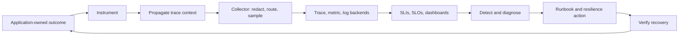

# Course 7 — AI Observability and Reliability Engineering

An AI system is operable only when a team can explain what happened, measure whether users
received a compliant outcome, contain dependency failure, and prove recovery. A vendor trace UI
or a pile of model logs is not that operating capability.

This course turns the Northstar underwriting model gateway into a privacy-safe observable service.
You will define a versioned telemetry contract, correlate a request across application and provider
boundaries, preserve authoritative metrics under trace sampling, detect a silent fallback
regression, defend a user-facing SLO, and run an evidence-backed failure game day.

## Learning outcomes

After completing the chapter and lab, you can:

1. assign logs, metrics, traces, and events distinct operational jobs;
2. propagate trace context without putting identity or secrets in baggage or trace headers;
3. define stable request, run, attempt, evidence, policy, prompt, route, model, and provider IDs;
4. build an internal telemetry contract and map it to evolving OpenTelemetry GenAI conventions;
5. redact content, bound metric cardinality, isolate tenants, and enforce retention;
6. choose head, tail, and adaptive sampling policies without corrupting SLI denominators;
7. define an eligible event population, compliant-success SLI, latency SLI, SLO, and error budget;
8. calculate multiwindow burn rates and handle low-traffic alerting deliberately;
9. detect silent fallback through route, model-mix, work-amplification, latency, and cost signals;
10. implement circuit breakers, bulkheads, typed degradation, and recovery probes;
11. create actionable dashboards, alerts, runbooks, game days, and incident records; and
12. compare OpenTelemetry-native, cloud-managed, and AI-specialist observability options.

## Prerequisites

- [Course 2 — Cloud and Distributed AI Systems](../02-cloud-distributed-ai-systems/README.md):
  partial failure, deadlines, retries, backpressure, and load shedding.
- [Course 3 — Enterprise Identity and Agent Authorization](../03-enterprise-identity-agent-authorization/README.md):
  tenant boundaries, trusted context, and safe audit evidence.
- [Course 5 — Agentic AI Architecture and AgentCore](../05-agentic-ai-architecture-agentcore/README.md):
  run/tool/effect identity, bounded work, and application-owned terminal state.
- [Course 6 — Model Gateways and Inference Economics](../06-model-gateways-inference-economics/README.md):
  request/attempt identity, fallback, hedging, usage, latency, and governed unit economics.
- Comfort with percentiles, ratios, typed Python, and incident-response fundamentals.

Course 8 will use the traces and metric contracts here as sources for evaluation datasets and
release evidence. Observability does not itself prove model quality or causal product impact.

## Scenario, success contract, and non-goals

Northstar's gateway normally sends underwriting summaries to an economy deployment, with a
premium fallback for a narrow retryable-failure class. The product still returns HTTP 200 during a
provider impairment because fallback succeeds—but premium share, latency, total provider work, and
cost rise sharply. The aggregate availability chart stays green.

Success means the operating team can:

- reconstruct one logical request across the application, gateway, provider, and validation spans;
- know which route, prompt, policy, model, and telemetry-contract versions produced the outcome;
- separate blocked, failed, degraded, and successful-compliant terminal states;
- detect the silent fallback regression before it consumes cost or latency objectives;
- page only on actionable sustained error-budget risk;
- contain the simulated provider failure without starving interactive work;
- preserve no raw prompts, outputs, credentials, or private reasoning; and
- produce a runbook, game-day record, and incident report with facts separated from hypotheses.

The deterministic lab does not deploy an OpenTelemetry Collector, call a model, create a cloud
dashboard, or predict a vendor's live behavior. It teaches portable contracts and correct metric
arithmetic. A production migration must validate SDK versions, exporter loss, Collector capacity,
backend query semantics, pricing, quotas, data residency, access control, and alert delivery.

## Mental model: observability is a control loop



Observability asks questions about unknown system states from emitted evidence. Monitoring checks
known conditions. Reliability engineering uses that evidence to choose objectives, contain failure,
manage error budgets, and improve the system. None of them is equivalent to logging everything.

## Part I — A signal has a job

### Traces: causal shape and request reconstruction

A trace represents one distributed operation as parent/child spans. Use it to answer:

- which component performed work and in what order;
- which provider attempt caused tail latency;
- whether fallback, retry, retrieval, or tool use amplified work;
- which version and policy applied; and
- where an error originated versus where it surfaced.

One logical request has one trace. Provider retries and fallback attempts are child operations, not
new user requests. A trace is evidence about execution; it is not the authoritative counter for an
SLO after sampling.

### Metrics: bounded aggregates and objectives

Metrics answer population questions cheaply: rates, ratios, distributions, saturation, cost, and
budget consumption. Metric dimensions must come from reviewed bounded sets such as task type,
route policy, terminal state, model deployment, region, and error class.

Do not use request IDs, user IDs, case IDs, arbitrary tool names, prompt text, error strings, or
URLs as labels. Each unique label combination creates another time series. Unbounded cardinality
causes cost, memory, and query failures precisely when the system is already under stress.

### Logs and events: named occurrences and diagnostic detail

Use structured events for meaningful points such as route selected, breaker opened, degradation
entered, approval denied, or incident mitigation applied. Use logs for diagnostic records that do
not have a duration. Include trace and span IDs so operators can pivot to the causal trace.

OpenTelemetry's event guidance distinguishes a duration-bearing operation (span), a discrete
occurrence (event), and an unstructured diagnostic record (log). Treat that distinction as a data
model, not a preference about which UI looks best.

### Evaluation records: product and model evidence

An evaluation score is neither an operational error code nor an SLO by default. Store its evaluator
version, rubric, label provenance, slice, and uncertainty. Course 8 will formalize that contract.
Operational traces can nominate cases for evaluation, but sampled traces do not automatically form
a representative dataset.

## Part II — Correlation and context propagation

### Identity layers

| Identity | Scope | Purpose |
|---|---|---|
| trace ID | one distributed execution | correlate spans and linked logs |
| logical request ID | one user-visible intent | join retries/attempts and support workflows |
| run ID | one durable workflow or agent run | reconstruct restart and checkpoint history |
| span ID | one timed operation | express parent/child structure |
| attempt ID | one provider/tool try | meter retry, fallback, hedge, and failure |
| provider request ID | provider boundary | reconcile support, billing, and unknown outcome |
| evidence ID/digest | source or approved evidence | prove which evidence supported a result |
| policy/prompt/router/model version | governed configuration | explain behavior and detect rollout drift |

Do not collapse these. Reusing the trace ID as an idempotency key gives telemetry infrastructure
authority over business replay. Creating a new logical request ID on every retry makes cost and
incident reconstruction incorrect.

### W3C Trace Context

`traceparent` carries portable trace and parent identity; `tracestate` allows bounded
vendor-specific state. Forward only at reviewed trust boundaries, validate length and syntax, and
never encode personally identifiable or confidential data. External calls may require a new trust
boundary or filtered state while retaining an auditable link.

### Baggage is propagated data, not free metadata

Baggage can flow farther than the service that created it. Use an allowlist of low-sensitivity,
low-cardinality propagation facts—perhaps service tier or processing region. Do not put tokens,
emails, tenant names, entitlements, prompts, or authorization decisions into baggage. Downstream
services must re-evaluate current authorization from trusted context.

### Async work and links

For a queue, persist a validated trace context with the message. Consumer processing may be a
child span when it continues the same causal operation. Batch consumers or fan-in operations often
need span links because several producer contexts contribute. Preserve logical operation identity
separately so replay and duplicate delivery remain visible.

## Part III — The Northstar telemetry contract

### Required low-sensitivity fields

The lab contract records:

- service, environment, deployment, region, and telemetry-contract version;
- trace, span, parent, logical request, attempt, and provider-request identity where applicable;
- pseudonymous tenant key, task type, route policy, and classification bucket;
- prompt, schema, policy, router, evaluator, and model deployment versions;
- terminal state, reason/error class, retry/fallback/degradation state, and attempt count;
- end-to-end and dependency duration, token/usage counts, and effective-dated cost units; and
- compliant outcome and resource-binding result from application validation.

Record values that the application can know. Do not invent precision. Provider cost may be an
estimate until billed usage arrives; mark the source and reconcile later.

### Content policy

Default to no instructions, prompts, retrieved text, tool arguments/results, model output, or
private reasoning in general telemetry. Operational diagnosis usually needs versions, hashes,
sizes, reason codes, and typed state—not full content.

If an exceptional debug workflow requires content:

1. establish a documented purpose and lawful basis;
2. use explicit opt-in, least privilege, region and tenant isolation;
3. redact before export, not only in the vendor UI;
4. separate content storage from general telemetry and link by opaque reference;
5. use a short retention window and immutable access audit;
6. protect deletion and subject-right workflows; and
7. test that prompt injection in captured content cannot execute in downstream viewers or agents.

Never record credentials or private chain-of-thought. A reasoning summary designed for users or
auditors is a separate product artifact with its own validation—not internal hidden reasoning.

### Pseudonymization is not anonymization

The lab hashes tenant identity. Production uses a managed secret salt and explicit rotation and
linkage rules. Low-entropy identifiers can still be reidentified. Authorization must protect the
mapping and every query; a hash does not remove privacy obligations.

### Collector boundary

An OpenTelemetry Collector commonly receives OTLP, adds reviewed resource metadata, filters or
transforms fields, batches, samples traces, and exports signals to one or more backends. Treat its
configuration as production code:

- authenticate and encrypt every hop;
- bind listeners to intended networks;
- cap queues and memory; expose dropped-span and exporter-failure metrics;
- redact before data crosses a region or trust boundary;
- isolate tenants and destinations;
- pin components and test upgrades; and
- define what happens when the telemetry path is unavailable.

Business requests should usually continue if non-critical telemetry export fails, but security
audit requirements may demand a different fail-safe path. Make that decision explicit.

## Part IV — Sampling without lying to yourself

### Head sampling

Head sampling decides when a trace begins, using facts known at that point. It is cheap and avoids
buffering entire traces, but cannot know that the request will later fail, become slow, fall back,
or violate a terminal invariant. A rare failure can disappear.

### Tail sampling

Tail sampling waits for completed spans and can retain errors, slow traces, fallbacks, policy
denials, degradation, and a representative baseline. It needs memory and a decision wait, and one
collector decision point must receive every span in a trace. Horizontal collector scaling
therefore needs trace-ID-sticky routing and tested behavior during topology change.

### The denominator rule

Create authoritative request counters and duration histograms before trace sampling. Never compute
availability, compliant-success rate, or cost solely from retained traces: tail sampling
overrepresents failures, while head sampling may miss them. Sampling changes diagnostic evidence,
not the truth population.

### Sampling policy record

Version the policy and record:

- mandatory keep rules;
- baseline ratio and randomness method;
- per-tenant fairness or caps;
- decision wait and incomplete-trace behavior;
- memory, queue, and export budgets;
- estimated inclusion probability if sampled data supports analysis; and
- an emergency reduction procedure that does not drop audit-critical events.

## Part V — User-facing SLIs, SLOs, and error budgets

### Start with a population contract

For each SLI define:

- the user journey and eligible event;
- inclusion/exclusion rules;
- what makes the event good;
- measurement point and source of truth;
- time window and late-arrival policy;
- dimensions used for diagnosis, not silent objective averaging; and
- owner and review cadence.

For Northstar, a policy-blocked request is not counted as service unavailability; it is reported as
a separate safety/control outcome. A submitted eligible request is good only when it reaches a
successful terminal state and the application validates a compliant result for the requested case.
An HTTP 200 with a wrong or ungoverned answer is bad.

### Core formulas

```text
compliant-success SLI = successful compliant eligible requests / eligible requests

latency SLI = compliant successes within threshold / compliant successes

allowed bad events = eligible requests × (1 − SLO target)

burn rate = observed bad-event ratio / (1 − SLO target)

cost per successful compliant task = all attributable cost / compliant successes
```

Keeping the latency denominator explicit prevents fast failures from improving the latency chart.
Report p50/p95/p99 as diagnostics; use a threshold-based good-event ratio for the objective when it
maps better to user experience.

### Targets are product decisions

An SLO is not “whatever the system did last month.” Balance user harm, safety, dependency ceilings,
fallback semantics, architectural cost, and team capacity. A target beyond what dependencies and
design can deliver creates permanent paging rather than reliability.

### Multiwindow burn alerting

A burn rate of 1 consumes exactly the budget over the SLO period. Fast-burn pages catch severe
events; slower-burn tickets catch chronic erosion. Combine a long window (material budget impact)
and a short window (the problem is still active) to improve precision and reset time.

The classic Google SRE starting points—such as 14.4× over 1 hour and 5 minutes or 6× over 6 hours
and 30 minutes—are examples, not universal constants. Recalculate for the objective and validate
with incident replay. Low-traffic services need minimum event volumes, synthetic probes, longer
windows, or direct symptom alerts; one failure should not create a mathematically dramatic but
operationally useless page.

### Error-budget policy

Define in advance what happens as budget is consumed:

| State | Evidence | Default response |
|---|---|---|
| healthy | objectives met, low burn | normal delivery |
| at risk | sustained ticket burn or slice regression | owner review and mitigation work |
| exhausted | budget below zero or severe page | freeze risky rollout; reliability work first |
| exceptional | approved business or safety need | accountable exception with expiry and residual risk |

The budget informs decisions; it does not automatically resolve trade-offs or authorize unsafe
rollouts.

## Part VI — Detect silent fallback and hidden work

The user may see a successful answer while the architecture degrades. Track together:

- logical request volume and successful-compliant rate;
- provider attempts per logical request;
- retry, fallback, cascade, hedge, cache, and degradation rates;
- selected model and provider share by route and workload slice;
- end-to-end, first-byte, and dependency latency;
- input/output/cached tokens and cost for every attempt, including losers;
- quota/rate-limit headroom, queue saturation, and breaker state; and
- prompt/router/policy/deployment version changes.

The lab regression detector requires corroboration from fallback rate, premium model share, and
cost. In production, use change-point or seasonality-aware methods only after defining false-alert
cost and evaluation. A sophisticated detector on the wrong denominator is still wrong.

## Part VII — Reliability mechanisms

### Retry

Retry only transient failures, with one owner, a deadline, attempt cap, backoff, jitter, and budget.
Authentication, authorization, residency, invalid input, and safety denials are not availability
failures to shop across providers. Every attempt belongs in cost and amplification metrics.

### Circuit breaker

A breaker prevents repeated calls to an unhealthy dependency:

```text
CLOSED --retryable failures exceed threshold--> OPEN
OPEN --cooldown expires--> HALF_OPEN
HALF_OPEN --probe succeeds--> CLOSED
HALF_OPEN --probe fails--> OPEN
```

Count dependency failures relevant to the protected resource. Do not trip a provider breaker on a
tenant authorization denial or malformed application request. Bound half-open concurrency so a
recovering service does not receive a thundering herd.

### Bulkhead

Bulkheads allocate separate capacity pools so batch summarization cannot exhaust interactive
underwriting review. Choose a boundary—tenant, workload class, model deployment, or dependency—from
the failure domain and fairness policy. Queue limits and explicit rejection are part of the design.

### Graceful degradation

Degradation must be typed and visible. A cached read-only result, limited model, or human-review
handoff cannot be counted as the full service objective unless the product contract explicitly
defines it as equivalent. Show the user the mode, preserve safety and authorization, and specify
entry/exit criteria.

### Load shedding and adaptive concurrency

Reject early before queues destroy every request's deadline. Admission can use current concurrency,
queue age, model quota, tenant fairness, and remaining deadline. Validate oscillation behavior and
ensure control traffic, health checks, and recovery probes retain capacity.

## Part VIII — Dashboard, alert, and runbook design

Every dashboard panel needs a question, denominator, owner, and action. Northstar's contract has
four views:

1. compliant task success and error-budget status;
2. end-to-end tail latency and dependency contribution;
3. fallback, attempts per request, breaker state, and saturation; and
4. total cost per successful compliant task and model-mix shift.

Use exemplars or links to pivot from a metric anomaly to retained traces. Dashboards are not access
control systems: queries and trace retrieval must enforce tenant and environment scope server-side.

### Alert quality checklist

An alert should identify the affected objective or invariant, severity, window, current value,
relevant version/slice, dashboard, runbook, and owning rotation. Test notification delivery and
deduplication. Page for urgent actionable user harm; create a ticket for slower budget risk; keep
interesting but non-actionable data on a dashboard.

### Northstar burn-alert runbook

1. **Declare and coordinate.** Acknowledge, assign commander and communications owner, record the
   incident ID, and freeze unrelated gateway changes.
2. **Confirm user impact.** Inspect eligible event counts, compliant-success and latency SLIs,
   affected slices, low-traffic caveats, and telemetry health.
3. **Correlate change.** Compare deployment, prompt, policy, router, model, provider, and Collector
   versions. Do not infer causation from timing alone.
4. **Inspect work amplification.** Review attempts per request, fallback/hedge rate, model mix,
   quota, saturation, cost, and breaker state.
5. **Contain.** Roll back a correlated change, open the breaker, shed load, or enter an approved
   degradation mode. Do not weaken identity, residency, validation, or safety controls.
6. **Verify.** Require both short and long recovery signals, successful synthetic probes, and
   representative compliant outcomes. A quiet alert alone is not proof.
7. **Communicate.** State observed facts, hypotheses, actions, residual risk, and next update time.
8. **Close deliberately.** An accountable owner approves closure after recovery evidence and owned,
   dated follow-ups exist.

## Part IX — Game days and incident learning

A game day is a planned experiment with a hypothesis, scope, abort conditions, observers, and
cleanup. The lab injects a retryable provider impairment, forces a breaker to open, routes degraded
work to human review, and overloads the batch bulkhead while interactive capacity remains intact.

Record:

- expected detector and time to detect;
- expected containment and time to mitigate;
- actual trace and metric evidence;
- whether the runbook was sufficient;
- surprise dependencies and telemetry gaps;
- customer and compliance impact; and
- owners, deadlines, and a retest date.

Separate incident facts from hypotheses. Avoid blame and avoid model-written certainty: an LLM can
summarize approved evidence, but the service owner owns causal analysis, recovery, and closure.

## Part X — OpenTelemetry and the 2026 state of the art

### What is stable and what is moving

As reviewed on 27 September 2026:

- OpenTelemetry Python lists traces and metrics as stable and logs as development;
- W3C Trace Context remains the interoperability base for distributed trace propagation;
- the OpenTelemetry Collector supports multi-signal processing and OTLP export;
- GenAI semantic conventions moved from the core semantic-conventions repository into the dedicated
  `semantic-conventions-genai` repository;
- its generative-client span document remains development-stage, and the new repository still marks
  its schema URL as TODO; and
- the GenAI guidance defaults to not recording instructions, inputs, or outputs.

Therefore, define and test a versioned internal Northstar contract; maintain an explicit mapping to
the pinned convention/SDK version; evaluate dual emission only for a bounded migration; and keep
dashboards and alerts compatible before removing old fields. “Uses OpenTelemetry” does not mean
two tools agree on every AI attribute or content policy.

### Collector topology

An agent Collector near each workload can enrich and queue signals; a gateway Collector can enforce
central policy and route exports. Tail sampling at a scaled gateway requires all spans for a trace
to reach the same instance. The official guidance recommends trace-ID load balancing and warns
about topology changes and decision consistency. Measure Collector refusal, queue, memory, batch,
and export loss as first-class reliability signals.

### Tooling landscape

| Option | Strong fit | Validate before selection |
|---|---|---|
| OpenTelemetry SDK + Collector | vendor-neutral instrumentation and multi-backend routing | language signal maturity, component pins, data loss, redaction, tail-sampling topology |
| Prometheus/Grafana + trace/log backend | established SLI, alert, dashboard, and infrastructure operations | exemplars, storage/cardinality, long-term retention, multi-tenancy, AI-specific views |
| cloud-native APM (CloudWatch, Azure Monitor, Google Cloud) | teams standardized on one cloud and identity/operations plane | GenAI integrations, export, cross-account/region access, sampling, content defaults, cost |
| Amazon Bedrock AgentCore Observability | AgentCore/CloudWatch agent workloads and built-in operational views | resource coverage, custom spans, content handling, cross-account model, export and pricing |
| Langfuse | AI traces, prompt/evaluation workflows, cloud or self-hosting | current OTLP path, region, RBAC, data lifecycle, scale, SDK/server compatibility |
| MLflow Tracing | teams combining MLflow, GenAI traces, evaluation, and self-managed data | supported attribute translation, deployment operations, access control, sampling, retention |
| Arize Phoenix/OpenInference | open-source AI tracing/evaluation and framework instrumentation | OpenInference↔OTel mapping, backend scale, auth, data policy, operational ownership |
| LangSmith | LangChain/LangGraph-heavy tracing, evaluation, and deployment workflows | platform coupling, data region/retention, export, access control, pricing and non-LangChain paths |
| commercial APM/AI observability | existing enterprise on-call, service map, logs/metrics/traces | AI semantic coverage, content defaults, eval integration, portability, price/cardinality |

Select from requirements and a production-shaped pilot. Score correlation completeness, lost
telemetry, redaction timing, tenant isolation, convention/version support, SLO math, query latency,
incident workflow, export/exit, operating burden, and total cost. A polished trace viewer does not
replace user-facing objectives, application validation, or resilience controls.

### Managed AI observability

AgentCore documents OpenTelemetry-compatible data stored in CloudWatch, built-in agent/gateway/
memory metrics, and runtime trace dashboards. This reduces setup for an AWS-centered deployment;
the application still owns redaction, correlation across non-AgentCore services, semantic outcome
events, correct SLI populations, alert policy, and incident closure.

MLflow currently documents OpenTelemetry-compatible tracing and GenAI convention translation for
ingestion/export. Langfuse's current SDK generation is built on OpenTelemetry and its supported
custom ingestion path is OTLP. These are useful convergence signals—not proof that schemas,
content defaults, or operational semantics are identical.

## Lab architecture

The standard-library-only [lab](lab.py) implements:

- immutable request, span, log, metric, SLO, alert, dashboard, and incident contracts;
- parent/child trace reconstruction with tenant-scoped queries;
- allowlisted baggage, pseudonymous tenant keys, forbidden-field redaction, and retention;
- bounded metric dimensions and unsampled authoritative outcome metrics;
- deterministic head and policy-based tail samplers;
- compliant-success, latency, fallback, degradation, cost, and error-budget calculations;
- multiwindow burn alerting with a minimum-event guard;
- silent-fallback regression detection;
- closed/open/half-open circuit breaker and per-pool bulkhead;
- explicit degradation semantics; and
- a failure game day with evidence-backed, application-owned incident closure.

Run the [notebook](ai_observability_reliability.ipynb) from this directory after installing the
repository environment:

```bash
uv run --project ../../.. jupyter execute ai_observability_reliability.ipynb --inplace
```

Run the invariant suite:

```bash
uv run --project ../../.. pytest ../../../tests/test_course_07_lab.py
uv run --project ../../.. mypy lab.py
```

## Lab sequence

1. Inspect the versioned signal and privacy contract.
2. Record and reconstruct one correlated request.
3. Attempt forbidden content, baggage, and high-cardinality telemetry.
4. Compare head and tail sampling on a rare failure.
5. Prove aggregate metrics remain complete when traces are dropped.
6. Calculate compliant-success, latency, error budget, fallback, and cost SLIs.
7. Show why aggregate availability misses silent fallback.
8. detect the regression using model mix, fallback, and unit economics.
9. Exercise breaker and bulkhead state transitions.
10. Run the provider-failure game day and inspect incident evidence.
11. Build the dashboard, alert, runbook, and production migration artifacts.

## Portfolio deliverables

Produce one review packet containing:

1. **Telemetry contract:** signals, IDs, field types, source, sensitivity, cardinality, retention,
   owner, and semantic-convention mapping.
2. **Data-flow diagram:** instrumentation, trust boundaries, Collectors, processors, sampling,
   backends, regions, access controls, deletion, and failure behavior.
3. **SLI/SLO specification:** user journey, eligible population, good event, windows, target,
   low-traffic strategy, data source, late events, and budget policy.
4. **Dashboard and alert specification:** every panel's question, denominator, slice, owner, action,
   and trace pivot; every alert's severity, burn windows, runbook, and test evidence.
5. **Resilience ADR:** retry ownership, breaker, bulkheads, degradation, load shedding, recovery
   probes, capacity assumptions, and residual risks.
6. **Game-day record:** hypothesis, fault, abort limits, expected/actual detection and containment,
   telemetry gaps, cleanup, owners, and retest date.
7. **Incident report:** timeline, facts, hypotheses, impact, contributing conditions, recovery proof,
   action owners/deadlines, and learning review.
8. **Tool selection memo:** weighted requirements, pilot evidence, privacy/security findings,
   convention maturity, cost, operating burden, exit plan, review date, and reversal trigger.

## Exit criteria

You are done when:

- every request can be correlated across the intended boundary without content or secret leakage;
- metrics reject high-cardinality identifiers and stay complete under trace sampling;
- tenant-scoped queries and retention are tested;
- SLI population and good-event definitions are reviewable and reproducible;
- cost counts every attempt and divides by successful compliant outcomes;
- burn alerting handles sustained and low-volume failure cases;
- silent fallback is detected even while transport success remains green;
- circuit breaker, half-open recovery, bulkhead isolation, and degradation state are tested;
- the game day reaches recovery and incident closure only through measured application evidence;
- the notebook executes without credentials or errors; and
- the production migration plan names telemetry-pipeline failure modes and rollback.

Passing tests show that the lab invariants hold for deterministic fixtures. They do not certify a
production telemetry pipeline, SLO, privacy program, or incident response process.

## Common failure modes

- computing SLOs from sampled traces;
- calling HTTP success “AI quality”;
- logging prompts by default because a tool supports it;
- placing tenant/user identity or tokens in baggage;
- using request IDs or raw error messages as metric labels;
- treating a hash as anonymization;
- losing trace parentage across queues, retries, or tools;
- recording only the winning provider call;
- hiding degradation behind the same success state;
- opening a breaker on caller or policy errors;
- using average latency while tail latency violates the objective;
- paging on every interesting anomaly without an owner or action;
- scaling tail-sampling Collectors without trace affinity;
- assuming OpenTelemetry compatibility means stable identical GenAI schemas; and
- allowing a model-generated incident summary to declare recovery or root cause.

## Primary and official references

Standards and OpenTelemetry:

- [W3C Trace Context Recommendation](https://www.w3.org/TR/trace-context/)
- [W3C Baggage Recommendation](https://www.w3.org/TR/baggage/)
- [OpenTelemetry specification overview](https://opentelemetry.io/docs/specs/otel/overview/)
- [OpenTelemetry logs specification](https://opentelemetry.io/docs/specs/otel/logs/)
- [OpenTelemetry Python status](https://opentelemetry.io/docs/languages/python/)
- [OpenTelemetry Collector agent-to-gateway deployment](https://opentelemetry.io/docs/collector/deploy/other/agent-to-gateway/)
- [OpenTelemetry security guidance](https://opentelemetry.io/docs/security/)
- [OpenTelemetry GenAI semantic conventions repository](https://github.com/open-telemetry/semantic-conventions-genai)
- [OpenTelemetry GenAI span conventions](https://github.com/open-telemetry/semantic-conventions-genai/blob/main/docs/gen-ai/gen-ai-spans.md)
- [OpenTelemetry events guidance](https://opentelemetry.io/docs/specs/semconv/general/events/)

Reliability engineering:

- [Google SRE Workbook: Implementing SLOs](https://sre.google/workbook/implementing-slos/)
- [Google SRE Workbook: Alerting on SLOs](https://sre.google/workbook/alerting-on-slos/)
- [Google SRE Book: Handling Overload](https://sre.google/sre-book/handling-overload/)
- [Google SRE Book: Addressing Cascading Failures](https://sre.google/sre-book/addressing-cascading-failures/)
- [AWS Builders' Library: Timeouts, retries, and backoff with jitter](https://aws.amazon.com/builders-library/timeouts-retries-and-backoff-with-jitter/)
- [Microsoft Azure Architecture Center: Circuit Breaker pattern](https://learn.microsoft.com/en-us/azure/architecture/patterns/circuit-breaker)
- [Microsoft Azure Architecture Center: Bulkhead pattern](https://learn.microsoft.com/en-us/azure/architecture/patterns/bulkhead)

Current platform documentation reviewed for the tooling comparison:

- [Amazon Bedrock AgentCore Observability](https://docs.aws.amazon.com/bedrock-agentcore/latest/devguide/observability.html)
- [MLflow Tracing](https://mlflow.org/docs/latest/genai/tracing/)
- [MLflow OpenTelemetry GenAI conventions](https://mlflow.org/docs/latest/genai/tracing/opentelemetry/genai-semconv/)
- [Langfuse tracing](https://langfuse.com/docs/observability/get-started)
- [Langfuse SDK and OpenTelemetry overview](https://langfuse.com/docs/observability/sdk/overview)
- [Arize Phoenix tracing](https://docs.arize.com/phoenix/tracing/)
- [OpenInference specification](https://github.com/Arize-ai/openinference/tree/main/spec)
- [LangSmith observability](https://docs.langchain.com/langsmith/observability)
- [Prometheus instrumentation practices](https://prometheus.io/docs/practices/instrumentation/)

Recheck versions, maturity labels, quotas, data locations, prices, retention defaults, licensing,
and deprecations at implementation time. The tooling review is dated 27 September 2026.
