# Course 8 — AI Evaluation, Experimentation, and Causal Impact

An AI release is a decision under uncertainty. A leaderboard score, a handful of attractive
examples, or an uncalibrated model judge cannot establish that a system is safe to release or that
it improves work. This course builds the evidence chain from a versioned evaluation case to a
bounded product decision.

You will evaluate Northstar's underwriting assistant offline, calibrate an automated judge against
blinded human labels, enforce release gates with uncertainty and slice coverage, and analyze the
randomized question: **Does the assistant improve productivity without harming decision quality?**

## Learning outcomes

After completing the chapter and lab, you can:

1. write metric contracts with an explicit population, numerator, denominator, direction, slices,
   aggregation, threshold, and owner;
2. separate development, judge-calibration, frozen release, and production-observation datasets;
3. construct representative cases and risk slices without leaking the release set into tuning;
4. combine deterministic assertions, component metrics, end-to-end outcomes, expert review, and
   calibrated model judges;
5. measure judge agreement, error modes, order bias, and uncertainty against human ground truth;
6. use paired comparisons, confidence intervals, non-inferiority, and family-wise error controls;
7. pre-register an experiment's hypothesis, unit, eligibility, assignment, horizon, primary
   metric, guardrail, minimum detectable effect, and analysis;
8. distinguish intention-to-treat impact from adoption and adopter-only selection bias;
9. use CUPED-style pre-period adjustment without changing the randomized estimand;
10. reason about DAGs, confounders, mediators, colliders, difference-in-differences, overlap, and
    the limits of propensity methods;
11. map current evaluation platforms to portable evidence contracts; and
12. write an accountable release memo that separates evidence, limitations, and decision rights.

## Prerequisites

- [Course 4 — Production RAG and Knowledge Systems](../04-production-rag-knowledge-systems/README.md):
  retrieval, citation, provenance, and access-aware evaluation.
- [Course 5 — Agentic AI Architecture and AgentCore](../05-agentic-ai-architecture-agentcore/README.md):
  trajectories, tool effects, termination, and application-owned outcomes.
- [Course 6 — Model Gateways and Inference Economics](../06-model-gateways-inference-economics/README.md):
  route comparisons, cost per successful compliant task, and versioned model access.
- [Course 7 — AI Observability and Reliability Engineering](../07-ai-observability-reliability/README.md):
  operational populations, telemetry, SLOs, and trustworthy outcome records.
- Working knowledge of probability, sampling, regression, hypothesis tests, and typed Python.

## Scenario, success contract, and non-goals

Northstar has a baseline assistant and a candidate prompt/router/model bundle. The candidate appears
better in demonstrations. Before broader use, the domain quality owner needs evidence that it:

- improves successful compliant outcomes on a frozen, risk-representative set;
- never uses an unapproved tool or leaks restricted content;
- preserves evidence support, tail latency, and governed unit economics;
- uses an automated judge only within a measured agreement envelope;
- improves underwriter task time under randomized assignment;
- does not reduce reviewed decision accuracy beyond an agreed margin; and
- has no prohibited outcome that is averaged away by a better mean.

The deterministic lab uses synthetic cases and transparent standard-library statistics. It does
not call a model, estimate a real product effect, replace expert statistical review, or authorize a
deployment. A production study must validate instrumentation, missingness, interference,
assignment integrity, power, distribution shift, privacy, and domain consequences.

## The evidence chain

```mermaid
flowchart LR
    Q[Decision question] --> C[Metric contract]
    C --> D[Versioned datasets and slices]
    D --> H[Deterministic and semantic evaluation]
    H --> J[Human labels and judge calibration]
    J --> U[Paired estimates and uncertainty]
    U --> G[Offline release gate]
    G --> X[Randomized product experiment]
    X --> M[Causal decision memo]
    M --> R[Accountable bounded rollout]
```



Evaluation does not end at a score. Every arrow is a provenance boundary: versions, owners,
populations, assumptions, and exclusions must remain inspectable.

## Part I — Start with the decision, not the metric

### Three different questions

Do not collapse these questions:

| Question | Typical evidence | What it cannot prove alone |
|---|---|---|
| Does the implementation satisfy an invariant? | deterministic test | usefulness on representative work |
| Is the candidate better on a defined evaluation population? | labelled offline comparison | causal production impact |
| Did access to the product improve an outcome? | randomized or identified causal study | every future release remains good |

A schema test can prove shape. A labelled set can estimate task performance. Random assignment can
estimate the effect of offering the assistant to an eligible population. Each answers a different
question and has a different denominator.

### Metric contract

Before computing a number, record:

- **construct:** what real property the metric is intended to represent;
- **population:** which cases, people, or events are eligible;
- **numerator and denominator:** including exclusions and missing outcomes;
- **unit:** case, task, user, team, tenant, or time window;
- **direction and threshold:** improvement, maximum harm, or exact zero;
- **aggregation:** micro, macro, weighted, paired, or per-slice;
- **uncertainty:** interval or decision procedure;
- **provenance:** dataset, label, evaluator, prompt, model, policy, and code versions; and
- **owner:** who can change the definition and who makes the decision.

“Accuracy = 92%” is not a contract. It is impossible to interpret without the eligible population,
label definition, abstention treatment, weighting, and uncertainty.

### Goodhart and proxy failure

Metrics become dangerous when they are mistaken for the goal. A terse answer may score poorly with
a verbosity-biased judge yet support a better decision. A high adoption rate may reflect novelty
or managerial pressure rather than benefit. A citation-presence score may reward unsupported links.
Use several measures tied to a causal model of success, retain hard forbidden outcomes, and inspect
disagreements rather than optimizing one proxy indefinitely.

## Part II — Dataset engineering and leakage control

### Dataset roles

Use physically or logically separated partitions:

- **development:** visible cases for implementation and prompt iteration;
- **calibration:** cases for choosing rubrics, thresholds, and judge mappings;
- **release:** frozen cases opened only by the governed evaluation job;
- **challenge/red-team:** rare, adversarial, and policy-critical cases;
- **production observation:** post-release outcomes used for monitoring and future dataset renewal.

The lab rejects duplicate prompt digests across partitions. Real leakage detection also considers
near duplicates, paraphrases, shared source documents, benchmark contamination, synthetic-data
ancestry, and whether a foundation model may already have seen the benchmark.

### Case contract

One case should bind:

- stable case ID and dataset version;
- source and collection date;
- task input or a secure reference;
- expected outcome or rubric;
- required evidence and allowed tools;
- policy/risk slice and weight;
- label provenance, ambiguity, and adjudication state; and
- intended and prohibited uses.

Do not copy confidential production content into an evaluation vendor by default. Apply the same
authorization, minimization, tenant, region, retention, and deletion controls used by the product.
Pseudonymization does not remove the need for access control.

### Representativeness is a claim to defend

Random sampling can represent common traffic while missing consequential rare cases. Pure expert
curation can cover hazards while distorting prevalence. A robust program combines:

1. prevalence-weighted production sampling;
2. mandatory risk and policy slices;
3. hard historical failures and regression cases;
4. adversarial/challenge cases; and
5. time-based or source-based holdouts for drift.

Report overall and slice results. Avoid silently averaging a restricted-data failure into thousands
of easy cases. A slice needs a definition, minimum support, owner, and action when underpowered.

## Part III — A layered evaluation portfolio

### Deterministic assertions first

Use code for properties code can know: schema validity, exact resource binding, authorization,
allowed tool set, terminal state, budget, citations drawn from supplied evidence, idempotency, and
zero forbidden outcomes. These checks are cheap, reproducible, and auditable. Do not ask a model
judge whether an API key appeared when a deterministic secret detector can decide.

### Component and end-to-end measures

For RAG, separate retrieval from answer behavior:

- retrieval recall/precision, rank-sensitive gain, policy-filter correctness, freshness;
- evidence coverage, citation entailment/support, grounded abstention;
- end-to-end task correctness and user decision quality.

For agents, evaluate more than the final prose:

- chosen tools and arguments;
- authorization and approval state;
- trajectory length, repeated work, and budget;
- state transitions, termination, and side effects;
- recovery after timeout, duplicate delivery, and unknown outcome; and
- final application-owned outcome.

A correct final answer reached through an unauthorized tool is a failed case.

### Semantic metrics and embedding similarity

Similarity is useful when surface wording can vary, but it does not imply factual support,
instruction compliance, safety, or business correctness. Thresholds are task- and model-specific.
Calibrate them against labelled examples, inspect false positives/negatives, and revalidate after
embedding or corpus changes.

## Part IV — Human evaluation that can be audited

### Rubric design

A rubric should define observable dimensions, anchors, abstention/uncertainty, examples, exclusions,
and escalation. Avoid compound questions such as “correct, clear, safe, and helpful.” Separate
dimensions so a safety failure cannot be offset by style.

### Blinding and randomization

Hide system identity and irrelevant metadata. Randomize presentation order. In pairwise evaluation,
repeat a sample with left/right order reversed. Monitor position, verbosity, brand, and evaluator
self-preference. Keep raters from seeing one another's decisions before independent labels.

### Agreement is diagnostic

Raw agreement can be high when one label dominates. Cohen's kappa adjusts for chance agreement but
also depends on prevalence and rater marginals. Report the confusion matrix and disagreements,
not only kappa. Low agreement can reveal an unclear construct, weak rubric, ambiguous cases, or
insufficient rater training—not merely “bad annotators.”

Use at least two independent annotations for consequential cases and an explicit adjudication path.
Version the final label, rubric, rationale code, and adjudicator decision.

## Part V — Model judges: useful measurement instruments, not ground truth

LLM-as-judge can scale rubric evaluation and produce structured rationales, but research has shown
position, verbosity, and self-enhancement biases. Treat a judge as a versioned instrument.

### Calibration protocol

1. Define the construct and blinded human reference set.
2. Lock the judge prompt, rubric, output schema, evaluator model, decoding, and parsing policy.
3. Compare on the identical population.
4. Report accuracy, precision, recall, false-positive rate, agreement, interval, and disagreements.
5. Audit order reversal, verbosity, model family/self-preference, and slice performance.
6. Decide permitted uses: triage, monitoring, weak labels, or release evidence.
7. Recalibrate after evaluator, prompt, rubric, task, language, or production-distribution change.

A high overall correlation does not establish safe classification at a release threshold. If false
positives create harm, measure that error explicitly. Preserve human escalation around ambiguous,
novel, or high-impact cases.

### Judge contamination and independence

An evaluator from the same model family may share training data, style preferences, or failure
modes with the candidate. A public benchmark may be memorized. Independence is not binary, so
record model lineage, benchmark exposure risk, prompt reuse, and whether a human or deterministic
check provides a separate line of evidence.

## Part VI — Uncertainty and release gates

### Pair cases

Compare baseline and candidate on the same cases. The paired difference removes case difficulty
from between-system variation. The lab bootstraps per-case differences with a fixed seed and reports
a confidence interval. In production, choose a method appropriate to the metric and dependence
structure; cluster by user or tenant when observations are not independent.

### Confidence intervals are not probability statements about a fixed result

A 95% frequentist confidence procedure covers the true parameter in 95% of repeated samples under
its assumptions. The observed interval is not a 95% posterior probability unless a Bayesian model
supports that statement. Use intervals to show precision and compare them with a predeclared
decision boundary.

### Non-inferiority and practical significance

A candidate may reduce cost or latency while preserving quality. Define the largest tolerable
quality regression **before** seeing results. Pass non-inferiority only when the lower bound of the
candidate-minus-baseline interval is above the negative margin. “Not statistically significant”
does not prove equivalence.

For a superiority claim, require both statistical compatibility and a minimum effect worth the
operational cost. Very large samples can make trivial differences look precise.

### Multiple comparisons and optional stopping

If a team examines many prompts, metrics, slices, and horizons, at least one attractive result can
occur by chance. Predeclare primary and guardrail metrics. Use Holm–Bonferroni or an appropriate
false-discovery procedure for a family of confirmatory tests. Label exploratory findings and
replicate them.

Repeatedly peeking at a conventional fixed-horizon p-value and stopping below 0.05 inflates false
positives. Either wait for the fixed horizon or use a designed sequential method with valid alpha
spending, always-valid inference, or Bayesian stopping rules.

### Three-way release outcomes

Use `pass`, `fail`, and `inconclusive`:

- **fail:** hard invariant violated, such as leakage or prohibited tool use;
- **inconclusive:** evidence is insufficient, imprecise, under-sliced, over cost/latency limits, or
  judge calibration is inadequate;
- **pass:** every predeclared hard and statistical gate clears.

Do not convert missing evidence into success. The release job emits evidence; it does not deploy.
The application owner decides the bounded rollout under organizational change controls.

## Part VII — Product experiments and causal estimands

### Pre-registration contract

Before assignment begins, specify:

- hypothesis and decision to be informed;
- eligibility and randomization unit;
- treatment, control, allocation, and exposure definition;
- primary outcome and safety/quality guardrails;
- minimum detectable effect, variance assumption, alpha, power, and sample horizon;
- sample-ratio-mismatch and missing-data diagnostics;
- estimator, covariates, clustering, heterogeneity plan, and multiple-test family;
- stopping, exclusion, contamination, and interference rules; and
- owner, review, and rollback conditions.

Randomize at the level that prevents interference. If users share assistant outputs inside a team,
user-level assignment may contaminate control; team-level assignment needs cluster-aware power and
analysis.

### Intention to treat

Intention-to-treat (ITT) compares all assigned treatment units with all assigned control units,
regardless of adoption. It estimates the effect of offering the product under the observed uptake
and preserves randomization. Adoption rate is useful operational evidence, but restricting analysis
to treatment adopters breaks the randomized comparison because adoption is post-treatment and
self-selected.

If the scientific question is the effect among compliers, use a justified method such as an
instrumental-variable/complier analysis with explicit assumptions; do not rename an adopter-only
mean as causal.

### Guardrails and prohibited outcomes

Northstar's primary metric is reviewed task time. Its guardrail is decision accuracy under a
non-inferiority margin. A prohibited outcome remains a hard stop. This prevents the optimization
“faster because people stopped checking” from being counted as success.

### Assignment diagnostics

A sample-ratio mismatch can reveal logging loss, assignment bugs, eligibility mistakes, bot
traffic, or differential attrition. Diagnose it before trusting outcome estimates. Also compare
pre-treatment covariates as a pipeline health check; do not repeatedly rerandomize until balance
looks appealing unless the design specified that procedure.

## Part VIII — Variance reduction and heterogeneous effects

### CUPED intuition

If a pre-treatment measure predicts the outcome, subtracting its predictable component can reduce
variance without changing assignment. The lab computes a CUPED-style adjusted post-task time:

```text
adjusted outcome = post outcome − theta × (pre outcome − mean pre outcome)
theta = covariance(post, pre) / variance(pre)
```

The covariate must be measured before treatment and not affected by it. Freeze its definition and
analysis before results. Report both raw ITT and adjusted estimates; CUPED increases precision, not
the magnitude of the real effect.

### Heterogeneity

Average benefit can conceal harm to novices, experts, languages, regions, or risk tiers. Predeclare
a small number of theory-backed interactions and ensure support. Exploratory subgroup discovery has
severe multiple-testing and winner's-curse risks. Treat sparse subgroup estimates as hypotheses for
future studies, not automatic personalization rules.

## Part IX — When randomization is unavailable

### Draw the causal graph first

State treatment, outcome, common causes, mediators, and colliders. Adjustment tries to block
backdoor paths from treatment to outcome. It must not mechanically include every available column.

- **confounder:** causes treatment and outcome; often must be adjusted;
- **mediator:** lies after treatment on the causal path; controlling it changes the estimand and can
  remove part of the effect;
- **collider:** is caused by two variables; conditioning can create a spurious association.

No statistical package repairs an unidentified question. The lab rejects missing measured
confounders and adjustment sets containing declared mediators or colliders.

### Propensity methods

The propensity score is the probability of treatment given observed pre-treatment covariates.
Matching, stratification, weighting, or doubly robust methods can balance **observed** covariates
under exchangeability, positivity/overlap, consistency, and correct measurement assumptions. They
cannot remove unmeasured confounding. Inspect overlap and extreme weights; report balance after
adjustment; conduct sensitivity analysis.

### Difference-in-differences

Difference-in-differences compares the treated group's before/after change with the control group's
change. Its central identifying assumption is parallel untreated trends, not merely similar levels.
Use multiple pre-periods, event-time plots, domain arguments, and appropriate group/time inference.
A non-significant pretrend test does not prove parallel trends, especially with low power.

Staggered adoption and heterogeneous effects require modern estimators; naive two-way fixed effects
can combine comparisons with problematic weights. Define the cohort/time estimand and anticipation
window explicitly.

## Part X — Tooling and state of the art (reviewed 2026-09-27)

### Portable foundation

Keep cases, outputs, annotations, metric contracts, and decisions in application-owned versioned
formats. Use pytest for deterministic invariants and a reviewed statistics package for production
analysis. A vendor UI is a view over evidence, not the system of record.

### Current platform categories

| Category | Examples | Strength | Due diligence |
|---|---|---|---|
| experiment/eval SDK | OpenAI Evals, promptfoo, DeepEval, Ragas | fast local and CI iteration | metric semantics, judge dependence, dataset custody |
| lifecycle platform | LangSmith, MLflow GenAI | datasets, runs, comparisons, regression workflows | export, lineage, tenancy, cost, lock-in |
| cloud-managed eval | Amazon Bedrock AgentCore Evaluations, Google Vertex AI evaluation, Microsoft Foundry evaluation | managed integration and operational scale | preview/GA status, regions, evaluator versions, data use |
| observability + eval | Arize Phoenix, Weights & Biases Weave, Langfuse | trace-to-case workflows and production feedback | sampling bias, privacy, retention, causal validity |
| product experimentation | Statsig, Eppo, GrowthBook, Optimizely, in-house platforms | assignment, exposure, sequential analysis | cluster support, SRM, metric governance, warehouse truth |

As of the review date, AWS documents AgentCore Evaluations with online, on-demand, and batch modes,
built-in and custom evaluators, and ground-truth comparison. LangSmith distinguishes offline and
online evaluation. MLflow documents versioned evaluation datasets and regression testing. Vertex
AI documents judge calibration against human ratings. Microsoft Foundry provides agent evaluators,
with feature maturity varying by evaluator. Verify live regional availability, pricing, limits, and
data terms before selection.

### Selection scorecard

Pilot tools against the same exported evidence package and score:

- dataset/annotation lineage and immutable versions;
- deterministic, human, judge, and custom-code evaluators;
- pairwise, slice, uncertainty, and regression support;
- trace/trajectory ingestion without losing application-owned outcome semantics;
- privacy, tenant/region isolation, retention, deletion, and access audit;
- reproducible evaluator pinning and change history;
- API/CI automation, warehouse integration, and export completeness;
- scale, latency, cost, quotas, failure behavior, and observability; and
- exit test: reproduce the release decision outside the vendor.

Do not select a platform from the number of built-in metrics. Select it from the evidence contract,
operating model, and reversibility.

## Practical lab

### Run it

From the repository root:

```bash
uv sync --locked
uv run pytest tests/test_course_08_lab.py
uv run jupyter execute \
  curriculum/advanced/08-ai-evaluation-causal-impact/ai_evaluation_causal_impact.ipynb \
  --inplace
```

### What you build

The reusable [lab](lab.py) implements:

- 32 cases across development, calibration, and release partitions;
- explicit metric contracts and required risk slices;
- case-bound deterministic correctness, evidence, compliance, latency, and cost evaluation;
- Wilson intervals and deterministic paired bootstrap comparison;
- blinded human-label adjudication and judge calibration;
- pairwise order-bias audit and three-way offline release decision;
- Holm–Bonferroni, a deliberate peeking anti-pattern, and fixed-horizon power;
- balanced randomized units, SRM detection, ITT, accuracy non-inferiority, CUPED, adoption, and
  novice/expert heterogeneity;
- difference-in-differences and pretrend diagnostics; and
- DAG-aware adjustment-set validation and an accountable decision memo.

### Failure injection

Modify one assumption at a time:

1. duplicate a release prompt into development;
2. omit a system output or add an unbound output;
3. use an unauthorized tool or flag restricted-data leakage;
4. lower slice support below the release minimum;
5. use a judge with poor human agreement or excessive order flips;
6. raise cost or tail latency above the regression limit;
7. stop the experiment before its fixed horizon;
8. unbalance assignment or add a prohibited outcome; and
9. adjust for adoption (a mediator) or reviewed-only status (a collider).

For each, predict `pass`, `fail`, or `inconclusive`, run it, and explain why the result follows from
the contract—not from intuition after seeing the score.

## Portfolio deliverables

1. **Evaluation strategy:** decision question, populations, dataset roles, slices, refresh policy,
   evaluators, human protocol, risks, and owners.
2. **Metric registry:** definitions, denominators, directions, thresholds, uncertainty, and version
   history.
3. **Judge calibration report:** blinded human reference, confusion matrix, interval, disagreement
   analysis, bias audits, permitted uses, and recalibration triggers.
4. **Release gate:** hard invariants, paired baseline, thresholds, three-way outcome, evidence
   manifest, and decision owner.
5. **Experiment analysis plan:** unit, eligibility, estimand, power, assignment, primary/guardrail,
   SRM, missingness, CUPED, multiplicity, heterogeneity, stopping, and rollback.
6. **Decision memo:** evidence, uncertainty, causal assumptions, limitations, recommendation,
   rollout boundary, monitoring, and named accountable owners.

## Review questions

1. Why is a release dataset different from a development set?
2. Which properties should be deterministic rather than judge-scored?
3. How could high judge accuracy conceal an unacceptable false-positive rate?
4. Why does a paired comparison usually provide more precision than two unrelated samples?
5. What does an inconclusive release mean operationally?
6. Why does adopter-only analysis break randomization?
7. When can CUPED improve precision, and when would its covariate be invalid?
8. What does a sample-ratio mismatch threaten?
9. Why can controlling a mediator or collider create the wrong causal estimate?
10. What evidence supports the parallel-trends assumption for difference-in-differences?
11. Which evaluator or platform change triggers recalibration?
12. Who owns the release decision, and why should the evaluation job not deploy?

## Primary and authoritative resources

### Evaluation and judges

- Liang et al., [Holistic Evaluation of Language Models (HELM)](https://arxiv.org/abs/2211.09110).
- Zheng et al., [Judging LLM-as-a-Judge with MT-Bench and Chatbot Arena](https://arxiv.org/abs/2306.05685).
- Liu et al., [G-Eval: NLG Evaluation using GPT-4 with Better Human Alignment](https://aclanthology.org/2023.emnlp-main.153/).
- OpenAI, [Evals repository](https://github.com/openai/evals).
- NIST, [AI Resource Center: Test, Evaluation, Verification and Validation](https://airc.nist.gov/).
- NIST, [TEVV-Athlon framework](https://www.nist.gov/artificial-intelligence/ai-research/tevv-athlon-framework-evaluating-ai-systems)
  (public draft at review time).

### Uncertainty and experiments

- Efron and Tibshirani, [Bootstrap methods for standard errors, confidence intervals, and other
  measures of statistical accuracy](https://doi.org/10.1214/ss/1177013815).
- Kohavi et al., [Online Controlled Experiments at Large Scale](https://ai.stanford.edu/~ronnyk/2013%20controlledExperimentsAtScale.pdf).
- Deng et al., [Improving the Sensitivity of Online Controlled Experiments by Utilizing
  Pre-Experiment Data (CUPED)](https://gwern.net/doc/statistics/power-analysis/2013-deng.pdf).
- Rosenbaum and Rubin, [The Central Role of the Propensity Score in Observational Studies for
  Causal Effects](https://www.stat.cmu.edu/~ryantibs/journalclub/rosenbaum_1983.pdf).
- Athey and Imbens, [The State of Applied Econometrics: Causality and Policy Evaluation](https://www.aeaweb.org/articles?id=10.1257/jep.31.2.3).

### Current tooling documentation

- AWS, [Amazon Bedrock AgentCore Evaluations](https://docs.aws.amazon.com/bedrock-agentcore/latest/devguide/evaluations.html).
- Google Cloud, [Evaluate a model using judge calibration](https://docs.cloud.google.com/vertex-ai/generative-ai/docs/models/evaluate-judge-model).
- Microsoft, [Agent evaluators in Microsoft Foundry](https://learn.microsoft.com/en-us/azure/foundry/concepts/evaluation-evaluators/agent-evaluators).
- LangSmith, [Evaluation types](https://docs.langchain.com/langsmith/evaluation-types).
- MLflow, [GenAI evaluation and monitoring](https://mlflow.org/docs/latest/genai/eval-monitor/).
- Ragas, [available metrics](https://docs.ragas.io/en/stable/concepts/metrics/available_metrics/).

## Completion standard

You are complete when the notebook executes from a clean environment, all tests pass, and another
reviewer can reproduce the release and experiment decisions from the versioned evidence. Your memo
must distinguish invariant failure, statistical uncertainty, causal assumptions, operational
constraints, and accountable decision ownership. A polished chart without that chain is not exit
evidence.
