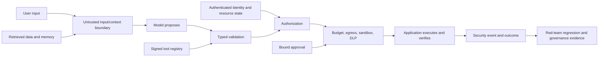

# Course 9 — AI Security, Red Teaming, and Governance

Prompt injection is not solved by a stronger system prompt. A safety classifier is not
authorization. A red-team pass is not permission to deploy. AI assurance emerges when trusted
application controls limit what a fallible model can access and do, adversarial evidence measures
the remaining exposure, and accountable owners govern residual risk throughout the lifecycle.

This course attacks Northstar's underwriting assistant with inert labelled cases, replaces its
prompt-only defense with a deterministic security gateway, and builds the governance evidence
needed for a bounded pilot decision.

## Learning outcomes

After completing the chapter and lab, you can:

1. model AI assets, trust boundaries, adversaries, abuse cases, preconditions, impacts, and
   assumptions across model, data, retrieval, memory, tools, protocols, and supply chain;
2. distinguish direct/indirect prompt injection, jailbreaks, data exfiltration, excessive agency,
   tool poisoning, unsafe output handling, supply-chain compromise, and resource exhaustion;
3. explain why model alignment and prompt instructions cannot enforce identity, authorization,
   tenant isolation, network egress, approval, or external effects;
4. design signed tool admission, narrow capabilities, default-deny egress, sandboxing, bounded
   work, data-loss prevention, and application-owned output handling;
5. secure retrieval and memory using authorization, provenance, lifecycle, integrity, and
   instruction/data separation;
6. create a labelled red-team suite with attack and benign populations, risk coverage, mutations,
   expected controls, reproducible traces, and regression ownership;
7. report blocked attempts, actual forbidden outcomes, detection, valid work blocked, and control
   coverage with correct denominators;
8. manage model, dataset, prompt, skill, tool, dependency, and provider supply-chain provenance;
9. build an AI inventory, threat model, control matrix, system card, evidence register, and
   time-bound residual-risk acceptance;
10. map NIST AI RMF, NIST AI 600-1, NIST SP 800-218A, ISO/IEC 42001, OWASP, and MITRE ATLAS to
    one operating assurance system without treating a crosswalk as compliance proof;
11. compare current open-source and managed security/evaluation tooling; and
12. design continuous control verification, incident containment, revocation, retesting, and
    accountable release decisions.

## Prerequisites

- [Course 3 — Enterprise Identity and Agent Authorization](../03-enterprise-identity-agent-authorization/README.md):
  authenticated context, default-deny policy, delegation, approval, and exact effect binding.
- [Course 4 — Production RAG and Knowledge Systems](../04-production-rag-knowledge-systems/README.md):
  authorization-before-ranking, provenance, poisoning, and deletion.
- [Course 5 — Agentic AI Architecture and AgentCore](../05-agentic-ai-architecture-agentcore/README.md):
  narrow tools, application-owned termination, bounded work, and effect recovery.
- [Course 7 — AI Observability and Reliability Engineering](../07-ai-observability-reliability/README.md):
  privacy-safe security telemetry, SLOs, response, and recovery evidence.
- [Course 8 — AI Evaluation, Experimentation, and Causal Impact](../08-ai-evaluation-causal-impact/README.md):
  representative cases, judge limits, uncertainty, release gates, and decision ownership.

## Scenario, success contract, and non-goals

Northstar's assistant reads confidential case data, retrieves policy, proposes an underwriting
decision, and can request an approved exception tool. Its prompt-only defense blocks one obvious
phrase. It does not protect against malicious retrieved documents, cross-tenant references,
poisoned tool schemas, unreviewed model artifacts, external egress, executable output sinks,
approval replay, or cost amplification.

Success means the team can:

- map every material asset and attack path to an owned control and executable evidence;
- keep model output and external content outside the authority boundary;
- prevent all labelled forbidden outcomes without blocking the benign reference work;
- prove at least two cases across every required threat category;
- validate fresh control evidence against the exact system version;
- accept only non-prohibited residual risk through independent, bound, expiring approval; and
- produce a system card and governance decision that disclose limitations.

The lab uses inert strings, mock digests, simulated tools, and synthetic records. It does not run
malware, exploit a live system, perform cryptography, scan a real dependency graph, certify ISO
conformance, establish legal compliance, or prove a live model robust against novel attacks.

## Mental model: assume the model can be fooled



The central rule is:

```text
model / retrieved content / memory / tool description -> untrusted proposal or data
trusted application -> authenticates, authorizes, validates, executes, verifies, records
```

Design as if the model will occasionally follow an attacker, misunderstand policy, expose context,
or choose the wrong tool. Security comes from containing the consequence, not predicting every
malicious string.

## Part I — Threat model the system, not only the model

### Assets and trust boundaries

Begin with what must be protected and where trust changes. Northstar's assets include:

- case content, customer identity, decision evidence, and restricted investigations;
- credentials, workload identity, approval receipts, policy and entitlement state;
- model, prompt, adapter, evaluator, dataset, embedding, index, memory, and tool artifacts;
- tool registry, schemas, MCP server metadata, sandbox, egress policy, and effect ledger;
- telemetry, incident records, system cards, and governance evidence; and
- availability, cost budgets, human attention, and organizational reputation.

Trust boundaries include browser-to-application, tenant-to-tenant, application-to-model provider,
retrieval-to-context, model-to-tool, sandbox-to-network, build-to-artifact registry, and operator-to-
governance workflow. A provider SDK is not automatically inside the application's trust boundary.

### Adversary and failure are both relevant

An adversary may be an external user, malicious insider, compromised supplier, poisoned document,
hostile website, tool server, or model artifact. The same forbidden outcome can also result from a
non-malicious model error, stale policy, confused deputy, logging leak, or deployment drift.
Controls should protect the invariant regardless of whether intent can be proven.

### Abuse-case record

For each threat, record:

- stable threat ID and category;
- targeted assets and trust boundary;
- entry point and required preconditions;
- attacker goal and concrete forbidden outcome;
- existing preventive, detective, responsive, and recovery controls;
- likelihood, severity, uncertainty, and residual risk;
- OWASP/MITRE references where useful;
- owned test cases, evidence, review trigger, and response playbook; and
- assumptions that would invalidate the analysis.

Risk-score arithmetic prioritizes discussion; it does not turn uncertain ordinal judgments into
precise expected loss. Preserve the narrative and uncertainty.

## Part II — Prompt injection and instruction/data confusion

### Direct, indirect, and multimodal injection

**Direct injection** arrives through user-controlled instructions. **Indirect injection** is
embedded in content the system is expected to process: a document, email, web page, ticket, tool
result, image, metadata field, memory, or database row. Multimodal content can carry instructions
that are not apparent in visible text.

Injection matters because language models do not enforce a hard security distinction between
“instruction” and “data.” Delimiters, XML tags, prompt hierarchy, classifiers, and adversarial
training may reduce success for measured attacks, but they do not create an authorization boundary.
OWASP continues to rank prompt injection as a central GenAI application risk and explicitly notes
that RAG and fine-tuning do not fully eliminate it.

### Defense in depth

Use several layers:

1. minimize untrusted content and preserve source/provenance metadata;
2. isolate user, retrieved, memory, and tool-result content from trusted application policy;
3. scan and quarantine known malicious or malformed content as one signal;
4. give the model only the minimum data and tools required for the current task;
5. treat every model-selected tool and argument as a request to a policy enforcement point;
6. bind identity, tenant, resource, action, parameters, policy, and approval from trusted state;
7. restrict egress, filesystem, network, process, and credential access outside the model;
8. validate and safely encode output for the destination sink; and
9. monitor actual effects and retain rapid revocation/containment.

A detector miss should not grant cross-tenant access. A detector hit should not be the only reason
a consequential action is denied. The gateway in the lab checks both content signals and invariant
controls.

### System prompts are not secrets or policy engines

Do not place credentials, private customer data, connection strings, or hidden authorization logic
in a system prompt. Assume determined users can infer substantial prompt behavior. System-prompt
disclosure becomes damaging when the prompt contains something that should have been protected by
proper secret storage or application enforcement.

## Part III — Data exfiltration and privacy boundaries

### Minimize before the model

Authorization should precede retrieval, context assembly, tool access, and model invocation.
Filter to the authenticated tenant and subject using authoritative data; select only required
fields; redact or tokenize sensitive values; and choose a provider/region/retention policy approved
for the classification. Do not ask the model to ignore data it should never have received.

### Control every exit

Data can leave through model output, tool arguments, URLs, DNS, images, markdown links, telemetry,
exception messages, caches, evaluation vendors, feedback pipelines, or training reuse. Inventory
egress paths and default deny them.

For tool execution:

- use destination allowlists resolved and enforced by the network layer;
- prevent redirects and DNS rebinding from escaping policy;
- bind data classification to permissible destinations and purposes;
- use separate credentials per tool/workload and never expose them to model context;
- inspect structured arguments and content at the enforcement boundary; and
- record destination, classification, decision, and reason without copying unnecessary content.

Data-loss prevention is one layer. It can miss transformed secrets and falsely block benign text,
so pair it with minimization, isolation, egress control, and incident response.

## Part IV — Excessive agency and tool security

### Capability is the dangerous unit

Risk grows with accessible data, permitted actions, credential scope, network reach, effect
reversibility, autonomy, and time. The model name or “agent” label matters less than the capability
envelope.

Use narrow typed tools such as `retrieve_policy(case_id)` rather than a generic shell, SQL client,
HTTP fetcher, or “execute anything” function. Each tool call must revalidate:

- authenticated subject and workload actor;
- current tenant, resource owner, action permission, and purpose;
- tool identity, version, schema digest, signer, and revocation;
- arguments, target binding, and data classification;
- deadline, attempts, cost, parallelism, and output size;
- approval and separation of duties for high-impact effects; and
- verified effect or explicit unknown outcome.

Course 3's approval invariant remains: an approval is single use and bound to the exact proposal,
principal, tenant, action, target, parameters, policy version, approver, issue time, and expiry. A
blocked request must not consume an otherwise valid receipt.

### Tool and MCP trust

Tool names, descriptions, schemas, icons, server instructions, and discovery metadata are untrusted
supply-chain inputs. Admit tools through an owned registry; pin a reviewed manifest digest; restrict
capabilities; verify server and authorization-server identity; and revoke versions promptly.

The current MCP specification strengthens authorization, but protocol support does not decide which
server, tool, resource, or action your application should trust. Do not pass upstream user tokens
through arbitrary servers, infer authority from tool metadata, or let a server widen requested
scope. Keep application policy at the effect boundary.

OWASP's September 2026 Agent Control Standard is an emerging open approach for inspectable agents,
runtime middleware hooks, and declarative policy enforcement. Evaluate maturity and interoperability
with a pilot; do not treat a new control API as proof that the underlying policies are correct.

## Part V — Sandboxing, output handling, and resource controls

### Sandbox the effect, not merely the model process

A sandbox limits the blast radius of untrusted code or tool work. Define:

- image and dependency provenance;
- CPU, memory, wall-clock, process, file, and output limits;
- read-only base filesystem and isolated ephemeral workspace;
- no ambient cloud credentials or host sockets;
- default-deny network with destination and method policy;
- tenant/workload isolation and cleanup verification;
- cancellation, timeout, and orphan-process handling; and
- immutable audit evidence outside the sandbox.

Containers are not automatically hostile-code sandboxes. Select an isolation technology based on
the adversary, kernel boundary, workload, latency, and operations. Never run red-team payloads
against production systems without explicit scope and safety approval.

### Output handling

Model output is untrusted data. Parse it into a narrow schema, validate semantics, then encode it for
the specific sink. Text intended for a chat UI must not become raw HTML; a generated query must not
be concatenated into SQL; a proposed command must not reach a shell. Parameterization, allowlists,
escaping, content security policy, and application-owned execution remain necessary.

### Unbounded consumption

Limit input/context length, model/tool calls, retries, delegation depth, parallelism, wall time,
tokens, output bytes, storage, network transfer, and cost. Rate limit by authenticated principal,
tenant, workload, and risk class. Detect distributed low-rate abuse, retry amplification, loops, and
expensive fallbacks. A budget-exhausted request is a typed terminal outcome, not an invitation to
silently bypass the limit.

## Part VI — RAG, memory, and context integrity

Retrieved content is evidence, not instruction or authority. Preserve source ID, version, tenant,
classification, lifecycle, timestamp, signer/producer, and digest. Enforce authorization and
deletion before ranking. Validate citations against the exact current evidence actually used.

Memory writes should be proposals. Validate subject/tenant, provenance, permitted field, retention,
consent, conflict, supersession, and system-of-record precedence before persistence. Separate
session scratch state from durable profile, business record, and audit history.

Poisoning defenses include controlled ingestion, source admission, scanning, anomaly review,
versioned indexes, canary documents, rollback, deletion propagation, and re-evaluation after corpus
changes. Similarity does not establish trustworthiness.

## Part VII — AI supply-chain security

The AI supply chain includes more than Python packages:

- foundation and fine-tuned models, adapters, quantizations, and serialization formats;
- training/evaluation data, embeddings, indexes, and synthetic-data generators;
- prompts, policies, rubrics, guardrails, skills, agents, tools, MCP servers, and UI templates;
- code, containers, drivers, inference servers, SDKs, plugins, and CI actions;
- providers, annotators, evaluators, hosting regions, and data-use terms.

For each artifact, capture supplier, source, version, digest, signature/attestation, build and data
provenance, license, usage/retention terms, vulnerability or withdrawal status, evaluation evidence,
approver, and revocation. Pin what runs. Separate admission from runtime discovery.

Traditional SBOMs remain necessary but may not express model/data lineage. AI/ML bills of materials
and model provenance formats are evolving. Prefer exportable, signed evidence and test whether an
artifact can be removed, replaced, and reconstructed without the vendor.

NIST SP 800-218A extends secure software development practices for AI model producers, system
producers, and acquirers. Use it with the underlying SSDF; it does not replace ordinary secure
development, dependency management, secret handling, or vulnerability response.

## Part VIII — Red teaming as a measured program

### Rules of engagement

Before testing, define authorization, scope, targets, environments, accounts, data, prohibited
actions, hours, rate/cost limits, safety monitors, stop conditions, escalation contacts, evidence
handling, cleanup, and disclosure. Use isolated synthetic environments by default. Never assume a
general security-test mandate authorizes social engineering, production data access, denial of
service, or third-party attacks.

### Case design

One case should record:

- case ID, version, risk category, attack goal, precondition, payload/source, and mutation family;
- expected control and allowed/blocked outcome;
- tenant, identity, data classification, tools, artifacts, and budgets;
- expected telemetry and cleanup; and
- owner, severity, provenance, and regression status.

Include direct and indirect attacks, encoding/format variations, multi-turn and cross-modal paths,
tool-result poisoning, reordered steps, compromised dependencies, authorization failures, and
benign near-neighbors. Novel attacks become minimized regression cases after responsible handling.

### Correct metrics

Keep populations separate:

```text
attack block rate        = blocked malicious cases / malicious cases
forbidden outcome rate   = malicious cases causing forbidden outcome / malicious cases
detection rate           = malicious cases generating the required signal / malicious cases
valid work blocked rate  = benign cases blocked / benign cases
control coverage         = exercised required controls / required controls
```

A blocked attack is not a forbidden outcome. A logged attack that still exports data is both
detected and a forbidden outcome. A system that blocks everything can achieve perfect attack block
rate and be unusable; always measure benign work.

### Baseline and residual risk

The lab's prompt-only baseline blocks one literal phrase but allows fifteen of sixteen attacks. The
defense-in-depth gateway blocks all sixteen while allowing four benign cases. These are deliberate
synthetic fixtures, not benchmark claims. Their purpose is to reveal which invariant each layer
enforces and how governance consumes the evidence.

Red-team success means “no violation found within this scope, time, capability, and attack set.” It
does not mean secure against all future attacks.

## Part IX — Governance as an operating system

### Inventory before policy

An AI inventory should bind:

- system ID/version, owner, business purpose, users, and deployment status;
- models/providers/regions, prompts/policies, tools, data sources/classes, and permitted actions;
- risk tier, impacted parties, oversight, appeal, and prohibited uses;
- upstream/downstream dependencies and accountable suppliers;
- evaluation, security, privacy, legal, and operational evidence;
- incident, change, review, expiry, retirement, and deletion obligations.

Discovery tools can find unsanctioned use, but a scanner finding is a candidate record until an
owner validates purpose and boundaries.

### NIST AI RMF and GenAI profile

NIST AI RMF 1.0 organizes outcomes under **Govern, Map, Measure, and Manage**. NIST AI 600-1 applies
that structure to generative AI risks. As of this course review, NIST states that AI RMF 1.0 is
being revised; pin the version used by each governance record and plan migration rather than
quietly changing control meaning.

Use the functions as a continuous loop:

- **Govern:** roles, policy, culture, inventory, competence, supplier and incident accountability;
- **Map:** context, purpose, actors, impacts, assets, threats, assumptions, and risk tolerance;
- **Measure:** evaluations, red teams, monitoring, uncertainty, security/privacy testing;
- **Manage:** prioritize, treat, accept, transfer, avoid, monitor, respond, and communicate.

### ISO/IEC 42001

ISO/IEC 42001:2023 specifies requirements for establishing, implementing, maintaining, and
continually improving an AI management system using a Plan-Do-Check-Act orientation. It addresses
organizational management; it is not a penetration-test checklist or model benchmark. The full
standard is licensed. Use authorized access and competent assurance professionals for a conformity
claim; do not infer certification from this course or a public summary.

### OWASP and MITRE ATLAS

OWASP supplies practical application-risk guidance. The project released a 2026 LLM Top 10 and an
Agent Control Standard in September 2026; version the edition in your control mapping. MITRE ATLAS
catalogues adversary tactics and techniques for AI-enabled systems and supports threat-informed
defense. Neither taxonomy is a complete risk assessment: map the categories to your architecture,
assets, impact, controls, and evidence.

Crosswalks reduce duplicate language. They do not prove that one test satisfies several frameworks
or that a control is correctly designed, deployed, and operating.

## Part X — Control evidence and residual-risk decisions

### Evidence contract

For each required control, retain:

- control and system/version IDs;
- owner and enforcement point;
- test IDs, environment, tool/evaluator versions, result, and artifact digest;
- collection and expiry times;
- exceptions, incidents, limitations, and review trigger; and
- immutable linkage to the approved release evidence.

A screenshot, policy paragraph, Jira ticket, or `enabled=true` flag is weak evidence by itself.
Prove runtime behavior with negative tests and operational signals.

### Three-way governance outcome

- **Fail:** a mandatory control fails, a forbidden outcome occurs, or prohibited risk remains.
- **Inconclusive:** evidence is missing, stale, misbound, under-covered, overly disruptive to valid
  work, or residual risk lacks valid acceptance.
- **Pass:** all required controls have fresh passing evidence, the red-team contract clears, and
  every non-prohibited residual risk has independent bound time-limited acceptance.

Risk acceptance must identify the exact system/version and risk, rationale, owner, independent
authorized approver, issue/expiry, compensating controls, monitoring, and review trigger. It cannot
waive a prohibited use or hide a failed mandatory control.

## Part XI — Detection, incident response, and continuous assurance

Record security-relevant observable state: request/run/tenant pseudonym, trusted principal and
workload IDs, resource/action/tool/artifact versions, policy decision and reason, approval ID/digest,
budgets, egress destination, detection, effect result, and terminal state. Do not log secrets,
private reasoning, or full sensitive content merely for investigation convenience.

Response should support:

1. contain a tenant, principal, credential, tool, model, prompt, dataset, connector, or egress path;
2. preserve and scope evidence with chain-of-custody appropriate to the incident;
3. determine actual effect separately from attempted/detected behavior;
4. rotate credentials, revoke artifacts/approvals, repair data, and notify accountable parties;
5. add a minimized regression case and test compensating controls;
6. prove recovery with representative outcomes and security probes; and
7. update inventory, threat model, system card, residual risk, and review cadence.

Continuous assurance triggers include model/provider/prompt/tool/schema/data changes, new
capabilities, new tenants or regions, policy revisions, incidents, new attack intelligence,
monitoring drift, expired evidence, and supplier-term changes.

## Part XII — Technology and state of the art (reviewed 2026-09-27)

### Tool categories

| Category | Examples | Strong fit | Critical review |
|---|---|---|---|
| threat knowledge | OWASP GenAI Security, MITRE ATLAS | abuse-case vocabulary and mappings | edition, coverage, architecture specificity |
| reproducible test platforms | NIST Dioptra, PyRIT, garak | tracked adversarial experiments and attack generation | scope, model/app coverage, isolation, evidence export |
| evaluation/red-team libraries | promptfoo, Giskard, Inspect AI, DeepTeam | CI-friendly suites and custom assertions | payload provenance, judge risk, deterministic invariants |
| guardrail/runtime policy | NeMo Guardrails, Guardrails AI, LlamaFirewall-style projects, cloud filters | content and workflow checks | bypasses, latency, false positives, policy authority |
| application policy | OPA, Cedar, OpenFGA, cloud IAM | deterministic identity/resource/action decisions | trusted attributes, lifecycle, fail behavior |
| sandbox and egress | microVM/container sandboxes, brokered tool gateways, network policy | isolate code/tool effects | kernel boundary, credentials, cleanup, observability |
| supply chain | Sigstore, in-toto/SLSA, CycloneDX, model registries | provenance, signing, attestations, inventory | AI/data semantics, revocation, verification at admission |
| managed AI security | cloud provider safety/security evaluations and controls | integration and operational scale | regions, maturity, data terms, export, lock-in |

NIST Dioptra 1.1 documents reproducible, traceable, modular AI testing and controlled red-team use;
it is primarily a testing platform rather than an application authorization layer. Microsoft's
PyRIT, NVIDIA garak, and other frameworks can generate and orchestrate adversarial probes; verify
their current scopes and never send confidential data or unsafe payloads to unapproved providers.

### Established, emerging, frontier, open

**Established practice:** least privilege, trusted identity, authorization at the effect boundary,
input/output validation, secret isolation, egress control, secure development, signed artifacts,
rate limits, audit, incident response, threat modeling, and independent review.

**Emerging practice:** standardized agent runtime control hooks, AI bills of materials, richer
model/data provenance, continuous adversarial evaluation linked to production traces, and automated
inventory/control-evidence collection.

**Research frontier:** generalizable prompt-injection defenses, agent control-flow integrity,
automated adaptive red teams, multimodal attacks, model weight/data provenance, formal capability
containment, and robust monitoring for strategic/deceptive behavior.

**Open problems:** benchmark contamination and transfer, unknown attack distributions, correlated
model/guardrail failures, human-targeted attacks, ecosystem-wide connector/skill governance, and
measuring residual risk when attacks and systems co-evolve.

Do not market a frontier technique as a complete control. Keep deterministic blast-radius limits.

## Practical lab

### Run it

```bash
uv sync --locked
uv run pytest tests/test_course_09_lab.py
uv run jupyter execute \
  curriculum/advanced/09-ai-security-red-teaming-governance/ai_security_red_teaming_governance.ipynb \
  --inplace
```

### What you build

The reusable [lab](lab.py) provides:

- authenticated context, tenant-bound resources, provenance-bound retrieved blocks;
- signed/pinned tool and artifact manifests with supplier and revocation checks;
- default-deny tool, permission, egress, DLP, output-sink, work, and cost controls;
- independent single-use approval for high-impact effects;
- sixteen attacks and four benign cases across eight threat categories;
- a prompt-only anti-pattern and defense-in-depth comparison;
- separate forbidden-outcome, blocked-attempt, detection, false-block, and coverage metrics;
- assets, threats, ATLAS/OWASP references, controls, assumptions, and risk register;
- version-bound expiring control evidence and residual-risk acceptance; and
- a three-way governance decision plus system card.

### Failure injections

1. Put an instruction in a retrieved policy document.
2. Request a resource from another tenant.
3. send restricted data to an external destination.
4. change a tool schema after its review digest was approved.
5. put tenant or credential claims in tool arguments.
6. invoke a high-impact tool without an exact approval or replay one receipt.
7. admit an unsigned, unreviewed, or revoked artifact.
8. route model output to a command/HTML/query sink.
9. exceed tool-call or cost budgets.
10. tamper with or cross tenants in durable context.
11. expire or misbind control evidence.
12. attempt to self-accept or indefinitely accept residual risk.

For each, identify the asset, trust boundary, expected control, event, actual effect, regression
test, containment, and governance consequence.

## Portfolio deliverables

1. **AI inventory record** with purpose, owners, versions, data/actions, dependencies, risk tier,
   lifecycle, and review triggers.
2. **Threat model and abuse-case catalogue** with architecture trust boundaries and ATT&CK/ATLAS or
   OWASP mappings where useful.
3. **Control matrix** linking risks to preventive/detective/respond/recovery controls, owners,
   enforcement points, tests, evidence, and expiry.
4. **Red-team plan and report** with rules of engagement, labelled attack/benign suite, mutations,
   denominators, results, limitations, regressions, and remediation owners.
5. **Supply-chain assurance record** for models, data, prompts, tools, skills, code, dependencies,
   providers, and terms.
6. **System card** disclosing intended use, prohibited use, capabilities, limits, evaluation,
   security, oversight, monitoring, incidents, and contacts.
7. **Residual-risk record** with independent time-bound acceptance or an explicit prohibition.
8. **Governance-as-code proposal** defining what is automatable, what requires human judgment, and
   how evidence is versioned, expired, revoked, and audited.

## Review questions

1. Why can prompt injection never create application authority in the secure design?
2. Which security invariant remains even if every content detector misses?
3. How does an indirect injection differ from a compromised tool manifest?
4. Why must authorization happen before retrieval and model invocation?
5. Which egress channels exist besides tool URLs?
6. Why should a blocked request not consume an approval receipt?
7. What does attack block rate hide if valid work blocked is not reported?
8. What claim can a successful red-team engagement make—and what can it not make?
9. Which artifact changes require supply-chain readmission and retesting?
10. How do NIST AI RMF, ISO/IEC 42001, OWASP, and MITRE ATLAS serve different jobs?
11. When is missing evidence inconclusive versus a hard failure?
12. Why can a risk acceptance not waive a prohibited use or a failed mandatory control?

## Primary and authoritative resources

### Risk, governance, and secure development

- NIST, [AI Risk Management Framework 1.0](https://www.nist.gov/itl/ai-risk-management-framework).
- NIST, [AI RMF Generative AI Profile — NIST AI 600-1](https://doi.org/10.6028/NIST.AI.600-1).
- NIST, [Secure Software Development Practices for Generative AI — SP 800-218A](https://doi.org/10.6028/NIST.SP.800-218A).
- ISO, [ISO/IEC 42001:2023 AI management systems](https://www.iso.org/standard/42001).
- NIST, [Dioptra AI testing platform](https://pages.nist.gov/dioptra/).

### Threats and application controls

- OWASP, [GenAI LLM Top 10 2026](https://genai.owasp.org/resource/owasp-genai-llm-top-10-2026/).
- OWASP, [Agent Control Standard](https://genai.owasp.org/resource/agent-control-standard-acs/).
- OWASP, [LLM Prompt Injection Prevention Cheat Sheet](https://cheatsheetseries.owasp.org/cheatsheets/LLM_Prompt_Injection_Prevention_Cheat_Sheet.html).
- OWASP, [AI Agent Security Cheat Sheet](https://cheatsheetseries.owasp.org/cheatsheets/AI_Agent_Security_Cheat_Sheet.html).
- OWASP, [RAG Security Cheat Sheet](https://cheatsheetseries.owasp.org/cheatsheets/RAG_Security_Cheat_Sheet.html).
- MITRE, [ATLAS](https://atlas.mitre.org/).
- Model Context Protocol, [2026-07-28 specification release](https://blog.modelcontextprotocol.io/posts/2026-07-28/).

### Supply chain, identity, and isolation

- NIST, [Secure Software Development Framework SP 800-218](https://csrc.nist.gov/pubs/sp/800/218/final).
- SLSA, [Supply-chain Levels for Software Artifacts](https://slsa.dev/spec/v1.1/).
- Sigstore, [documentation](https://docs.sigstore.dev/).
- CycloneDX, [machine-learning bill of materials](https://cyclonedx.org/capabilities/mlbom/).
- NIST, [Zero Trust Architecture SP 800-207](https://csrc.nist.gov/pubs/sp/800/207/final).
- IETF, [OAuth 2.0 Security Best Current Practice RFC 9700](https://www.rfc-editor.org/rfc/rfc9700.html).

## Completion standard

You are complete when the notebook executes from a clean environment, all invariants pass, and an
independent reviewer can follow one threat from asset and attack path through preventive control,
red-team result, telemetry, evidence, residual risk, and accountable decision. The work must state
what remains unknown. A perfect synthetic attack score or framework crosswalk is not proof of
production security.
