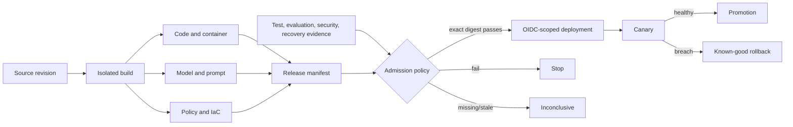

# Course 10 — CI/CD, Infrastructure, and AI DevOps

**Level:** Advanced · **Time:** 12–16 hours · **Status:** Ready in repository  
**Prerequisites:** [Course 2](../02-cloud-distributed-ai-systems/README.md),
[Course 7](../07-ai-observability-reliability/README.md),
[Course 8](../08-ai-evaluation-causal-impact/README.md), and
[Course 9](../09-ai-security-red-teaming-governance/README.md)

> **Thesis:** promote one immutable, compatible set of application, infrastructure, model,
> prompt, policy, data, and evaluation artifacts through evidence-bound gates; deploy it with
> short-lived identity; and prove progressive delivery, rollback, and recovery before production.

The primary lab is the credential-free
[notebook](ai_devops.ipynb). Its reusable implementation is [lab.py](lab.py), and the
[checkpoint](checkpoint.json) tests architecture judgment rather than command recall.

## Learning outcomes

After this course, you can:

1. design a build-once/promote-many pipeline whose release manifest binds every AI component;
2. distinguish a checksum, signature, provenance statement, SBOM, vulnerability result, and
   release approval—and verify each at the right boundary;
3. exchange a GitHub Actions OIDC identity for a short-lived, least-privilege deployment
   capability without storing cloud access keys;
4. review an infrastructure plan, protect state, detect drift, and apply only the exact approved
   plan against the expected state version;
5. choose shadow, canary, blue-green, or rolling delivery from risk and observability needs;
6. gate a canary on compliant success, safety, errors, latency, cost, and sample sufficiency;
7. rollback to a verified known-good multi-artifact release and evaluate a recovery drill against
   RTO, RPO, integrity, and authorization; and
8. compare current delivery, IaC, supply-chain, progressive-delivery, and MLOps tools without
   confusing a product feature with an operating control.

## Scenario, success criteria, and boundaries

Northstar Underwriting is releasing version 10 of its assistant. The code passed unit tests, but
the production behavior also depends on an image, model, prompt, authorization policy, evaluation
set, infrastructure plan, and runtime configuration. A previous team deployed `latest`, copied AWS
keys into CI, re-created a Terraform plan after approval, and called a Kubernetes rollback without
verifying the model or prompt version. That is not a recoverable release process.

The target pipeline succeeds only when:

- every required artifact has an immutable digest, trusted signer, trusted builder, provenance,
  source revision, and an SBOM where appropriate;
- component compatibility is explicit across model API, prompt input, policy API, data schema,
  and evaluator contract;
- test, type, notebook, evaluation, security, provenance, IaC, and recovery evidence is fresh and
  bound to the exact manifest, commit, policy, producer, and expiry;
- production identity is bound to the expected issuer, audience, repository, environment,
  reusable workflow, branch, run, and lifetime;
- the reviewed infrastructure plan is the plan applied and the state has not changed meanwhile;
- a canary has enough observations and no safety, quality, reliability, latency, or cost breach;
- rollback restores an admitted known-good manifest, not a convenient tag; and
- a recovery drill proves data and service recovery rather than merely starting replacement
  compute.

This course does **not** deploy AWS resources, claim that mock signatures are cryptographic proof,
or substitute a local scanner for security review. All side effects are deterministic simulations.

## 1. Mental model: release a graph, not one binary

An AI release is a compatibility graph. Changing one node can invalidate evidence for others.



The central boundary is unchanged from earlier courses:

```text
model, scanner, evaluator, IaC engine -> propose or produce evidence
trusted release controller           -> verify, authorize, deploy, observe, and record
```

A green badge is not authority. The controller must identify what ran, which policy interpreted
the result, whether the evidence is current, and which exact artifacts it covers.

## 2. From source to a verifiable release

### 2.1 Build once; promote the digest

Build once in an isolated job and promote the same bytes. Rebuilding between staging and
production changes the subject of the evidence, even when source is unchanged. A production
release manifest should bind at least:

- repository, immutable commit, workflow definition, run and builder identity;
- application package and container image digest;
- model, adapter, tokenizer, prompt/template, tool and policy versions;
- evaluation dataset/slice definition and evaluator version;
- infrastructure configuration and provider lock digest;
- SBOMs, provenance and attestations;
- compatibility contracts and migration identifiers; and
- policy version, evidence IDs, decision, approver, time and expiry.

Tags such as `latest`, `prod`, or even `v10` are pointers, not immutable identities. A digest
identifies bytes. A signature authenticates a statement or artifact. Provenance says how an output
was produced. An SBOM inventories components. A vulnerability report interprets inventory against
known findings. None alone proves fitness or safety.

### 2.2 Provenance is evidence, not absolution

[SLSA provenance v1.1](https://slsa.dev/spec/v1.1/provenance) separates build definition from run
details and binds subjects, external parameters, resolved dependencies, builder identity, and
invocation metadata. Verify the subject digest, trusted signer-builder pair, source, workflow,
parameters, and expected build type. Merely generating an attestation adds little value unless a
consumer enforces a policy.

[GitHub artifact attestations](https://docs.github.com/en/actions/concepts/security/artifact-attestations)
use Sigstore and can bind repository, environment, commit, workflow and event to build provenance.
GitHub explicitly warns that an attestation does not prove an artifact is secure; consumers still
need a policy. [Sigstore verification](https://docs.sigstore.dev/cosign/verifying/verify/) can verify
keyless identity constraints. [CycloneDX](https://cyclonedx.org/capabilities/mlbom/) extends bills
of materials to AI/ML assets, but teams still need lineage, license/data-rights review, withdrawal,
and runtime admission.

### 2.3 Dependency and vulnerability policy

Separate four questions:

1. Is the component present in the released artifact?
2. Is the vulnerability relevant to that version and configuration?
3. Is the vulnerable path exploitable in this product?
4. What authorized, expiring exception exists until remediation?

Do not gate only on a raw severity count. Also do not allow a model or scanner to self-waive a
finding. A waiver needs an owner, rationale, exact artifact/finding, compensating controls,
expiration, and revocation path. Course 10's lab blocks exploitable critical findings unless a
current explicit waiver exists.

## 3. Pipeline mechanics and trust zones

### 3.1 Separate untrusted validation from privileged deployment

Pull-request jobs process contributor-controlled code and inputs. They should have read-only
repository permissions, no production environment, no cloud role, and no persistent privileged
runner. Build and test results may flow forward as verified artifacts; arbitrary scripts must not.

GitHub's current [secure-use guidance](https://docs.github.com/en/actions/reference/security/secure-use)
recommends least-privilege `GITHUB_TOKEN`, warns against checking untrusted pull-request code out in
privileged `pull_request_target` or `workflow_run` contexts, and says full-length commit SHAs are the
only immutable way to reference an action. It also warns that self-hosted runners can retain a
compromise. Use ephemeral isolated runners for hostile workloads, dedicated groups for trust zones,
restricted egress, clean caches, and no Docker socket or cloud metadata access by default.

### 3.2 A production pipeline shape

```text
pull request: lint -> type -> tests -> notebook -> security -> speculative plan
merge:        rebuild once -> SBOM -> scan -> attest -> immutable registry
staging:      verify manifest -> deploy same digests -> smoke/eval/load/recovery checks
production:   environment approval -> OIDC exchange -> apply reviewed plan -> canary
observe:      decide promote / hold / rollback -> verify effect -> release record
```

Use concurrency controls per environment, bounded timeouts, one retry owner, and stable logical
operation IDs. A timeout after an API call has an unknown outcome; reconcile cloud or deployment
state before retrying. Never interpret an absent response as “nothing happened.”

### 3.3 Gate semantics

A useful gate has three states:

- **pass:** all required, trusted, fresh, exact-version evidence meets policy;
- **fail:** a measured control or invariant is breached; and
- **inconclusive:** evidence is missing, stale, underpowered, corrupt, or untrusted.

Inconclusive is not a softer pass. It requests more evidence. This avoids both unsafe promotion
and treating observability loss as product failure.

## 4. Workload identity: OIDC rather than stored cloud keys

A GitHub job can request a short-lived OIDC token and exchange it with a cloud trust policy. The
cloud—not a workflow string—decides whether to issue credentials.

Validate:

- issuer and cryptographic signature/JWK lifecycle;
- audience expected by the token exchange;
- repository or immutable repository identity;
- subject bound to branch, tag, pull request, or protected environment;
- reusable workflow identity where central deployment is required;
- expected event, run and actor context where supported;
- issued-at, not-before, expiry and token/replay constraints; and
- the resulting role's actions, resources, session duration, tags and boundary.

GitHub's [OIDC reference](https://docs.github.com/en/actions/reference/security/oidc) documents these
claims. As of this course review on 27 September 2026, repositories created after 15 July 2026 use
immutable owner/repository IDs in default subject claims; older repositories retain the earlier
format unless opted in. Inspect the actual claim format before writing cloud trust conditions.
AWS does not support GitHub custom claims, so bind the available `aud` and `sub` conditions tightly.

`id-token: write` permits requesting an OIDC token; it does not itself grant a cloud role. Put that
permission only on the deployment job, attach a protected GitHub environment, and make the cloud
role narrower than the human administrator role.

## 5. Infrastructure as code: plan, review, apply, reconcile

Terraform's graph compares configuration, prior state and refreshed remote objects to produce a
plan. The safe automation invariant is:

```text
the reviewed plan digest == applied plan digest
and reviewed state version == current state version
and provider/configuration locks are unchanged
```

If state, configuration, provider versions, credentials/account, variables, or modules changed,
create and review a new plan. Do not run a fresh unreviewed plan during apply.

Review changes for:

- public storage or endpoints, open ingress and wildcard IAM;
- encryption, private networking and key ownership;
- backups, deletion protection and retention;
- destructive replacement, region/account or tenant changes;
- secrets or sensitive values in configuration, logs, plans or state;
- provider/module sources and lockfiles;
- monitoring, budgets, tags and operational ownership; and
- drift, import/move operations and migration reversibility.

[Terraform's plan reference](https://developer.hashicorp.com/terraform/cli/commands/plan) warns that
saved plans can contain sensitive values even when terminal output redacts them. Treat plans and
state as restricted artifacts: encrypted remote storage, access control, locking, audit, versioning,
retention, and no PR attachment by default. [Terraform automation guidance](https://developer.hashicorp.com/terraform/tutorials/automation/automate-terraform)
also notes saved plans depend on OS/architecture and identical provider plugins. Use
`plan -refresh-only` for inspected drift reconciliation; the deprecated `refresh` behavior can
update state without the same review boundary.

## 6. AI component compatibility and migrations

Application semantic versioning does not capture every AI contract. Track compatibility explicitly:

| Producer | Consumer contract | Failure if ignored |
|---|---|---|
| model/tokenizer | prompt and inference adapter | malformed inputs, quality regression |
| prompt/template | application input/output schema | parse failure or changed behavior |
| policy | authorization attributes and tool schema | denied valid work or excess access |
| data/feature schema | model and evaluator | skew, leakage, invalid measurement |
| evaluation set | evaluator and release policy | incomparable scores |
| embedding model | vector index and query encoder | silent retrieval collapse |
| telemetry schema | dashboards and gates | false pass from missing signals |

Choose expand-and-contract migrations where old and new readers/writers overlap safely. Use shadow
reads, dual writes only with reconciliation, versioned indexes, and feature flags. A database
rollback is rarely equivalent to an application rollback: destructive schema or data changes may
require roll-forward, restore, or explicit compensation.

## 7. Progressive delivery

### Shadow

Send copied inputs to the candidate but suppress side effects and user-visible output. Shadowing is
good for compatibility, latency, cost and quality comparison; it is not proof of user experience,
authorization effects or full capacity. Protect production data and do not double external effects.

### Canary

Route a small, representative, policy-controlled fraction to the candidate. Compare the candidate
with a concurrent baseline across required slices. Define minimum volume, evaluation horizon,
abort thresholds and automatic rollback before starting. Canary analysis should include:

- compliant success, forbidden outcomes and valid work blocked;
- error/timeout/degradation/fallback rates;
- latency tails and saturation;
- evaluation quality and critical slices;
- cost per successful compliant task; and
- version mix, trace completeness and telemetry loss.

Course 10 refuses to promote an underpowered canary and treats any forbidden outcome as a hard
failure. [Argo Rollouts](https://argoproj.github.io/argo-rollouts/) implements canary, blue-green,
traffic shaping and metric analysis for Kubernetes. Its controller is a mechanism; teams still own
metric semantics, risk slices, data integrity, rollback target and post-rollback verification.

### Blue-green and rolling

Blue-green maintains two complete environments and switches traffic, making reversal fast but
increasing cost and data-compatibility work. Rolling updates are simpler and efficient, but mix
versions and offer weaker metric-controlled progression. Select based on state compatibility,
traffic control, capacity, risk and recovery objective—not fashion.

## 8. Rollback and disaster recovery

Rollback is a forward operation selecting a prior known-good release. It must restore the whole
compatible graph: application, image, model, prompt, policy, configuration, infrastructure and
data/index contract. Verify availability, signatures, revocation status, evidence, environment,
and restoration outcome. Record the failed and restored digests, reason, operator/controller,
start/end, data action and verification.

Disaster recovery asks a different question: can the organization rebuild the service and restore
authoritative state after loss of a region, account, control plane or data store? A drill must prove:

- RTO: time to recover the service;
- RPO: maximum acceptable data loss;
- backup freshness, integrity, encryption and independence;
- infrastructure and artifact reconstruction;
- secrets, keys, identity, DNS/network and external dependencies;
- authorization and tenant isolation after restore; and
- evidence capture, abort, cleanup, gaps and next retest.

A successful restore command without integrity and authorization validation is not recovery proof.

## 9. Technology landscape and selection

| Layer | Options | Strong fit | Questions before selection |
|---|---|---|---|
| CI/CD | GitHub Actions, GitLab CI, Buildkite, cloud-native pipelines | source-integrated build/test and controlled promotion | runner isolation, identity, permissions, reusable workflows, evidence export, cost |
| GitOps/CD | Argo CD/Rollouts, Flux, Spinnaker, cloud deployment services | declarative reconciliation and progressive delivery | secret model, multi-tenant boundary, metric authority, rollback/data behavior |
| IaC | Terraform/OpenTofu, Pulumi, AWS CDK/CloudFormation | reviewable repeatable infrastructure | state, provider ecosystem, language/runtime, drift, policy, import and exit |
| policy | OPA/Conftest, Sentinel, cloud policy, admission controllers | deterministic pre-merge/runtime policy | data sources, exceptions, versioning, enforcement point, bypass and audit |
| supply chain | SLSA/in-toto, Sigstore/Cosign, GitHub attestations | signed provenance and admission | signer-builder trust, transparency/privacy, offline verification, revocation |
| SBOM/scan | CycloneDX/SPDX, Syft/Grype, Trivy, dependency review | inventory and vulnerability workflows | ecosystem/AI coverage, VEX/waivers, freshness, exploitability, false positives |
| ML lifecycle | MLflow, SageMaker, Vertex AI, Azure ML, Kubeflow | model registry, experiment and deployment lineage | prompt/policy/data support, identity, portability, approvals, rollback semantics |
| feature flags | OpenFeature-compatible or managed platforms | decouple exposure from deploy and provide kill switches | server authority, targeting privacy, stale clients, audit and outage default |

Run a production-shaped pilot. Score isolation, identity, exact artifact promotion, evidence APIs,
policy enforcement, progressive-delivery control, recovery, observability, multi-region behavior,
operating burden, cost, portability, and exit. A single integrated suite may reduce glue work; a
composable stack may improve best-of-breed capability and exit. Measure both.

## 10. State of the art, reviewed 2026-09-27

### Established practice

- protected branches/environments, least privilege, immutable dependencies and isolated builds;
- build-once/promote-by-digest, signed provenance, SBOMs and vulnerability policy;
- reviewed IaC with protected remote state and drift detection;
- short-lived workload identity instead of stored cloud keys;
- metric-controlled canary/blue-green delivery and verified rollback; and
- regular recovery rehearsal with explicit RTO/RPO.

### Emerging practice

- deployment admission that verifies attestations rather than only creating them;
- AI/ML BOMs and multi-artifact manifests covering model, data, prompt, policy and evaluators;
- immutable OIDC subjects and centrally governed reusable deployment workflows;
- policy-as-code over release evidence and compatibility graphs; and
- linked artifact inventories connecting build, vulnerability, deployment and ownership records.

### Research and engineering frontier

- reproducible or independently verifiable model builds at practical scale;
- trustworthy lineage across proprietary model APIs and mutable hosted aliases;
- standardized AI release manifests, evaluator provenance and prompt/tool semantics;
- safe automated remediation without capability widening; and
- causal progressive-delivery analysis under non-stationary model and user behavior.

### Open problems

Attestation trust still depends on build-platform and identity assumptions. Vulnerability databases
remain incomplete and exploitability context is hard. Model providers may update hosted behavior
behind stable names. Data rights and withdrawal propagate poorly through derived models and indexes.
Rollback cannot always reverse learned, cached, or externally observed effects. Treat continuous
verification and revocation as first-class lifecycle work.

## 11. Worked release walkthrough

The notebook executes this sequence:

1. create eight artifacts for code, image, model, prompt, policy, dataset, evaluation and IaC;
2. compute one canonical manifest digest;
3. admit trusted, fresh, exact-manifest gate evidence;
4. inject a failed quality gate, a critical exploitable vulnerability and an incompatible prompt;
5. validate GitHub OIDC claims and issue a short-lived manifest-bound capability;
6. review a safe plan, then detect public exposure, wildcard IAM, secrets and destructive change;
7. apply the exact plan once and prove state drift and operation-ID conflict stop execution;
8. compare healthy, failed and underpowered canaries;
9. rollback to a verified known-good release; and
10. evaluate recovery evidence against RTO, RPO, integrity and authorization.

## 12. Evaluation contract

Do not report “pipeline pass rate” alone. Track:

- release admission rate by fail/inconclusive reason;
- lead time and waiting time by gate;
- change failure and rollback rate, with severity and affected traffic;
- mean time to detect, decide, contain and verify recovery;
- provenance/SBOM/evidence coverage over released artifacts;
- stale-evidence and unreviewed-drift frequency;
- canary sample sufficiency and false promotion/rollback review;
- forbidden outcomes and valid work blocked;
- RTO/RPO attainment and restore-integrity rate; and
- cost per successful compliant release and delivery toil.

Keep populations and denominators explicit. A blocked unsafe release is a successful control event,
not a service failure. An unavailable evaluator is inconclusive, not evidence the candidate is bad.

## 13. Failure modes and anti-patterns

| Anti-pattern | Why it fails | Control |
|---|---|---|
| rebuild for production | evidence covered different bytes | promote an immutable digest |
| deploy a tag | pointer can move | resolve and verify digest |
| one `green=true` field | no producer, scope, freshness or policy binding | typed gate evidence |
| long-lived AWS keys | broad, persistent replayable credential | OIDC + scoped short session |
| repository-only OIDC trust | any branch/workflow may deploy | environment/ref/workflow subject conditions |
| unpinned action | dependency can change | verified full commit SHA |
| privileged PR job | attacker-controlled code reaches credentials | separate trust zones |
| plan then re-plan on apply | approved and executed changes differ | store/protect/apply exact plan |
| “sensitive” means absent | plan/state may still contain plaintext | ephemeral values plus protected state |
| canary with 20 requests | false confidence | predeclared minimum volume/horizon |
| rollback only container | model/prompt/policy remain incompatible | whole-manifest rollback |
| backup exists | restore may fail or cross tenants | recurring integrity/authz recovery drill |

## 14. Production upgrade checklist

- Define owners and separation of duties for build, policy, infrastructure and deployment.
- Protect workflow files with CODEOWNERS and branch rules; pin actions and reusable workflows.
- Default tokens to read-only; scope `id-token: write` and deployment permission to one job.
- Use ephemeral isolated runners and review cache/artifact trust across privilege boundaries.
- Generate, store and verify provenance and SBOM attestations for release artifacts.
- Keep registries immutable; define retention, replication, revocation and break-glass recovery.
- Protect plans/state as sensitive; lock state and prevent out-of-band infrastructure changes.
- Bind approvals and evidence to exact digests, policy, environment, owner, issue/expiry and state.
- Make rollout thresholds and abort behavior versioned policy; verify post-rollback health.
- Rehearse regional/account/control-plane loss and dependency outage, not only pod restart.
- Record release, deployment, rollback and recovery evidence with stable operation IDs.
- Audit exceptions and waivers; expire them automatically and surface renewal before release.

## 15. Exercises

### Implementation

1. Add a telemetry-schema artifact and make the release gate reject a dashboard-incompatible change.
2. Bind an approval receipt to the manifest, infrastructure plan and production environment, then
   prove alteration, expiry and replay fail.
3. Add a VEX-style exploitability assessment whose producer, finding, artifact and expiry are
   verified separately from the scanner.

### Diagnosis

4. Simulate a lost apply response. Reconcile by operation/plan digest before deciding whether to
   retry, fail or record the existing receipt.
5. Create Simpson's paradox in canary slices: the aggregate passes while high-risk underwriting
   cases regress. Design the slice gate.
6. Inject telemetry loss. Explain why the result is inconclusive rather than a promotion pass.

### Architecture judgment

7. Choose between rolling, blue-green and canary for a model plus irreversible feature migration.
8. Design trust policies for a central reusable workflow deploying many repositories without
   granting repository-wide wildcard production access.
9. Write an ADR comparing Terraform/OpenTofu, Pulumi and a cloud-native IaC tool for Northstar.
10. Design a recovery exercise for loss of registry, state backend and model provider in one event.

## 16. Review questions

1. Why is a release manifest more useful than a container tag?
2. What does provenance prove, and what does it not prove?
3. Why must evidence bind both the commit and the full manifest digest?
4. When is a gate inconclusive rather than failed?
5. Which OIDC claims keep an unrelated branch or workflow from assuming the production role?
6. Why can a Terraform plan contain secrets despite `sensitive = true`?
7. What makes a canary sample representative and sufficient?
8. Why can rollback require a data roll-forward?
9. How do RTO and RPO differ?
10. What proves that a recovery drill preserved tenant authorization?

## 17. Authoritative references

- [GitHub Actions secure use](https://docs.github.com/en/actions/reference/security/secure-use)
- [GitHub Actions OIDC reference](https://docs.github.com/en/actions/reference/security/oidc)
- [GitHub artifact attestations](https://docs.github.com/en/actions/concepts/security/artifact-attestations)
- [Using artifact attestations](https://docs.github.com/en/actions/how-tos/secure-your-work/use-artifact-attestations/use-artifact-attestations)
- [SLSA v1.1 specification](https://slsa.dev/spec/v1.1/)
- [SLSA provenance](https://slsa.dev/spec/v1.1/provenance)
- [Sigstore verification](https://docs.sigstore.dev/cosign/verifying/verify/)
- [CycloneDX ML-BOM](https://cyclonedx.org/capabilities/mlbom/)
- [OpenSSF Scorecard](https://scorecard.dev/)
- [Terraform plan](https://developer.hashicorp.com/terraform/cli/commands/plan)
- [Terraform sensitive data](https://developer.hashicorp.com/terraform/language/manage-sensitive-data)
- [Terraform automation](https://developer.hashicorp.com/terraform/tutorials/automation/automate-terraform)
- [Terraform drift](https://developer.hashicorp.com/terraform/tutorials/state/resource-drift)
- [Argo Rollouts](https://argoproj.github.io/argo-rollouts/)
- [NIST SSDF 1.1](https://doi.org/10.6028/NIST.SP.800-218)
- [NIST SP 800-218A](https://doi.org/10.6028/NIST.SP.800-218A)

## Summary

AI DevOps is not CI plus a model registry. It is the evidence-preserving control plane that moves
one compatible artifact graph from source to production and back. The durable invariants are exact
identity, trusted provenance, explicit compatibility, short-lived authority, reviewed state change,
measured exposure, verified rollback, and rehearsed recovery.
