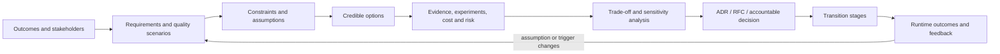

# Course 11 — Solution Architecture and Technical Strategy

**Level:** Advanced · **Time:** 12–16 hours · **Status:** Ready in repository  
**Prerequisites:** Courses 1–10, especially
[cloud systems](../02-cloud-distributed-ai-systems/README.md),
[identity](../03-enterprise-identity-agent-authorization/README.md),
[evaluation](../08-ai-evaluation-causal-impact/README.md), and
[AI DevOps](../10-ci-cd-infrastructure-ai-devops/README.md)

> **Thesis:** turn business outcomes, stakeholder concerns, quality scenarios, constraints, and
> uncertain evidence into architecture options, accountable decisions, migration stages, and
> reversal triggers that technical and non-technical stakeholders can challenge.

The primary practical artifact is the credential-free
[notebook](solution_architecture_strategy.ipynb), backed by the tested decision contracts in
[lab.py](lab.py). Use the [checkpoint](checkpoint.json) after completing the capstone.

## Learning outcomes

After this course, you can:

1. separate business outcomes, capabilities, functional requirements, quality attributes,
   constraints, assumptions, risks, and implementation choices;
2. write measurable quality-attribute scenarios with source, stimulus, environment, artifact,
   response, and response measure;
3. select architecture views from stakeholder concerns and document context, containers,
   runtime interactions, deployment, data, control, and trust boundaries;
4. generate credible build, buy, partner, hybrid, and “do less” options before selecting products;
5. evaluate options with hard constraints, exact-version evidence, units, freshness, confidence,
   sensitivity, risk, total cost, operating ownership, portability, and exit;
6. write ADRs and RFCs that preserve alternatives, consequences, evidence, assumptions, owners,
   review dates, and reversal triggers;
7. design current, transition, and target states with staged entry/exit/rollback/kill criteria; and
8. communicate one evidence chain to product, engineering, platform, security, legal, finance,
   operations, and executives at the level each needs.

## Capstone question

> **Should Northstar build a centralized RAG and agent platform?**

Three slogans are competing for funding:

- “let every product team build its own stack”;
- “centralize everything in one custom platform”; and
- “buy an enterprise AI suite.”

None is yet an architecture option. Northstar must define which capabilities are differentiated,
which controls must be consistent, which decisions remain with domains, which managed primitives
are replaceable, how the system exits a provider, and what evidence would reverse the decision.

### Success criteria

The final recommendation must:

- meet explicit security, reliability, performance, quality, compliance, delivery, and cost
  thresholds;
- describe the system boundary, owners, users, external dependencies, data/control/trust flows,
  current state, transitions, and target state;
- use evidence bound to exact option versions, units, sources, producers, freshness, confidence,
  and independence requirements;
- expose uncertainty and sensitivity instead of hiding it behind weighted-score precision;
- include three-year cost ranges, risk-adjusted loss, unit economics, migration and exit cost;
- record consequences, assumptions, decision rights, review date and reversal triggers; and
- identify a safe incremental path whose stages have entry, exit, rollback and kill criteria.

### Non-goals and boundaries

This course does not claim an algorithm can make an architecture decision, that a cloud framework
is a universal scorecard, or that one diagram represents a system. The lab uses synthetic evidence;
it does not measure real providers. Architecture review is not production authorization. A model
may summarize requirements or suggest options, but accountable people and trusted applications
validate evidence, decide, authorize and record.

## 1. Mental model: architecture is a decision system

Architecture is the structure needed to achieve outcomes under constraints, plus the reasoning
that makes the structure defensible and changeable. An architecture description is a set of models
and records about that system—not the system itself.



The deliverable is not “the diagram.” It is a traceable chain from outcome to evidence to decision
to implementation and feedback.

## 2. Foundations: terms that prevent category errors

| Term | Meaning | Common failure |
|---|---|---|
| outcome | measurable change for users or the organization | treating a platform launch as value |
| capability | what the organization/system can repeatedly do | naming a vendor as a capability |
| functional requirement | behavior the system must provide | mixing it with implementation |
| quality attribute | how well behavior must operate | saying “scalable” without a scenario |
| constraint | non-negotiable boundary | quietly assigning it a low score |
| assumption | unproved condition used in reasoning | recording it as fact |
| risk | uncertain event with consequence | using a red/yellow label without exposure |
| option | coherent architecture and operating model | comparing isolated product features |
| decision | selected option with owner and consequences | equating review discussion with approval |
| principle | durable decision guidance | turning current product choice into dogma |

Keep **hard constraints** outside compensatory scoring. An option that leaks between tenants is not
made acceptable by lower cost. Keep preferences in trade-off analysis, where stakeholders can see
what improves and worsens.

## 3. Stakeholders, concerns, and decision rights

Start with people who experience, fund, build, govern, operate, buy, audit, or can stop the system.
For each concern, record the outcome, measure, owner, decision right, consultation need, and
evidence source.

Northstar's product owner prioritizes customer and underwriter outcomes. Security owns control
acceptance, not product priority. Platform owns the paved road and its SLO. Domain teams own their
business workflow and on-call behavior. Data owners decide permitted use. Legal interprets terms
and obligations. Finance challenges forecasts. An architecture review chair accepts the decision
record; that role does not grant production deployment authority.

Avoid RACI theatre. For each consequential decision, name one accountable owner, who supplies
evidence, who can veto under which policy, and the escalation path when concerns conflict.

## 4. Quality-attribute scenarios

“Secure, fast, reliable and scalable” is not testable. A quality scenario has six parts:

```text
source -> stimulus -> environment -> affected artifact -> response -> response measure
```

Examples:

- **Performance:** an underwriter submits a complex case during peak load; the assistant returns a
  grounded response within 2 seconds p95 while meeting quality and safety thresholds.
- **Security:** a tenant attempts to retrieve another tenant's case during normal operations; the
  knowledge plane denies before retrieval, produces zero forbidden outcomes and records a reason.
- **Reliability:** a provider or region fails during production traffic; the system gives a typed
  degraded response and meets a 30-minute recovery objective without bypassing authorization.
- **Modifiability:** a new model provider is admitted; adapters, evaluation and policy change while
  domain applications remain compatible, and the migration completes within two engineer-weeks.
- **Operability:** an on-call engineer diagnoses a quality regression; traces link route, model,
  prompt, policy and evidence versions within 15 minutes without exposing restricted content.

Scenarios force trade-offs into the open. Lower latency may increase cost. Central controls can
improve consistency while increasing team dependency and blast radius. Portability can slow access
to proprietary capability. There is no best architecture without prioritized scenarios.

## 5. Architecture descriptions and views

[ISO/IEC/IEEE 42010:2022](https://www.iso.org/standard/74393.html) distinguishes an architecture
from its description and relates stakeholders, concerns, viewpoints, views and model kinds. It does
not prescribe one process, notation, or tool. Use that discipline to choose views intentionally.

### Minimum useful view set for the capstone

1. **System context:** people, Northstar's platform, systems of record, model/provider, identity,
   audit and external governance boundaries.
2. **Container/service view:** domain applications, gateway, orchestration, policy, retrieval,
   inference, evaluation, telemetry, registry and deployment control plane.
3. **Dynamic view:** one high-risk underwriting request including authentication, authorization,
   retrieval, model/tool proposals, approval, execution, verification and audit.
4. **Deployment view:** accounts/projects, regions, networks, compute, data stores, keys, queues,
   trust zones, failover and environment separation.
5. **Data and lifecycle view:** sources, rights, ingestion, indexes, prompts, models, evidence,
   retention, deletion, lineage and recovery.
6. **Current/transition/target:** what exists, what temporarily coexists, and what is retired.

The [C4 model](https://c4model.com/) provides notation-independent context, container, component
and code zoom levels plus dynamic and deployment diagrams. Use only levels that answer a concern.
C4 describes static structure well; augment it with data, trust, lifecycle, state, failure and
operating views for AI systems.

### View hygiene

Every element and relationship needs a name, responsibility and direction. Show trust boundaries,
protocols, authoritative data ownership, tenant scope, deployment zones, state, external suppliers,
failure behavior and operators. Date and version the view. A diagram without scope, legend, concern,
owner or corresponding runtime evidence becomes decoration.

## 6. Generate options before products

Separate the capability decomposition from product selection:

```text
experience and domain workflow
shared contracts and SDKs
identity / policy / approval / audit
model gateway / retrieval / orchestration
evaluation / observability / release
data, infrastructure and operations
```

For each layer ask whether it is differentiating, regulated, shared, commodity, rapidly changing,
capacity-heavy, or hard to exit.

### Credible capstone options

| Option | Strength | Structural cost | Best fit |
|---|---|---|---|
| domain point solutions | fast local experiments, domain autonomy | duplicated controls, inconsistent evidence, supplier sprawl | few low-risk unrelated use cases |
| central custom platform | maximum common control and customization | long lead time, platform bottleneck, high cognitive/operating load | unique regulated capabilities with sustained team |
| integrated commercial suite | rapid feature breadth and support | contract/data/provider coupling, feature gaps, exit cost | requirements closely match product and terms |
| governed hybrid platform | central contracts/trust plane, domain ownership, managed commodity primitives | integration and boundary discipline | shared controls plus diverse domain experiences |
| do less / shared libraries only | low investment and reversibility | limited runtime consistency and platform leverage | uncertain demand requiring discovery |

Do not create a straw alternative. Give every option a coherent operating model, migration path,
failure model and exit strategy.

## 7. Evidence and trade-off mechanics

Course 11's lab requires each observation to bind:

- option ID and version;
- criterion and unit;
- observed value and source;
- trusted producer;
- creation and expiry;
- confidence; and
- independent evidence where the criterion requires it.

Missing or stale evidence is **inconclusive**, not a zero score. A hard-threshold breach
**disqualifies** the option. Units cannot be mixed. Vendor claims are inputs, not independent proof.

### Weighted utility without fake precision

The lab maps an observation to `[0,1]` between an explicit worst and best value, applies its weight,
and subtracts an uncertainty penalty:

```text
adjusted utility = normalized value - penalty × (1 - evidence confidence)
option utility   = Σ criterion weight × adjusted utility
```

Clamping prevents extrapolated scores. This model is a conversation aid. Weights, bounds and
confidence are judgments; disclose them and rerun sensitivity analysis. Never average away hard
security, legal, safety or residency constraints.

### Sensitivity and regret

Perturb priorities, volume, provider prices, adoption, staffing, quality thresholds and exit cost.
If a small weight change flips the winner, the recommendation is fragile: gather evidence, stage a
pilot, delay irreversible commitment or choose the more reversible option. Record decision regret:
what would become expensive if an assumption is wrong?

### When not to score

Do not force numbers when evidence is ordinal, causality is unknown, stakeholders have not agreed
on outcomes, options are not comparable, or a regulatory interpretation is unresolved. Use a
narrative options paper, experiments and explicit open questions first.

## 8. Build, buy, partner, and total economics

Price is not total cost. Model ranges for:

- discovery, procurement, legal/security review and migration;
- platform subscription/compute/storage/network and committed spend;
- product, engineering, platform, data, security, operations and support people;
- inference, embeddings, retrieval, evaluation, observability and retries per unit;
- outages, failures, security incidents and noncompliance as expected risk loss;
- integration, customization, training and organizational adoption;
- switching, data/model/prompt export, parallel run, contract termination and decommissioning; and
- opportunity cost and time to value.

Report low/expected/high scenarios and cost per successful compliant task at meaningful volumes.
The lab includes migration, annual platform/people, unit, exit and risk-adjusted costs over three
years. Avoid double-counting labor already present, while recognizing that “existing team” is not
free capacity.

Buy when commodity capability meets requirements and exit terms are acceptable. Build when the
capability is strategically differentiating or available products cannot meet a hard boundary.
Partner when external expertise or capacity accelerates learning while Northstar retains ownership,
evidence and exit. Hybrid is a design, not a compromise slogan: specify exactly who owns each layer.

## 9. State of the art, reviewed 2026-09-27

### Established practice

- stakeholder concerns, measurable quality scenarios and architecture trade-off analysis;
- context/deployment/dynamic/data/trust views and decision records;
- well-architected review across security, reliability, performance, operations, cost and
  sustainability;
- evolutionary delivery, fitness functions, SLOs, policy-as-code and platform product thinking;
- TCO, unit economics, risk, portability and exit planning; and
- current, transition and target states with incremental migration.

The [SEI Architecture Tradeoff Analysis Method](https://www.sei.cmu.edu/library/the-architecture-tradeoff-analysis-method/)
is an established structured method for exposing interactions among qualities such as security,
availability, performance and modifiability. Use the ideas proportionately rather than turning a
two-week decision into ceremony.

### Current AI workload guidance

The [AWS Generative AI Lens](https://docs.aws.amazon.com/wellarchitected/latest/generative-ai-lens/generative-ai-lens.html)
now covers the lifecycle from scoping through continuous improvement across operational excellence,
security, reliability, performance, cost and sustainability, including a multi-tenant platform
scenario. [Azure's AI workload guidance](https://learn.microsoft.com/en-us/azure/well-architected/ai/get-started)
emphasizes nondeterminism, experimentation, model decay and adaptability. The
[Google Cloud Well-Architected Framework](https://docs.cloud.google.com/architecture/framework)
was reviewed in January 2026 and provides six pillars plus AI/ML and financial-services
perspectives. These lenses help find risks; they do not eliminate option-specific evidence.

### Emerging practice

- architecture fitness functions wired to delivery and runtime evidence;
- policy and evaluation contracts spanning code, model, prompt, data, tool and infrastructure;
- internal AI platforms combining centralized trust controls with federated product ownership;
- provider-neutral gateways, portable telemetry and explicit exit rehearsals; and
- decision intelligence linking architecture assumptions to live cost, SLO, quality and risk data.

### Open problems

Rapid provider change makes evidence stale. Hosted model aliases can change behavior without a
traditional deployment. Data rights and AI supply-chain dependencies are hard to visualize.
Quality and business outcome estimates are often non-causal. Platform adoption depends on developer
experience and organization design, not only components. Interoperability standards do not yet make
complex agent, memory, evaluation and governance stacks freely portable.

## 10. Worked Northstar decision

The lab evaluates eight criteria:

- months to first governed use case;
- successful compliant task rate;
- cross-tenant forbidden outcomes;
- monthly availability;
- annualized total cost;
- tested portability;
- team cognitive/on-call load; and
- strategic differentiation.

Point solutions fail the isolation threshold. The fully custom central platform misses the
time-to-value constraint. The governed hybrid meets hard boundaries and remains the winner when
each criterion receives a 15% relative weight increase in turn. This is synthetic evidence, so the
conclusion is a worked method—not a real procurement recommendation.

The target centralizes identity/policy/tool admission, release/evaluation contracts, model access,
telemetry schemas and approved platform primitives. Domain teams retain user experience, workflow,
domain evaluation, product SLO and business outcome ownership. Managed providers remain behind
adapters and explicit data/residency/availability/exit contracts.

## 11. ADRs, RFCs, and architecture reviews

### ADR

Use an ADR for a consequential decision that should survive team memory. Include:

- ID, title, status, date, owner and independent approver;
- context and decision scope;
- selected option and credible alternatives;
- consequences—positive, negative and new obligations;
- evidence IDs, assumptions and confidence;
- reversal triggers and review date; and
- a digest or version so alteration invalidates acceptance.

Accepted does not mean permanent. Supersede rather than silently rewrite history.

### RFC / options paper

Use an RFC before the decision when stakeholders need to challenge requirements, options, evidence,
interfaces, migration and open questions. Time-box discussion, name the decision maker, record
dissent and close with a decision or explicit experiment.

### Architecture review

Review the outcome/requirement chain; system/data/control/trust boundaries; identity and tenant
isolation; quality and evaluation; failure/recovery; observability and operations; supply chain;
cost/capacity; migration/rollback; ownership; evidence gaps; assumptions; and reversal. A review
finding must name severity, violated scenario or policy, evidence, owner and resolution state.

## 12. Migration: current, transition, target

The target is not a starting state. Northstar uses four stages:

1. **Foundation:** establish contracts and trust plane without moving applications.
2. **Pilots:** migrate two bounded domains and test quality, SLO, security and unit economics.
3. **Scale:** publish a self-service paved road with support, onboarding and escape hatches.
4. **Consolidate:** retire duplicated controls only after parity, adoption and export proof.

Each stage has dependencies, accountable owner, entry and measurable exit criteria, rollback, kill
criteria and status. The lab detects unknown dependencies, cycles, stages marked complete before
their prerequisites, absent ownership, and missing reversal paths.

Use strangler migration, compatibility contracts, traffic shadowing, dual reads, reversible flags,
data reconciliation and time-bounded coexistence. Dual write is not automatically safe; identify
the system of record and conflict recovery. Do not decommission the legacy path until data export,
retention, audit, DR and operational acceptance pass.

## 13. Communication at multiple altitudes

Use one evidence base with different resolution:

| Audience | Lead with | Include |
|---|---|---|
| executive | decision, value, risk, investment and reversal | one-page options, range, milestones, owner |
| product | user outcome and sequencing | capability boundary, experiment, adoption, kill criteria |
| engineering | interfaces and change impact | containers, runtime flows, contracts, migration |
| platform/operations | service ownership and SLO | capacity, failure, observability, support, DR |
| security/legal/data | trust and obligations | identity, data flows, suppliers, retention, evidence |
| finance/procurement | range and commercial exposure | TCO, unit economics, commitment, exit, sensitivity |

Do not hide dissent. State “what we know,” “what we assume,” “what remains unknown,” “who decides,”
and “what observation would change the recommendation.”

## 14. Evaluation contract

Evaluate the strategy after decision and during migration:

- quality-scenario coverage and pass rate with correct denominators;
- evidence freshness, confidence and unresolved gaps;
- sensitivity/winner stability and assumption burn-down;
- lead time, adoption, developer success and exception rate;
- SLO, compliant success, forbidden outcomes and valid work blocked;
- cost per successful compliant task and forecast error;
- platform support load, cognitive load and duplicated capability retired;
- migration exit/rollback success and time in temporary states;
- supplier concentration and exit-test success; and
- business outcomes measured through Course 8's causal methods where feasible.

Avoid architecture maturity scores that reward document volume. Measure whether decisions and
platform capabilities improve outcomes under the stated constraints.

## 15. Failure modes and anti-patterns

| Anti-pattern | Failure | Correction |
|---|---|---|
| vendor-first diagram | requirements bend to product | decompose capabilities and scenarios first |
| generic NFRs | cannot test or trade off | write source/stimulus/response measures |
| averaging hard constraints | cheap insecure option wins | gate before scoring |
| missing evidence = zero | unknown becomes bad performance | report inconclusive |
| vendor evidence as independent | confidence inflated | bind producer and independence requirement |
| exact weighted score | hides judgment and uncertainty | show ranges and sensitivity |
| only build price | ignores people, risk, migration and exit | full range TCO and unit economics |
| centralize everything | bottleneck and blast radius | centralize policy/scale advantage, federate domain decisions |
| diagram as architecture | no decision or runtime proof | trace concerns to views, ADRs and evidence |
| big-bang target state | irreversible migration risk | staged transition with rollback/kill criteria |
| immutable ADR | assumptions decay silently | scheduled review and reversal triggers |

## 16. Production practice checklist

- Maintain a versioned concern/requirement/quality-scenario registry.
- Link views, ADRs, controls, tests, SLOs, costs and owners through stable IDs.
- Store evidence provenance, units, population, time, confidence and option version.
- Require hard-constraint admission before trade-off scoring.
- Run sensitivity and low/expected/high scenarios; publish unresolved evidence gaps.
- Model data, trust, control, deployment, failure and organizational boundaries.
- Validate supplier terms, data rights, residency, subcontractors, continuity and export.
- Define platform product ownership, support, adoption, exceptions and deprecation.
- Automate fitness functions where deterministic; keep accountable review where judgment remains.
- Revisit decisions on triggers, incidents, material version changes and scheduled dates.
- Rehearse provider and platform exit rather than accepting a document-only plan.
- Verify migration effects and decommissioning; do not infer success from task completion text.

## 17. Exercises

### Implementation

1. Add a sustainability criterion with a defensible unit and evidence source; test sensitivity.
2. Add a commercial suite option and distinguish vendor claims from independent pilot evidence.
3. Create a compatibility fitness function that links an ADR to Course 10 release evidence.

### Diagnosis

4. Make the aggregate hybrid option win while the regulated-risk slice fails. Correct the model.
5. Introduce correlated evidence sources and explain why three documents are not corroboration.
6. Increase volume 10× and provider price 2×; identify the decision's break-even and trigger.

### Architecture judgment

7. Decide which capabilities Northstar must centralize and which domain teams should own.
8. Write a current/transition/target migration where one domain cannot leave the legacy index.
9. Design a provider-exit game day that proves model, prompt, data, telemetry and audit portability.
10. Present the same recommendation as a one-page executive memo and a technical RFC appendix.

## 18. Review questions

1. Why is an architecture description not the architecture?
2. What makes a quality scenario testable?
3. Which constraints must remain outside weighted scoring?
4. When should missing evidence be inconclusive?
5. How does sensitivity analysis change a recommendation?
6. What costs are omitted by subscription-price comparison?
7. Which platform capabilities create leverage versus bottlenecks?
8. Why should an accepted ADR carry reversal triggers?
9. What is special about a transition architecture?
10. What runtime evidence would disprove the Northstar recommendation?

## 19. Authoritative references

- [ISO/IEC/IEEE 42010:2022](https://www.iso.org/standard/74393.html)
- [C4 model](https://c4model.com/)
- [SEI Architecture Tradeoff Analysis Method](https://www.sei.cmu.edu/library/the-architecture-tradeoff-analysis-method/)
- [AWS Well-Architected Framework](https://docs.aws.amazon.com/wellarchitected/latest/framework/welcome.html)
- [AWS Generative AI Lens](https://docs.aws.amazon.com/wellarchitected/latest/generative-ai-lens/generative-ai-lens.html)
- [AWS multi-tenant generative AI platform scenario](https://docs.aws.amazon.com/wellarchitected/latest/generative-ai-lens/multi-tenant-generative-ai-platform-scenario.html)
- [Azure Well-Architected AI workloads](https://learn.microsoft.com/en-us/azure/well-architected/ai/get-started)
- [Azure AI design methodology](https://learn.microsoft.com/en-us/azure/well-architected/ai/design-methodology)
- [Google Cloud Well-Architected Framework](https://docs.cloud.google.com/architecture/framework)
- [TOGAF Standard, 10th Edition](https://www.opengroup.org/togaf)
- [FinOps Framework](https://www.finops.org/framework/)
- [NIST AI Risk Management Framework](https://www.nist.gov/itl/ai-risk-management-framework)
- [Architecture Decision Records](https://adr.github.io/)

## Summary

Staff-level architecture is the practice of making consequential technical choices reviewable,
measurable and reversible. Start with outcomes and concerns, express qualities as scenarios, keep
hard boundaries outside scoring, bind evidence to exact options, expose uncertainty, include total
operating and exit consequences, record the decision, migrate incrementally, and learn from runtime
outcomes.
