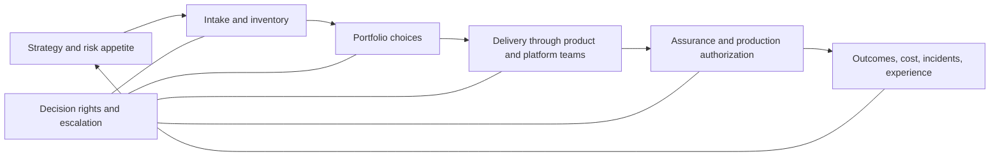

# Course 12 — Enterprise AI Operating Model and Leadership

**Level:** Advanced · **Prerequisite:** [Course 11](../11-solution-architecture-technical-strategy/README.md)

**Time:** 12–16 hours · **Last reviewed:** 28 September 2026

**Primary lab:** [enterprise_ai_operating_model.ipynb](enterprise_ai_operating_model.ipynb)

**Reusable implementation:** [lab.py](lab.py) · **Checkpoint:** [checkpoint.json](checkpoint.json)

## Course thesis

Staff impact improves how the organization chooses, builds, governs, operates, and learns from AI
work—not how much one person implements. A credible operating model converts strategy into
decision rights, services, constraints, feedback, investment, and accountable change.

The course is a capstone for the complete program. You will triage **70 synthetic GenAI proofs of
concept** at Northstar Underwriting. You will stop unsafe or ownerless proposals, commission bounded
experiments where evidence is weak, fund a small portfolio under budget and capacity constraints,
define risk-proportionate paths to production, publish an AI service catalogue, assess capability
maturity, and defend a 12-month roadmap and investment range.

## Learning outcomes

By the end, you can:

1. translate enterprise intent into an outcome-and-risk portfolio rather than a backlog of demos;
2. design centralized, decentralized, and federated team interactions and explain their failure
   modes;
3. assign one accountable owner for product, platform, risk, release, procurement, and exception
   decisions without confusing a title or RACI label with authorization;
4. build intake and triage that gates prohibited work before scoring and treats missing evidence as
   inconclusive;
5. select a portfolio under spend, capacity, dependency, duplication, and risk-concentration
   constraints without rewarding sunk cost;
6. specify paved-road services as supported internal products with eligibility, SLO, support,
   lifecycle, unit cost, and escape paths;
7. create narrow, independently approved, version-bound, expiring exception records;
8. assess organizational maturity from current evidence without averaging away a weak control;
9. sequence a funded roadmap with outcome metrics, dependencies, exit criteria, and kill criteria;
10. evaluate low/base/high investment scenarios with adoption, discounting, opportunity cost, and
    sensitivity rather than a single invented ROI;
11. lead design review, dissent, escalation, delegation, and mentoring with inspectable evidence;
12. measure portfolio value, governance friction, platform health, developer experience, and
    valid work blocked with explicit populations and denominators.

## Prerequisites

You should be able to read typed Python and already understand the program's identity,
authorization, RAG, agents, gateways, observability, evaluation, security, delivery, and
architecture boundaries. Course 11 is especially important: an operating model cannot compensate
for an incoherent architecture, and an architecture review does not itself authorize release.

## Scenario, success criteria, non-goals, and boundaries

Northstar has accumulated 70 GenAI proofs of concept across underwriting, claims, customer service,
finance, and operations. Many duplicate the same retrieval, evaluation, gateway, or document
capability. Several have no durable owner, measurable outcome, approved data, credible evidence, or
run-cost estimate. Leadership wants a production portfolio in twelve months without creating one
central team that owns every business decision.

Success means the learner produces:

- an evidence-qualified portfolio with `fund`, `experiment`, `hold`, `stop`, and `refer` outcomes;
- a control path for each risk tier and an exception boundary that cannot waive prohibited work;
- a decision-rights matrix, operating-model choice, and interaction model;
- a service catalogue for reusable AI platform and assurance capabilities;
- a maturity assessment with evidence gaps and floor constraints visible;
- a budgeted dependency-aware roadmap and low/base/high investment cases;
- a leadership record that preserves disagreement and assigns escalation; and
- an executive narrative traceable to the same facts as the engineering record.

This course does **not** select a real vendor, certify an organization to ISO/IEC 42001, offer legal
advice, or claim that deterministic synthetic results predict Northstar's live outcomes. The model
or scoring system may recommend. Trusted organizational authorities validate evidence, own policy,
approve risk, allocate money, authorize production, and verify outcomes.

## Why this matters

Organizations rarely fail to produce AI demonstrations. They fail to make a small number of clear,
owned, evidence-backed production commitments. Common symptoms are:

- a centralized “AI team” becoming the delivery bottleneck and accidental owner of domain risk;
- federated teams repeatedly building gateways, retrieval, evaluation, and controls;
- committees reviewing everything while owning nothing;
- innovation funnels that reward presentation quality or sunk cost;
- risk labels applied inconsistently, with low-risk work waiting behind high-risk work;
- “paved roads” that are undocumented mandates rather than usable products;
- maturity heat maps based on opinion, not current operating evidence;
- platform adoption and activity counts reported as business value; and
- roadmaps with features and dates but no outcome, exit, or kill criteria.

The operating model is the connective tissue among strategy, portfolio, architecture, delivery,
assurance, finance, and learning. It determines who can decide, which path is fast, which proof is
required, how exceptions expire, and how production results change the next allocation decision.

## Mental model: an operating system for decisions

Think of the operating model as six connected loops:



The loops answer different questions:

| Loop | Question | Durable evidence |
|---|---|---|
| strategy | Which outcomes and risks matter? | objectives, risk appetite, investment envelope |
| intake | Is there an owner, outcome, subject, risk tier, evidence and cost? | versioned candidate record |
| portfolio | Which few bets fit constraints and dependencies? | disposition with reason codes |
| delivery | What is owned by domain teams versus shared services? | interaction model and service contract |
| assurance | Which controls and independent decisions are required? | evaluation, threat model, approval, exception |
| learning | Did the system create compliant value, and what changes? | outcome, unit economics, DX, incidents, maturity |

Three invariants run through the system:

1. **Hard constraints precede preference.** Prohibited use, missing ownership, and unapproved
   sensitive data cannot be averaged against expected value.
2. **Evidence and authority are different.** A strong business case does not approve risk; a job
   title or RACI cell does not grant system permission.
3. **Every commitment has a learning boundary.** A production bet, experiment, exception, service,
   and roadmap initiative needs review, expiry, exit, or kill conditions.

## Foundations: operating model, governance, management, and organization

An **operating model** describes how capabilities, teams, processes, information, technology,
partners, funding, and management systems combine to deliver strategy. **Governance** evaluates
options, sets direction, assigns accountability, and monitors performance and conformance.
**Management** plans and operates within that direction. **Organization design** shapes team
boundaries and interaction, but an org chart alone is not an operating model.

ISO/IEC 42001:2023 specifies requirements for establishing, implementing, maintaining, and
continually improving an AI management system. Its Plan–Do–Check–Act structure is useful for the
organizational loop, but buying a checklist or naming a committee does not establish operating
effectiveness. The [NIST AI RMF Core](https://airc.nist.gov/airmf-resources/airmf/5-sec-core/)
treats Govern as cross-cutting and explicitly calls for clear roles, executive responsibility,
inventory, lifecycle monitoring, and safe decommissioning. NIST also states that its playbook is
voluntary and not a universal ordered checklist.

### The trusted boundary

```text
model, facilitator, scorecard -> proposes, clusters, summarizes, challenges
trusted evidence process      -> verifies source, version, unit, freshness, independence
accountable authority         -> allocates, accepts risk, contracts, authorizes, sunsets
delivery and control systems  -> enforce, execute, observe, reconcile, record
```

AI can help summarize 70 cases or draft an executive narrative. It must not silently create the
owner, risk tier, evidence, permission, approval, or claimed outcome.

## Team topology choices

### Centralized

A central AI group owns scarce expertise and much delivery. It can establish early consistency and
is sometimes proportionate for a small or highly regulated organization. At scale it commonly
becomes a queue, loses domain context, and assumes accountability that belongs to product or risk
owners.

### Decentralized

Domain teams own capabilities end to end. This maximizes local context and autonomy when teams are
mature, but produces duplicated platforms, inconsistent controls, fragmented procurement, and
uneven operations if shared constraints are weak.

### Federated shared management

Domain product teams own users, workflow, domain evidence, adoption, and outcomes. Platform teams
provide reusable contracts and services. Security, risk, legal, procurement, evaluation, and
finance own or support their respective decisions. A small enablement function improves skills and
patterns without becoming a permanent dependency.

Microsoft's current Cloud Adoption Framework describes centralized, shared-management,
decentralized, and hybrid models and notes that platform teams can offer AI tooling and data
services while workload teams operate autonomously within guardrails. That is vendor guidance, not
a universal law, but it is a useful comparison lens.

| Model | Strong fit | Primary risk | Required countermeasure |
|---|---|---|---|
| centralized | early capability, scarce experts, strong uniformity | queue and domain distance | explicit exit to federated ownership |
| decentralized | mature autonomous domains | duplication and uneven controls | minimal mandatory contracts and shared evidence |
| federated | multi-domain enterprise | ambiguous seams and coordination tax | decision rights, service contracts, escalation SLOs |
| hybrid by risk | mixed maturity and consequence | complexity and inconsistent classification | authoritative tiering and periodic review |

Northstar chooses a federated model with risk-tiered interaction. It does not centralize every AI
decision; it centralizes trust, contracts, leverage, and independently owned control where that
reduces duplicated risk or effort.

## Internal mechanics: from 70 PoCs to a portfolio

### 1. Intake is a contract, not a form collection

Each candidate binds an ID and version to a domain, sponsor, accountable owner, outcome, risk tier,
data status, evidence, expected value, cost, capacity, dependency, and duplication group. A changed
scope or data source creates a new evidence subject.

### 2. Gate hard failures

The lab stops candidates with missing identity, sponsor, owner, outcome, invalid resources,
prohibited use, or unapproved moderate/high-risk data. A weighted score is never calculated for a
failed hard boundary.

### 3. Qualify evidence

Expected value, feasibility, and outcome confidence require one exact-version record with a unit,
trusted producer, observation and expiry. Outcome confidence requires independence. Missing,
duplicate, stale, untrusted, wrong-unit, or version-mismatched proof yields `refer`, not a made-up
zero or pass.

### 4. Separate learning from scaling

Low outcome confidence or feasibility creates a bounded `experiment`. An experiment has a fraction
of the cost and capacity, explicit learning target, and no presumption of later funding. It is not a
smaller production launch.

### 5. Optimize the portfolio, not each item independently

Eligible candidates are ordered deterministically, then selected under budget, capacity,
dependency, duplicate-capability, and high-risk concentration constraints. Sunk cost is recorded
but excluded from preference. A production implementation should consider mathematical
optimization where interactions are material, then retain understandable reason codes and human
accountability.

### Worked example

Suppose two teams propose summarization assistants. Both pass the control boundary. Proposal A has
slightly higher standalone value, while B creates a reusable evidence-extraction service needed by
three later initiatives. A project ranking may choose A; a portfolio decision may fund B first
because dependencies and reuse change total value. Conversely, “strategic reuse” must not become a
pretext for a central platform to build speculative capabilities without validated consumers.

## Risk-based governance and exception paths

The lab maps:

- low risk → self-service inventory, ownership, and evaluation;
- moderate risk → guarded path plus threat model and monitoring;
- high risk → independent review and human-oversight evidence; and
- prohibited → stop.

Risk tier changes the control path, not the need for an owner or outcome. Controls should be
automated where deterministic and reviewed where judgment or independent accountability matters.

An exception is a narrow policy object, not a hallway agreement. It binds the exact candidate and
version, policy and control, rationale, compensating controls, independent authorized approver,
policy version, issue time, expiry, and use state. A changed subject, stale policy, expiry, replay,
self-approval, or non-waivable control fails validation.

## Decision rights and team interaction

A useful matrix describes the decision—not merely activities—and names one accountable authority,
responsible implementers, required consultation, information flow, escalation owner, and response
time. The lab covers:

- product outcome;
- platform standard;
- risk acceptance;
- production release;
- provider contract; and
- policy exception.

Consultation is not veto by default. Accountability is not execution access by default. Production
systems must still derive authority from authenticated identity and policy. The matrix makes the
organizational agreement explicit; application controls enforce the relevant technical boundary.

### Interaction modes

Use collaboration for a novel boundary that needs joint discovery; facilitation for a temporary
capability gap; and a service contract for stable consumption. Permanent “collaboration” across
every change creates coordination tax. Permanent hand-off creates queues and context loss.

## Paved roads and service catalogue

The CNCF Platforms White Paper describes internal platforms as integrated capabilities presented
for internal users, emphasizes platform-as-product, user experience, reduced cognitive load,
secure defaults, optionality, and composition. Its maturity model covers investment, adoption,
interfaces, operations, and measurement across progressive levels. These are useful diagnostics;
Northstar must still choose capabilities based on its own consumers and outcomes.

A paved road is the easiest supported path for a recurring need. It should be attractive because
it reduces lead time and risk, not because an undocumented mandate blocks alternatives. Each
catalogue item in the lab includes:

- service ID, owner, consumers, and outcome;
- service level and support path;
- eligibility, onboarding, quota, and current version;
- deprecation notice and migration obligation;
- unit cost or allocation model; and
- an exit path for unsupported needs.

The initial catalogue contains a model gateway, evaluation service, and independent risk-review
service. A service with no owner, support, lifecycle, or exit is a dependency, not a product.

## Standards as executable interfaces

Prefer the smallest set of mandatory standards that protect interoperability, safety, evidence,
and operations:

1. identity, tenant, resource, and delegated-authority contract;
2. data provenance, classification, retention, deletion, and source version;
3. model/prompt/policy/evaluation/release version graph;
4. release evidence and approval subjects;
5. telemetry fields, redaction, metrics, and SLO semantics;
6. incident, exception, sunset, and supplier-exit records.

Each standard needs an owner, version, rationale, conformance mechanism, exception path, migration
window, and review trigger. A standards council should retire obsolete rules as deliberately as it
adds new ones.

## Capability maturity without theatre

Northstar assesses strategy, product, data, engineering, evaluation, security, operations,
platform, and people. Each dimension requires one current trusted evidence record. Missing or stale
evidence makes the assessment inconclusive. The overall readiness uses the weakest relevant
dimension, not an average that lets excellent CI conceal absent ownership or skills.

The sample is scalable in several technical dimensions but provisional in people capability.
Therefore the roadmap funds decision clarity, portfolio discipline, enablement, and a paved road
before claiming enterprise scale.

This resembles the CNCF maturity principle that people, process, policy, and technology must
progress together. It is not a claim of formal CNCF or ISO assessment.

## Roadmap mechanics

Each initiative includes an owner, quarter, outcome metric, baseline, target, cost, capacity,
dependencies, exit criteria, and kill criteria. The deterministic roadmap sequences:

1. decision rights;
2. evidence-based portfolio gate;
3. three supported paved-road services; and
4. scale review based on compliant outcomes and unit value.

The validator rejects missing contracts, same-quarter dependencies, budget overflow, capacity
overflow, and initiatives whose target does not change the baseline. Roadmaps remain hypotheses:
execution evidence can reorder, narrow, or stop them.

## Investment case and FinOps

The current FinOps Framework describes a collaborative operating model connecting engineering,
finance, leadership, procurement, and product; it explicitly includes AI as a technology category
and covers usage/cost, business value, optimization, governance, education, and executive strategy.
Use its vocabulary where helpful, while keeping AI quality, safety, and evidence in the same
decision.

The lab reports low/base/high scenarios with annual benefits, annual costs, adoption probability,
discount rate, discounted value and cost, NPV, benefit-cost ratio, and break-even year. It does not
collapse uncertainty into one sales number.

Include costs for platform product teams, domain delivery, evaluation, security, operations,
change, training, procurement, providers, data, migration, exit, and opportunity cost. Attribute
benefits only when measurement can connect the change to cycle time, quality, loss avoidance,
revenue, satisfaction, or capacity. Time saved is not automatically cash saved.

## Leadership mechanics

### Design reviews

A review begins with the decision, accountable owner, deadline, constraints, and evidence gaps.
Reviewers distinguish hard constraints, evidence challenges, preferences, and implementation
suggestions. The output records decision, obligations, dissent, unresolved risks, owner, review
date, and escalation—not consensus theatre.

### Dissent and escalation

The lab requires dissent to bind the proposal digest and evidence IDs. The accountable owner must
respond. `resolved` cannot hide unresolved risks; `escalated` requires an owner. This creates
psychological and technical safety: disagreement remains inspectable without giving every
participant an indefinite veto.

### Delegation and mentoring

Delegation transfers bounded decision space and supplies resources, check-in cadence, escalation
triggers, definition of done, and a learning outcome. “Own this” without authority, support, or
feedback is abandonment. Staff leadership increases the system's capability by growing other
decision-makers, not by keeping all complex work.

### Executive communication

Use a one-page chain:

```text
business problem -> portfolio decision -> investment range -> material risks
-> operating-model change -> 12-month evidence milestones -> explicit ask
```

An executive view changes resolution, not facts. It must remain traceable to the candidate,
evidence, control, cost, and decision records used by engineering and risk teams.

## Evaluation system

No single metric represents organizational performance. Use a balanced set with explicit units and
populations:

| Dimension | Examples | Failure to avoid |
|---|---|---|
| outcomes | compliant scaled outcomes, cycle time, quality, causal business effect | counting launches |
| portfolio | stop-early rate, evidence-gap rate, concentration, option value | rewarding spend consumed |
| platform | time to first compliant path, SLOs, reuse, support load, retention | forced adoption rate |
| governance | decision latency by risk, exception expiry, valid work blocked, control breach | review count |
| economics | cost per funded outcome, unit cost, forecast error, realized benefit | tokens or cloud spend alone |
| people | delegation completion, skill coverage, bus factor, review quality | training attendance alone |
| delivery | lead time, reliability, recovery, rework | output volume without quality |

The 2025 DORA report characterizes AI as an amplifier of the underlying organizational system and
points users to an AI Capabilities Model. Treat this as empirical research about associations and
capabilities, not proof that a specific tool causes Northstar's outcome. Keep delivery, reliability,
developer experience, and business outcomes together.

## Technology and framework landscape

| Category | Options | Strong fit | Important limitation |
|---|---|---|---|
| AI management/risk | ISO/IEC 42001, NIST AI RMF/Playbook, sector controls | management system, roles, inventory, lifecycle, risk outcomes | not product selection or automatic compliance |
| operating model | Azure CAF, Google AI Adoption Framework, AWS CAF | structured people/process/technology comparisons | vendor context and service incentives |
| platform product | CNCF Platforms White Paper and maturity model, Backstage ecosystems | service catalogue, self-service, DX, measurement | a portal is not an operating model |
| value/cost | FinOps Framework, FOCUS data, internal unit economics | cross-functional allocation, forecasting, business value | cost optimization alone can damage quality or safety |
| delivery research | DORA, SPACE research | multi-dimensional delivery and developer experience | surveys/associations need local validation |
| portfolio tooling | product portfolio, architecture repository, GRC, work management | durable intake, dependencies, decisions, evidence links | workflow tools can encode bad governance faster |
| optimization | spreadsheets, constrained optimization, scenario simulation | transparent small portfolios or complex constraints | objective functions embed contestable assumptions |

Select tools only after defining the record, owner, workflow, integration, audit, export, retention,
and exit requirements. A new “AI governance platform” does not replace authentication,
authorization, evaluation, independent judgment, or accountable leadership.

## State of the art as of September 2026

### Established practice

- named system and risk ownership, inventory, tiered controls, and lifecycle review;
- product/domain ownership combined with shared platform and assurance capabilities;
- service catalogues, versioned standards, outcome-based roadmaps, and unit economics;
- continuous delivery, evaluation, telemetry, incident learning, and decommissioning.

### Emerging practice

- AI-specific paved roads that compose identity, gateways, evaluation, observability, security,
  cost allocation, and release evidence;
- policy and evidence as machine-verifiable release inputs rather than committee documents;
- enterprise portfolio decisions joining AI risk, architecture, capacity, causal value, and FinOps;
- agent registries, capability boundaries, and operating accountability spanning humans and agents.

### Research and open problems

- causally measuring AI's organizational effect while adoption, skill, workflow, and selection
  change together;
- allocating platform value and shared cost without driving gaming or central-team empire building;
- evaluating human-AI team skill formation, deskilling, and decision quality over time;
- federated governance across suppliers, jurisdictions, autonomous agents, and changing models;
- maintaining decision evidence as hosted models and policies change outside the buyer's release;
- optimizing portfolio option value without obscuring public-interest and non-financial risk.

NIST notes in 2026 that AI RMF 1.0 is being revised. Therefore this course cites the current Core
and Playbook with dates and teaches durable decision mechanics rather than freezing draft changes
into code.

## Failure modes and mitigations

| Failure | Consequence | Mitigation |
|---|---|---|
| score overrides a prohibited use | unsafe work enters portfolio | hard gate before scoring |
| missing proof becomes zero or pass | false precision or unsafe optimism | explicit refer/inconclusive state |
| committee has many approvers | slow work and no accountability | one accountable owner plus escalation |
| central AI team owns domain outcomes | queue and responsibility inversion | federated product ownership |
| every team builds infrastructure | duplication and uneven controls | consumer-tested shared services |
| paved road has no exit | shadow systems and resentment | supported exception/escape contract |
| adoption becomes a target | coercion and Goodhart effects | pair adoption with DX, outcomes, reliability |
| maturity scores are self-attested | confidence theatre | current evidence and floor constraints |
| sunk cost increases priority | escalation of commitment | exclude sunk cost from prospective score |
| experiment has no learning rule | permanent pilot | hypothesis, budget, horizon, exit/kill |
| exception has no expiry | permanent bypass | bound independent receipt and review |
| dissent is erased | repeated risk and low trust | durable evidence-linked dissent record |
| ROI assumes full adoption | false funding case | low/base/high adoption sensitivity |
| roadmap lists outputs only | activity without value | baseline, target, owner, kill criteria |

## Production upgrade path

| Lab mechanism | Enterprise implementation |
|---|---|
| frozen dataclasses | governed schemas with versioning, ownership and migrations |
| in-memory candidate list | authorized portfolio registry with immutable history |
| trusted producer set | authenticated workload identity, signatures and provenance |
| deterministic selection | reviewed optimization with policy, audit and explainable reason codes |
| exception validation | atomic single-use workflow integrated with policy enforcement |
| decision matrix validator | identity-backed approval and escalation workflow |
| catalogue validator | service portal plus live SLO, support and lifecycle telemetry |
| maturity records | sampled control and operating evidence with assessor independence |
| roadmap validator | finance/capacity system integration and quarterly outcome review |
| scenario NPV | finance-reviewed model with ranges, attribution and forecast error |
| notebook metrics | governed dashboards with metric definitions and anti-gaming review |

Protect portfolio, personnel, risk, and supplier information by least privilege. Keep tenant and
system boundaries explicit. Version policies and decision subjects. Reconcile workflow retries and
unknown outcomes before duplicating allocations or approvals. Retain only necessary evidence and
provide appeal, correction, sunset, and audit paths.

## Practical lab sequence

Run the notebook from this directory:

```bash
uv run --project ../../.. jupyter execute enterprise_ai_operating_model.ipynb --inplace
```

The lab follows:

1. inspect the 70-candidate portfolio;
2. demonstrate a naive sunk-cost and score-only baseline;
3. validate exact-version evidence and hard gates;
4. compare `fund`, `experiment`, `hold`, `stop`, and `refer` outcomes;
5. select under budget, capacity, dependency, duplication, and risk constraints;
6. inject stale, missing, wrong-unit, and untrusted evidence failures;
7. map risk tiers to controls and exercise exception failures;
8. validate decision rights and platform service contracts;
9. assess maturity from evidence and expose the weakest dimension;
10. validate a four-quarter roadmap and break its dependency/capacity assumptions;
11. compare investment scenarios and adoption sensitivity;
12. preserve dissent and define bounded delegation; and
13. calculate portfolio metrics and production upgrades.

## Portfolio deliverables

Produce these artifacts from the scenario:

- a portfolio disposition memo for all 70 candidates with reason codes;
- the six-decision rights matrix and escalation agreement;
- a three-service catalogue plus one justified service not to build;
- a risk-tier control standard and sample exception record;
- a nine-dimension maturity assessment with evidence IDs and priority gap;
- the four-quarter roadmap with budget, capacity, dependencies, exit and kill criteria;
- low/base/high investment cases and sensitivity narrative;
- a dissent record and delegation contract; and
- a five-minute executive defense plus an engineering appendix.

## Exercises

1. **Implementation:** add a domain concentration limit without changing hard-gate behavior.
2. **Diagnosis:** remove one confidence record and explain why `refer` is more accurate than `stop`.
3. **Experiment design:** specify the smallest bounded experiment for a low-confidence high-value
   candidate, including success, safety, time, spend, and termination.
4. **Architecture judgment:** decide whether evaluation should be a platform service, enabling
   function, or domain capability at Northstar's current maturity.
5. **Governance:** define a control that must never be waived and explain who owns that policy.
6. **Economics:** add opportunity cost and forecast error; show how the portfolio changes.
7. **Leadership:** write a dissent record for an executive-sponsored but under-evidenced proposal.
8. **Mentoring:** delegate service-standard ownership while preserving production approval outside
   the delegate's boundary.
9. **Metrics:** design a valid-work-blocked measure with population, numerator, denominator, unit,
   slices, cadence, owner, and response.
10. **Oral defense:** answer why Northstar should stop most PoCs without sounding anti-innovation.

## Review questions

1. Why can no weighted portfolio score authorize a prohibited use?
2. When does a central AI team help, and what signal says it should relinquish delivery ownership?
3. How do product ownership and risk ownership differ?
4. What makes a platform service voluntary in practice even when standards are mandatory?
5. Why is an average maturity score dangerous?
6. What must bind an exception to prevent silent scope widening?
7. Which portfolio metrics can create harmful incentives?
8. How should DORA or platform-maturity research inform—but not dictate—Northstar's roadmap?
9. What is the difference between stopping a candidate and commissioning an experiment?
10. How does a Staff specialist lead when the accountable executive chooses a different option?

## Authoritative and primary references

### Management systems and risk

- [ISO/IEC 42001:2023 — AI management systems](https://www.iso.org/standard/42001)
- [NIST AI RMF 1.0 and revision status](https://www.nist.gov/itl/ai-risk-management-framework)
- [NIST AI RMF Core](https://airc.nist.gov/airmf-resources/airmf/5-sec-core/)
- [NIST AI RMF Playbook](https://www.nist.gov/itl/ai-risk-management-framework/nist-ai-rmf-playbook)
- [NIST AI 600-1 — Generative AI Profile](https://doi.org/10.6028/NIST.AI.600-1)

### Platforms and operating models

- [CNCF Platforms White Paper](https://tag-app-delivery.cncf.io/whitepapers/platforms/)
- [CNCF Platform Engineering Maturity Model](https://tag-app-delivery.cncf.io/whitepapers/platform-eng-maturity-model/)
- [Microsoft Cloud Adoption Framework operating models](https://learn.microsoft.com/en-us/azure/cloud-adoption-framework/plan/prepare-organization-for-cloud)
- [Google Cloud AI Adoption Framework](https://cloud.google.com/resources/cloud-ai-adoption-framework-whitepaper)
- [DORA State of AI-assisted Software Development 2025](https://dora.dev/research/2025/dora-report/)

### Economics, accountability, and measurement

- [FinOps Framework](https://www.finops.org/framework/)
- [FinOps Governance, Policy & Risk capability](https://www.finops.org/framework/capabilities/governance-policy-risk/)
- [OECD AI accountability principle](https://oecd.ai/en/dashboards/ai-principles/P9)
- [SPACE framework — ACM Queue](https://queue.acm.org/detail.cfm?id=3454124)

## Summary

An enterprise AI operating model is successful when it makes safe, valuable work easier; unsafe or
unsupported work harder; accountability clearer; evidence reusable; exceptions narrow; and
learning faster. The Staff-level contribution is the decision system: a small, measurable portfolio
that can move through trusted services and controls, produce outcomes, reveal failure, and change
course without losing ownership or history.
